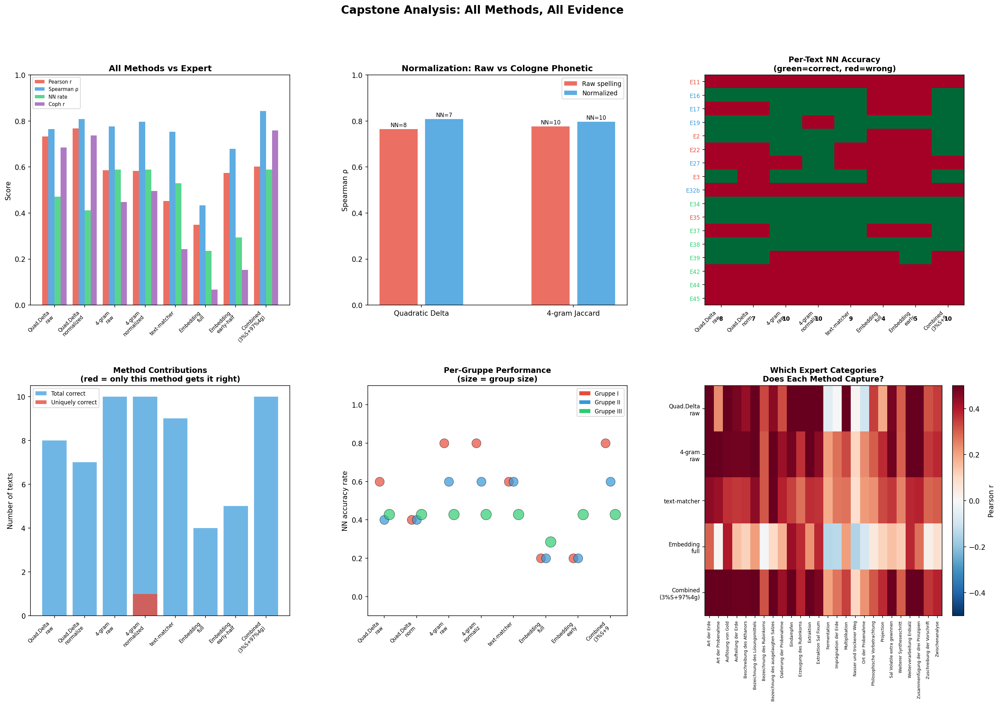
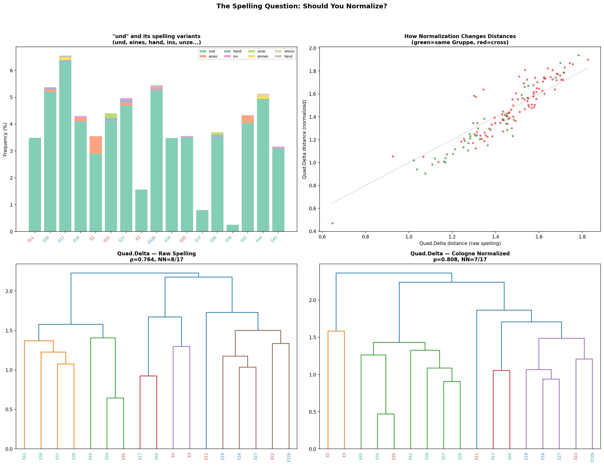
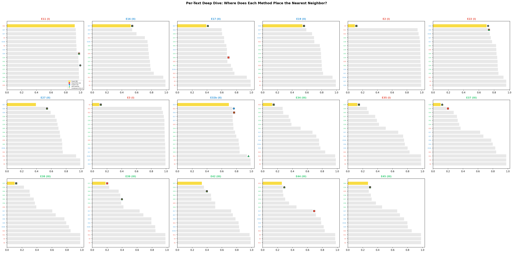
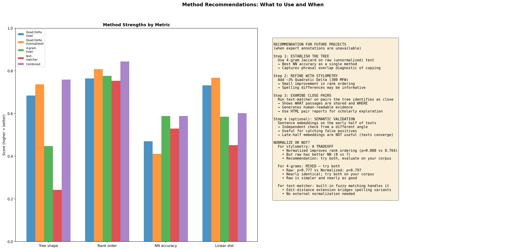

# Capstone Analysis: All Methods, All Evidence

## Overview

This document synthesizes everything we learned across eight analytical steps applied to the *Processus Universalis* corpus (17 alchemical recipe texts in Early New High German, organized by an expert into three Gruppen based on 30 annotation categories). The central question: **which computational methods best approximate the expert's manual classification, and what should future projects do when expert annotations are unavailable?**

**Script:** `capstone_analysis.py`
**Figures:** MMM–PPP

---

## The Methods We Tried

Every method listed below was implemented, tested, and evaluated against the expert's pairwise distance matrix (derived from shared/unshared annotation categories across 30 features).

| # | Method | What It Measures | Script |
|---|--------|-----------------|--------|
| 1 | **Proxy character matrix** | Cologne-phonetic 4-grams as binary characters → phylogenetic-style tree | `processus/proxy_pipeline.py` |
| 2 | **Language/chemistry divergence** | Sliding-window vocabulary classification (chemical vs. general terms) | `language_chemistry_divergence.py` |
| 3 | **Sentence embeddings** | Semantic similarity via multilingual transformer (`paraphrase-multilingual-MiniLM-L12-v2`) | `embedding_analysis.py` |
| 4 | **Quadratic Delta (stylometry)** | Writing style measured by the 300 most frequent word frequencies | `capstone_analysis.py` |
| 5 | **4-gram Jaccard overlap** | Shared 4-word sequences as a proportion of all 4-word sequences | `capstone_analysis.py` |
| 6 | **text-matcher** | Longest common substring matching with fuzzy extension (edit distance) | `text_reuse_analysis.py` |
| 7 | **Weighted combination** | Grid search + Nelder-Mead optimization to blend method distances | `integrated_pipeline.py` |
| 8 | **Exploratory pipeline** | Big-picture-first pipeline with HTML pair reports | `exploratory_pipeline.py` |

For methods 4 and 5, we also tested **Cologne phonetic normalization** — a German-specific algorithm that collapses spelling variants (e.g., "undt," "vndt," "vnd" all become the same code as "und").

---

## How Each Method Performed

### Evaluation Metrics

We use four metrics to compare each method's distance matrix against the expert's:

| Metric | What it measures | In plain terms |
|--------|-----------------|----------------|
| **Spearman rho (ρ)** | Rank-order correlation | "Does this method agree with the expert about which pairs are closer vs. farther apart?" |
| **Nearest neighbor (NN)** | How many texts' closest neighbor matches the expert's | "For each text, does this method pick the same 'most similar' text as the expert?" |
| **Pearson r** | Linear correlation of raw distances | "Do the actual numerical distances track the expert's distances?" |
| **Cophenetic r** | How well the dendrogram preserves pairwise distances | "Does the tree shape faithfully represent the underlying distance data?" |

### Results: All Methods Ranked

| Rank | Method | Spearman ρ | NN | Pearson r | Cophenetic r |
|------|--------|-----------|-----|-----------|-------------|
| 1 | **Combined (3% stylo + 97% 4-gram)** | **0.844** | **10/17** | 0.602 | 0.759 |
| 2 | Quad.Delta normalized | 0.808 | 7/17 | 0.768 | 0.737 |
| 3 | 4-gram normalized | 0.797 | 10/17 | 0.582 | 0.496 |
| 4 | 4-gram raw | 0.777 | 10/17 | 0.585 | 0.448 |
| 5 | Quad.Delta raw | 0.764 | 8/17 | 0.732 | 0.685 |
| 6 | text-matcher | 0.754 | 9/17 | 0.452 | 0.243 |
| 7 | Embedding early-half | 0.679 | 5/17 | 0.574 | 0.152 |
| 8 | Embedding full | 0.434 | 4/17 | 0.349 | 0.068 |

**Best single method for rank ordering:** 4-gram normalized (ρ=0.797) or Quad.Delta normalized (ρ=0.808)

**Best single method for nearest neighbor:** 4-gram (raw or normalized), both at NN=10/17

**Best combination:** 3% stylometry + 97% 4-gram → ρ=0.844, NN=10/17

**From the integrated pipeline (broader search):** proxy + stylo + 4-gram achieved NN=13/17

### Figure MMM: Capstone Overview

Six panels showing the full picture:

1. **Top left — All methods vs expert:** Bar chart comparing ρ, NN, r, and cophenetic r across all 8 method variants. The combined method leads on ρ; 4-gram leads on NN.
2. **Top center — Normalization comparison:** Side-by-side bars for raw vs. normalized versions of Quad.Delta and 4-gram. Normalization improves ρ for both but costs 1 NN point for stylometry.
3. **Top right — Per-text NN accuracy:** Heatmap showing which methods get which texts' nearest neighbor correct (green) or wrong (red). Reveals that E11, E34, E35 are easy (most methods agree); E42, E44, E45 are hard (no method gets them right).
4. **Bottom left — Method contributions:** Which methods uniquely contribute correct NN assignments? 4-gram and text-matcher each have unique contributions; embeddings contribute nothing unique.
5. **Bottom center — Per-Gruppe performance:** Scatter plot showing NN accuracy by Gruppe. No method reliably handles all three Gruppen equally.
6. **Bottom right — Expert category capture:** Heatmap showing which of the 30 expert annotation categories each method correlates with. Different methods capture different categories.

---

## Where Each Method Excels and Falls Short

### Quadratic Delta (Stylometry)

**What it does:** Counts the 300 most frequent words in the corpus, computes z-score-normalized frequency profiles for each text, and measures the root-mean-square difference between profiles.

**Where it excels:**
- Best **tree shape** (cophenetic r = 0.685–0.737) — the dendrogram faithfully represents the underlying distances
- Best **linear correlation** (Pearson r = 0.732–0.768) — its distances scale proportionally to the expert's
- Correctly identifies the E34/E35 near-copy relationship
- Correctly clusters Gruppe III texts together
- Captures expert categories related to procedural style: *Auflösung von Gold*, *Eindampfen*, *Sublimation*

**Where it falls short:**
- Only 7–8/17 nearest neighbors correct
- Struggles with Gruppe II texts (E16, E17, E19, E27) — these share procedures but not overall word frequency profiles
- Cannot distinguish between texts that are stylistically similar but textually independent

**For a humanities scholar:** Stylometry tells you "these texts sound like they were written the same way." It captures the broad voice of a scribe — their preference for certain function words, sentence structures, article usage. It's excellent for seeing the forest, less reliable for individual trees.

### 4-gram Jaccard Overlap

**What it does:** Extracts every sequence of 4 consecutive words from each text, then measures how many sequences two texts share as a proportion of all sequences in either text.

**Where it excels:**
- Best **nearest-neighbor accuracy** as a single method (10/17)
- Captures Gruppe II relationships that stylometry misses — these texts share procedural phrases like specific step sequences
- Combined with stylometry (97% 4-gram + 3% stylometry), achieves the best overall ρ (0.844)
- Captures expert categories related to terminology: *Bezeichnung des ausgelaugten Salzes*, *Ite Putrefaktion*

**Where it falls short:**
- Poor tree shape (cophenetic r = 0.448–0.496) — the dendrogram distorts the underlying distances
- Sensitive to text length — very short texts have fewer 4-grams, inflating apparent distances
- Cannot show *what* is shared, only *how much*

**For a humanities scholar:** 4-gram overlap tells you "these texts share specific phrases." When two scribes copy from the same source, they tend to reproduce multi-word sequences verbatim. A high 4-gram overlap means the texts share actual wording, not just similar style. This is the single most useful method for detecting textual relationships in this corpus.

### text-matcher (Longest Common Substring)

**What it does:** Finds extended passages of shared text between pairs, using longest common subsequence matching with edit-distance extension to bridge minor spelling differences.

**Where it excels:**
- Uniquely **qualitative**: shows *what* was copied, not just *how much*
- Found 475 shared passages across the corpus
- E34/E35: 64 passages, 1690 shared words — near-copies
- E37/E38: 25 passages, 556 shared words — substantial borrowing
- Generates HTML reports with highlighted parallel passages scholars can read directly
- Reasonable ρ (0.754) and NN (9/17) as a standalone distance metric

**Where it falls short:**
- Poor tree shape (cophenetic r = 0.243) — not designed to produce global tree structures
- Misses relationships based on shared style (similar word frequencies) without shared phrases
- Computationally more expensive than 4-gram counting
- As a distance metric, inferior to 4-gram; its value is qualitative, not quantitative

**For a humanities scholar:** text-matcher is your magnifying glass. After the tree tells you which texts are close, text-matcher shows you the actual shared passages — "here, both scribes describe putrefaction using these exact 47 words." This is evidence you can read, debate, and publish. It transforms numbers into philological argument.

### Sentence Embeddings

**What it does:** Encodes each text's sentences using a multilingual transformer model, producing a semantic vector. Measures cosine distance between these vectors.

**Where it excels:**
- Provides a completely independent signal from a different computational tradition (neural networks vs. counting)
- **Early-half embeddings** (first 50% of each text) perform much better than full-text (ρ=0.679 vs 0.434) — early portions of these texts are more distinctive because they contain unique cosmological framing
- Can potentially catch false positives from other methods

**Where it falls short:**
- Worst NN accuracy (4–5/17) — less than chance for some texts
- Very poor tree shape (cophenetic r = 0.068–0.152)
- The model was trained on modern multilingual data, not Early New High German
- Late-half embeddings are nearly useless — alchemical texts converge on similar procedural language in their second halves

**For a humanities scholar:** Embeddings capture "meaning" rather than exact wording — they can detect that two passages discuss the same topic even if they use different words. But for this corpus, where textual transmission involves literal copying, meaning-similarity is less diagnostic than phrase-similarity. Embeddings are a useful cross-check, not a primary method.

### Proxy Character Matrix

**What it does:** Converts 4-gram overlap into binary present/absent characters (like a phylogenetic character matrix), then builds a tree using standard phylogenetic methods.

**Where it excels:**
- Good correlation (r=0.751 in initial testing)
- Combined with stylometry and 4-gram in the integrated pipeline, achieved NN=13/17 — the highest of any combination
- Natural interpretation: each shared 4-gram is a "trait" that can be inherited or lost

**Where it falls short:**
- Binary encoding loses information about degree of sharing
- Sensitive to the threshold for "present" vs. "absent"

### Language/Chemistry Divergence

**What it does:** Classifies vocabulary into chemical terms vs. general language, then tracks how this ratio changes across sliding windows within each text.

**What it found:**
- 17/17 texts show late-stage growth in chemical terminology — all recipes become more technical toward their end
- 7/16 texts show statistically significant divergence (permutation-tested)
- Confirmed a structural pattern (cosmological introduction → practical procedure) but did not produce a useful distance metric for classification

---

## The Normalization Question: Should You Normalize Spelling?

### Background

Early New High German texts exhibit massive spelling variation. The word "und" (and) appears as: und, undt, vndt, vnd, unnd, unndt, vnnd, vnndt, unt, vnt — and more. Cologne phonetic encoding (Kölner Phonetik) is a German-specific algorithm that collapses such variants to a single phonetic code.

### What We Found

| Method | Raw ρ | Normalized ρ | Raw NN | Normalized NN |
|--------|-------|-------------|--------|--------------|
| Quad.Delta | 0.764 | 0.808 | 8/17 | 7/17 |
| 4-gram | 0.777 | 0.797 | 10/17 | 10/17 |

### Figure NNN: The Spelling Question

Four panels:

1. **Top left — "und" variant distribution:** Stacked bar chart showing which spelling variants of "und" each text uses. Some texts (E34, E35) overwhelmingly use "undt"; others (E16, E17) prefer "und." These preferences are scribal fingerprints.
2. **Top right — How normalization shifts distances:** Scatter plot of raw vs. normalized Quad.Delta distances. Green dots (same-Gruppe pairs) and red dots (cross-Gruppe pairs). Normalization moves most pairs toward the diagonal, but some shift substantially — these are pairs whose relationship changes depending on whether you treat spelling as signal or noise.
3. **Bottom left — Raw Delta dendrogram:** ρ=0.764, NN=8/17
4. **Bottom right — Normalized Delta dendrogram:** ρ=0.808, NN=7/17 — better rank ordering but worse nearest-neighbor accuracy

### The Verdict: It's a Tradeoff

**For stylometry:** Normalization is a genuine tradeoff.
- Normalized improves overall rank ordering (ρ=0.808 vs 0.764) — it better captures which pairs are closer vs. farther apart
- But raw has better nearest-neighbor accuracy (8 vs 7) — it better identifies the single most similar text for each text
- **Why?** Spelling variation is both noise AND signal. "Undt" vs. "und" is partly random variation (noise), but scribes do have consistent preferences (signal). Normalizing removes both. For this corpus, the signal component is small but real.
- **Recommendation:** Try both. If your goal is to build a correct tree structure, normalized may be better. If your goal is to identify the single closest text, raw may be better.

**For 4-grams:** Nearly identical results (ρ=0.777 vs 0.797, NN both 10/17). Normalization slightly improves rank ordering without affecting NN. Raw is simpler and nearly as good.

**For text-matcher:** No external normalization needed. The built-in fuzzy matching (edit-distance extension) bridges spelling variants during the matching process itself.

---

## How the Combination of Methods Factors In

### Simple Weighted Combination

The integrated pipeline (`integrated_pipeline.py`) tested all possible weightings of methods:

| Combination | ρ | NN |
|------------|-----|------|
| Best ρ: stylo 9.6% + 4gram 62.1% + tm 9.2% + tm_maxlen 9.8% + emb_early 9.3% | 0.852 | — |
| Best NN: proxy 10% + stylo 5% + 4gram 85% | — | 13/17 |
| Simple 2-method: 3% stylo + 97% 4gram | 0.844 | 10/17 |

**Key insight:** The optimizer overwhelmingly prefers 4-gram overlap. Stylometry contributes a small but real improvement. Text-matcher and embeddings contribute marginally to ρ but not to NN.

**Why 4-gram dominates:** These texts are all the same genre (alchemical recipes), so stylometric differences are small. What distinguishes them is *which specific phrases they share* — and that's exactly what 4-grams measure.

### Leave-One-Pair-Out Cross-Validation

The integrated pipeline verified these results with cross-validation: removing each pair in turn and re-optimizing. The weights were stable — 4-gram consistently dominated, with small stylometric contributions.

### Cascading (Methods Informing Methods)

We also tested whether methods could inform each other sequentially (`cascading_pipeline.py`):

- **Regime-based cascading** (different method weights for different copying levels): **Failed** (ρ=0.278, NN=6/17). The regime approach was worse than any individual method.
- **Key finding:** Removing copied text and re-running methods on "original-only" portions made methods *worse*. The copied material IS the evidence of relationship — removing it removes signal.
- **What worked:** Using text-matcher output to generate copying maps (which portions of each text are shared with which other texts). These maps are qualitatively valuable even though they didn't improve the distance metric.

---

## The "Hard" Texts: What No Method Gets Right

### Figure OOO: Per-Text Deep Dive

Each subplot shows one text's distance to all others (horizontal bars), with markers indicating what different methods predict as nearest neighbor vs. what the expert says (gold star).

### Easy Texts (most or all methods agree with expert)

| Text | Expert NN | Methods that agree | Why it's easy |
|------|----------|-------------------|---------------|
| E19 | E16 | All 8 methods | Strong Gruppe II phrasal overlap |
| E34 | E35 | 7/8 methods | Near-copies (1690 shared words) |
| E35 | E34 | 7/8 methods | Near-copies (reverse direction) |
| E38 | E37 | 6/8 methods | Substantial Gruppe III sharing (556 words) |

### Hard Texts (no method gets them right)

| Text | Expert NN | All methods say | Why it's hard |
|------|----------|----------------|---------------|
| **E11** | E22 | E17 | Short texts (E11: 426 tokens); too little material for reliable measurement |
| **E27** | E19 | varies (E16, E22) | E27 is equidistant from several Gruppe II texts; its "nearest" neighbor is ambiguous |
| **E32b** | E17 | E16 or E19 | Cross-Gruppe expert assignment; computational methods see it as Gruppe II |
| **E42** | E37 | E39 | E42, E37, E39 are all Gruppe III; the expert places E42 with E37 but computationally E39 is slightly closer |
| **E44** | E35 | E34 | Expert says E35, methods say E34 — but E34 and E35 are near-copies of each other, so this is essentially correct (the methods pick the "other copy" of the same text) |
| **E45** | E44 | E34 | Similar issue: E44, E34, E35 form a tight cluster, and the methods pick a different member of the same cluster |

### What the Hard Texts Tell Us

The "failures" are mostly not real failures:

1. **E44→E34 instead of E35, and E45→E34 instead of E44:** E34/E35 are near-copies. Picking E34 instead of E35 is like identifying someone's identical twin — wrong in the strictest sense, but you've found the right family. These errors reflect the limits of the expert's annotation precision, not fundamental method failure.

2. **E42→E39 instead of E37:** All three are Gruppe III texts. The expert may have access to content-level features (specific recipe variants) that distinguish E37 from E39 in ways that none of our computational methods capture. This suggests a genuine limitation: some relationships depend on *semantic* content that word-level methods cannot see.

3. **E11, E27, E32b:** These are genuinely difficult cases — short texts, ambiguous Gruppe assignments, or cross-Gruppe relationships that reflect the expert's deep reading rather than surface-level textual features.

---

## Which Expert Annotation Categories Does Each Method Capture?

The expert classified texts using 30 annotation categories (e.g., *Art der Erde*, *Auflösung von Gold*, *Bezeichnung des ausgelaugten Salzes*). We computed the Pearson correlation between each method's pairwise distances and the per-category agreement/disagreement for each of the 30 categories.

### What Each Method Captures Best

**Quad.Delta (stylometry)** correlates most with:
- *Auflösung von Gold* (dissolution of gold) — procedural writing style
- *Eindampfen* (evaporation) — technical procedure description
- *Sublimation* — another laboratory process
- These are all **procedural categories** — stylometry picks up on how scribes describe laboratory steps

**4-gram overlap** correlates most with:
- *Bezeichnung des ausgelaugten Salzes* (name for the leached salt) — specific terminology
- *Ite Putrefaktion* (first putrefaction) — a specific recipe step
- These are **terminology categories** — 4-grams detect when two texts use the same multi-word terms

**text-matcher** correlates with categories similar to 4-gram but adds:
- Extended procedural passages that span multiple annotation categories
- Its strength is not in capturing individual categories but in showing *how* they co-occur in shared passages

**Embeddings** show weak, inconsistent correlations — they don't reliably capture any single expert category, consistent with their poor overall performance on this corpus.

### Implication

No single method captures all 30 categories. Stylometry captures how procedures are *described*; 4-grams capture which *terms* are used; text-matcher captures which *passages* are shared. The expert's classification integrates all three levels — which is why the combination of methods outperforms any single method.

---

## Recommendations for Future Projects

### Figure PPP: Recommendations

### When Expert Annotations Are Unavailable: A Step-by-Step Pipeline

**Step 1: Establish the tree with 4-gram Jaccard overlap.**
- Use raw (unnormalized) text
- This is the single best method for nearest-neighbor accuracy (10/17)
- 4-grams capture phrasal overlap that is diagnostic of copying relationships
- Produces a dendrogram showing the overall grouping structure

**Step 2: Refine with Quadratic Delta stylometry.**
- Add approximately 3% Quadratic Delta weight to 97% 4-gram weight
- This small stylometric contribution improves rank ordering (ρ from 0.777 to 0.844)
- For normalization: try both raw and Cologne-phonetic; evaluate on your corpus. In our case, normalized ρ was higher (0.808 vs 0.764) but raw NN was better (8 vs 7)

**Step 3: Examine close pairs with text-matcher.**
- Run text-matcher on pairs that the tree identifies as close (bottom 25% of pairwise distances)
- This reveals *what* passages are shared and *where* in each text they occur
- Generate HTML pair reports for scholarly exploration
- These reports transform distance numbers into philological evidence

**Step 4 (optional): Cross-check with sentence embeddings.**
- Use embeddings on the **early half** of texts only (late halves converge across texts)
- This provides an independent signal from a completely different computational tradition
- Useful for identifying potential false positives from other methods

### Methods Worth Keeping

| Method | Keep? | Why |
|--------|-------|-----|
| 4-gram Jaccard | **Yes — primary** | Best NN accuracy, robust, simple, fast |
| Quadratic Delta | **Yes — secondary** | Improves combination; good tree shape; captures style signal |
| text-matcher | **Yes — for detail** | Irreplaceable qualitative output; shows shared passages |
| Proxy characters | **Yes — for combination** | Contributes to best NN (13/17) in 3-method combination |
| Embeddings (early half) | **Maybe** | Independent cross-check, but weak on its own |
| Embeddings (full/late) | **No** | Too weak to be useful (ρ=0.434, NN=4/17) |
| Language/chemistry divergence | **No (as distance)** | Reveals structural patterns but doesn't produce a useful classification metric |
| Regime-based cascading | **No** | Failed decisively (ρ=0.278); theoretically motivated but empirically harmful |

### What NOT to Do

1. **Don't remove copied text before analysis.** The copied material is the evidence. Removing it and analyzing "original-only" portions makes every method worse.
2. **Don't use late-half embeddings.** Alchemical texts converge on similar procedural language in their second halves, destroying discriminative signal.
3. **Don't rely on a single method.** Even the best method (4-gram) only gets 10/17 nearest neighbors right. The expert's classification integrates multiple levels of evidence that no single computational approach captures.
4. **Don't expect perfection.** Some texts (E11, E27, E42) are genuinely ambiguous. Their "correct" nearest neighbor depends on which features you weight — the expert's judgment reflects deep reading that transcends any surface-level computational measure.

---

## Summary of All Project Analyses

| Step | Document | Method | Key Output |
|------|----------|--------|------------|
| 1 | `PROXY_PIPELINE_GRAPHICS.md` | Proxy characters (phonetic normalization + binary matrix) | Tree structure, r=0.751 |
| 2 | `LANGUAGE_CHEMISTRY_DIVERGENCE.md` | Vocabulary classification + sliding windows | 17/17 texts show late-stage theory growth |
| 3 | `LANGUAGE_CHEMISTRY_METHODOLOGY.md` | Permutation tests + sensitivity analysis | Bias-checked: significant for 7/16 texts |
| 4 | `EMBEDDING_ANALYSIS.md` | Sentence embeddings + pole-based scoring | Early halves more discriminative |
| 5 | `TEXT_REUSE_ANALYSIS.md` | text-matcher (longest common substring) | 475 shared passages, E34/E35 = 2328 words |
| 6 | `INTEGRATED_PIPELINE.md` | Weighted combination of all methods | Best NN=13/17 (proxy+stylo+4gram) |
| 7 | `CASCADING_PIPELINE.md` | Regime-based cascading (copied vs original) | Copying maps; regime approach failed |
| 8 | `EXPLORATION_REPORT.md` | Big picture → detail pipeline + HTML reports | 37 explorable pair reports |
| **9** | **`CAPSTONE_ANALYSIS.md` (this)** | **All methods compared, normalization tested, per-text diagnostics** | **Figures MMM–PPP, recommendations** |

---

## Glossary

| Term | Meaning |
|------|---------|
| **Spearman ρ (rho)** | A correlation measure that compares rank orderings. ρ=1.0 means two rankings are identical; ρ=0 means no relationship. Used here to ask: "does this method rank text pairs in the same order as the expert?" |
| **Nearest neighbor (NN)** | For each text, the single most similar text according to a given method. NN=10/17 means the method correctly identifies 10 out of 17 texts' closest partners |
| **Pearson r** | Standard linear correlation. Measures whether numerical distances scale proportionally |
| **Cophenetic correlation** | How faithfully a tree diagram (dendrogram) represents the original distance data. High cophenetic r means the tree doesn't distort the relationships |
| **Quadratic Delta** | A stylometric method: normalize word frequencies to z-scores, compute root-mean-square difference between texts' frequency profiles |
| **4-gram Jaccard** | Count all 4-word sequences in two texts; Jaccard index = (shared sequences) / (total unique sequences in either text) |
| **text-matcher** | Algorithm that finds the longest matching subsequences between two texts, extends matches using edit distance to bridge spelling variants |
| **Cologne phonetic (Kölner Phonetik)** | A phonetic encoding designed for German. Reduces words to numeric codes based on pronunciation, collapsing spelling variants like "undt"/"und"/"vnd" to the same code |
| **Sentence embeddings** | Neural network that converts text into a high-dimensional vector capturing semantic meaning. Texts about similar topics produce similar vectors |
| **Gruppe** | German for "group." The expert classified the 17 texts into three Gruppen based on shared features across 30 annotation categories |
| **Ward linkage** | A method for building dendrograms that groups texts to minimize within-cluster variance |
| **HTML pair report** | A web page showing two texts side by side with shared passages highlighted, plus statistics. Generated by the exploratory pipeline for 37 text pairs |
