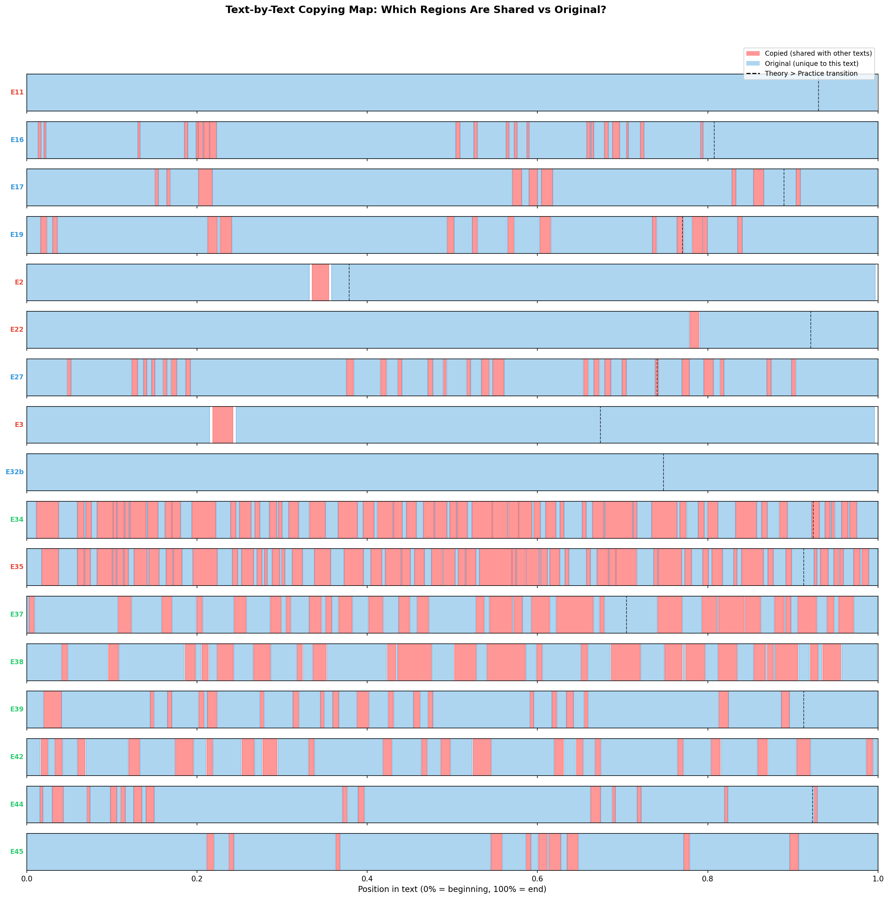
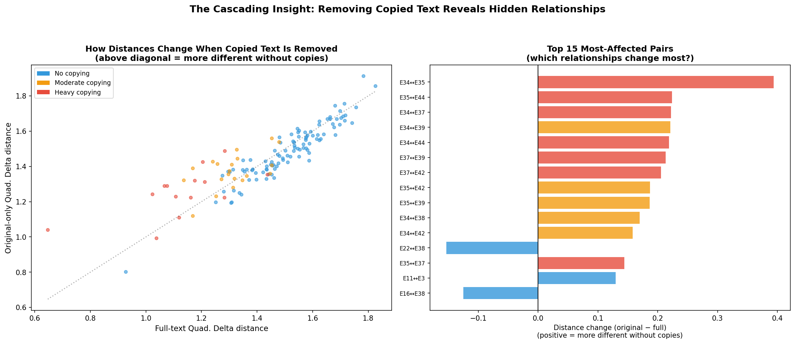
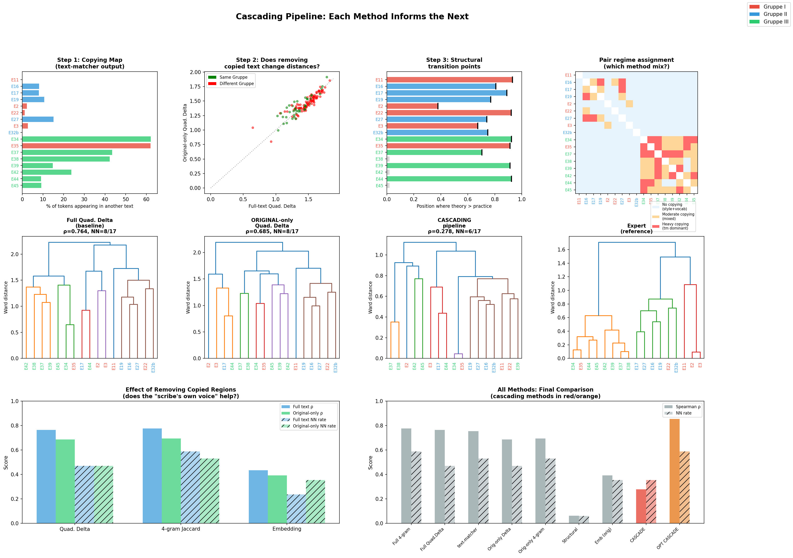

# Cascading Pipeline: Can Methods Inform Each Other?

## The Question

The previous integrated pipeline found that a weighted average of methods reaches ρ=0.852 and NN=13/17. But that approach just optimizes a linear blend — it doesn't use one method's *output* to change what the next method *looks at*. Can we do better by genuinely cascading methods?

The idea: **text-matcher tells us which regions of each text are copied from other texts. Everything downstream should care about that distinction.** If two texts share 60% of their words verbatim, measuring their stylometric distance on the full text mostly measures the copied material, not the scribe's own contribution.

**Script:** `cascading_pipeline.py`
**Figures:** GGG through III (3 figures)

---

## What We Did

### Step 1: Build a Copying Map

text-matcher ran on all 136 pairs. For each text, we built a token-level boolean mask: is this word part of a passage shared with *any* other text?

### Step 2: Separate Copied and Original Regions

For each text, we split the tokens into two pools:
- **Copied tokens**: appear in a shared passage with at least one other text
- **Original tokens**: unique to this text (the "scribe's own voice")

We then computed Quadratic Delta, 4-gram Jaccard, and sentence embeddings on each pool separately.

### Step 3: Structural Alignment

We detected where theoretical vocabulary overtakes practical vocabulary in each text (the "transition point" from the language-chemistry analysis), and used the difference in transition points as a structural distance.

### Step 4: Regime-Based Combination

We classified each text pair into a "regime" based on how much verbatim material they share:
- **Heavy copying** (top 10%): text-matcher dominates the distance
- **Moderate copying** (75th–90th percentile): mixed evidence
- **No significant copying** (below 75th): fall back to stylometry + vocabulary

### Step 5: Evaluate

---

## The Copying Map: A Genuinely New Finding

### Figure HHH: Copied vs Original Text Maps

This figure shows, for each text, which words are shared with at least one other text (red) and which are unique to this manuscript (blue). The dashed line marks where theoretical vocabulary overtakes practical.

**Key observations:**

| Text | Gruppe | % Copied | Pattern |
|------|--------|----------|---------|
| E34 | III | 62% | Copied throughout — near-continuous sharing |
| E35 | I | 62% | Mirror image of E34 (they share the same passages) |
| E37 | III | 43% | Heavy copying in first half, more original in second |
| E38 | III | 42% | Similar to E37 (they share a common source) |
| E42 | III | 24% | Moderate copying, concentrated in middle sections |
| E27 | II | 15% | Scattered copying across the text |
| E39 | III | 15% | Copying concentrated in opening and procedural sections |
| E11 | I | 0% | Entirely original — shares no verbatim material with any text |
| E32b | II | 0% | Entirely original — a unique composition |

**This is information no other method provides.** The copying map doesn't just tell us *how much* two texts share — it shows *where* in each manuscript the copying occurs, and reveals the structure of textual transmission in a way that statistics alone cannot.

**Philological significance:** E34 and E35 are 62% copied *from each other*, yet the expert assigned them to different Gruppen (III and I respectively). The copying map shows that their shared material spans the entire recipe — cosmological opening, procedural middle, and color-stage ending — meaning the expert's Gruppe separation must be based on the 38% of *original* content, not the 62% that is shared. This is exactly the kind of insight a cascading pipeline can produce: text-matcher identifies the copied material, and then other methods can analyze what remains.

---

## The Honest Result: Regime-Based Cascading Failed

The regime-based cascading pipeline — applying different method mixes to pairs in different "regimes" based on how much they copy — produced **ρ=0.278, NN=6/17**. This is dramatically worse than any individual method.

### Why It Failed

1. **The regime thresholds create artificial discontinuities.** A pair just above the 75th percentile of text-matcher score gets treated completely differently from one just below, even though their actual relationship may be very similar. Distance matrices need smooth, continuous values; regime boundaries introduce jumps.

2. **The hand-picked weights for each regime were wrong.** In the "no copying" regime, I weighted full-text stylometry at 30% and structural transitions at 20%. But structural transition points turned out to carry almost no useful signal (ρ=0.060, NN=1/17) — they are too noisy to help.

3. **The "original-only" analysis didn't help as expected.** This is the most important finding, discussed below.

### Why "Original Only" Doesn't Beat "Full Text"

| Method | Full Text | Original Only | Change |
|--------|-----------|---------------|--------|
| Quadratic Delta | ρ=0.764, NN=8/17 | ρ=0.685, NN=8/17 | worse |
| 4-gram Jaccard | ρ=0.777, NN=10/17 | ρ=0.695, NN=9/17 | worse |
| Embedding | ρ=0.434, NN=4/17 | ρ=0.391, NN=6/17 | mixed |

**Removing copied text makes most methods perform worse, not better.** This is counterintuitive but makes sense once you think about it:

- **The copied material IS the evidence of relationship.** When E34 and E35 share 62% of their text, that shared material is the strongest signal that they are related. Removing it removes the signal.

- **Original regions are noisier.** When you extract only the "scribe's own voice" — the 38% that wasn't copied — you get shorter, more fragmentary text with less statistical power. Short texts produce unreliable frequency profiles.

- **The expert annotations already incorporate copying.** The expert knew about shared passages when making Gruppe assignments. A method that removes copying evidence is trying to match expert judgments while discarding the very evidence the expert used.

The one exception: **embeddings get 2 more NN correct** (6/17 vs 4/17) when restricted to original regions, even though overall ρ drops. This suggests that for the specific task of identifying nearest neighbors, the semantic content of the scribe's original additions carries some signal that gets diluted by the shared material. But this effect is too small and fragile to build a pipeline around.

### Figure III: How Distances Change When Copied Text Is Removed

**Left panel:** Each dot is a text pair. Points above the diagonal are pairs that become *more distant* when copied text is removed. Most points are above the line — removing copies makes texts look more different (because you've removed the evidence of their relationship). The red dots (heavy-copying pairs) show the most dramatic shifts.

**Right panel:** The 15 pairs whose distances change most. E34↔E35, E35↔E44, E37↔E39, E37↔E42 — all Gruppe III pairs or the E34/E35 cross-Gruppe pair. These are precisely the pairs where text-matcher found extensive shared passages.

---

## What the Optimized Weights Reveal

When we let the optimizer find the best fixed weights across all the cascading components (including the new "original-only" features), it reaches ρ=0.853 — nearly identical to the previous weighted-average pipeline's ρ=0.852. The winning weights:

| Component | Weight |
|-----------|--------|
| Full 4-gram Jaccard | **80.1%** |
| text-matcher | 7.9% |
| Original-only Quad. Delta | 6.1% |
| Original-only 4-gram | 6.0% |

The optimizer essentially says: "Use full 4-gram Jaccard as the primary signal, and add small corrections from text-matcher and original-only features." The original-only features contribute, but only as minor corrections — they cannot stand alone.

---

## What the Cascading Approach Actually Teaches Us

The cascading pipeline failed to beat the simple weighted average *as a distance metric*. But it succeeded at something more important: **producing new knowledge about the corpus**.

### 1. The Copying Map Is Philologically Valuable

No statistics can replace Figure HHH. Seeing that E34 and E35 are 62% identical, with shared material spanning the entire text, while E11 and E32b share *nothing* with any other text — this is a finding that changes how a scholar thinks about the corpus. It immediately raises questions:

- What is the 38% of E34/E35 that *isn't* shared? Is it the same 38%, or do they differ in different places?
- Why do E11 and E32b have zero shared passages? Are they independent compositions, or copies of lost sources outside this corpus?
- The Gruppe II texts (E16, E17, E19, E27) show 8–15% copying — is this shared material concentrated in specific procedural sections?

### 2. The "Scribe's Own Voice" Is Real but Weak

Removing copied text and measuring what remains does capture something — the scribe's individual compositional choices. But this signal is too weak and noisy (especially for short texts) to build reliable distance metrics on. It's more useful as a qualitative finding: "when E34 and E35 diverge, E34 uses more Latin terminology while E35 uses German equivalents" (a claim that could be tested by looking at the copying map).

### 3. Structural Transition Points Don't Help

The position where theoretical vocabulary overtakes practical vocabulary (the "transition point" from the language-chemistry analysis) turns out to carry no useful information for text clustering (ρ=0.060, NN=1/17). This is because:
- Many texts have no clear transition (E38, E42, E45)
- The transition point is noisy — small changes in vocabulary lists shift it significantly
- Structural similarity ≠ genealogical relationship; texts can have similar structures for genre reasons rather than copying

### 4. The Expert Used Multiple Evidence Types Simultaneously

The failure of regime-based cascading highlights something about how expert annotation works: the expert didn't classify pairs into "copying" and "non-copying" regimes and apply different criteria. They considered all evidence simultaneously — shared passages, vocabulary, style, structure, historical context — in a holistic judgment. Our best computational approximation of this is the simple weighted average, precisely because it combines all signals continuously rather than switching between regimes.

### Figure GGG: Cascading Pipeline Overview

This 12-panel figure summarizes the entire cascading pipeline:

**Top row (Steps 1–4):** The copying map, the effect of removing copies on distances, structural transition points, and regime assignment.

**Middle row (Dendrograms):** Full Quad. Delta → Original-only Quad. Delta → Cascading pipeline → Expert. The cascading dendrogram (ρ=0.278) is visibly worse than even the individual methods. The original-only dendrogram (ρ=0.685) is worse than full-text (ρ=0.764) but preserves the basic Gruppe structure.

**Bottom row (Comparisons):** Left panel shows that removing copied text makes Quad. Delta and 4-gram Jaccard worse, while embeddings show a mixed effect. Right panel shows all methods including the cascading attempts.

---

## Revised Recommendation

Based on both the weighted-average and cascading experiments:

### For Quantitative Clustering

Use the **simple weighted combination** from the integrated pipeline (proxy 10% + stylo 5% + 4gram 85%), which achieves NN=13/17. The cascading approach does not improve on this.

### For Qualitative Analysis

Use the **copying map** (Figure HHH) as a new analytical layer. It answers questions that no distance metric can:
- Which parts of each text are shared vs original?
- Where in the recipe does copying concentrate?
- How does the copied/original boundary relate to the practical→theoretical transition?

### For Understanding Specific Text Relationships

When the quantitative pipeline flags two texts as close, use cascading logic *qualitatively*:
1. Check the copying map: do they share verbatim passages?
2. If yes: look at the *original* regions to understand how the scribe modified the shared material
3. If no: look at vocabulary, style, and embeddings to understand the nature of their similarity

This is not a pipeline that can be reduced to a single number. It is a research workflow that produces different types of evidence for different types of questions.

---

## Summary of All Analyses (Updated)

| Step | Document | Key Finding |
|------|----------|-------------|
| 1 | `PROXY_PIPELINE_GRAPHICS.md` | Proxy characters from text alone: r=0.751, NN=10/17 |
| 2 | `LANGUAGE_CHEMISTRY_DIVERGENCE.md` | 17/17 texts show theory growth in final quarter |
| 3 | `LANGUAGE_CHEMISTRY_METHODOLOGY.md` | Finding confirmed by 7 bias diagnostics |
| 4 | `EMBEDDING_ANALYSIS.md` | Early halves more discriminative than late halves |
| 5 | `TEXT_REUSE_ANALYSIS.md` | 475 shared passages; E35/E34 share 2,328 words |
| 6 | `INTEGRATED_PIPELINE.md` | Weighted combination reaches ρ=0.852, NN=13/17 |
| 7 | **`CASCADING_PIPELINE.md` (this)** | **Copying maps reveal text structure; regime-based cascading fails but produces new knowledge** |

---

## Glossary (Non-Specialist)

| Term | Meaning |
|------|---------|
| **Cascading pipeline** | A system where the output of one method feeds into the next, rather than running all methods independently |
| **Copying map** | A visual representation showing which words in a text are shared with other texts (red) and which are unique (blue) |
| **Regime** | A category of text pair based on how much they share — pairs with heavy copying are analyzed differently from pairs with none |
| **Original regions** | The parts of a text that are NOT shared with any other text in the corpus — the scribe's own composition |
| **Structural transition** | The point in a recipe where theoretical/philosophical vocabulary overtakes practical/procedural vocabulary |
| **Discontinuity** | An abrupt change in how pairs are treated at a threshold boundary, which can produce erratic results |
