# Processus Universalis — Code and Visualisation Documentation

This document provides detailed documentation for the data extraction and visualisation pipeline applied to the *Processus Universalis* XML corpus. It is structured in two layers: a **technical description** of how each step works, and a **non-technical explanation** aimed at humanities scholars unfamiliar with the computational methods.

---

## Table of Contents

1. [Overview of the Pipeline](#1-overview-of-the-pipeline)
2. [Data Extraction (`extract_processus.py`)](#2-data-extraction)
3. [Corpus Overview Visualisations (`visualize_processus.py`, Figures 1–6)](#3-corpus-overview-visualisations)
4. [Evolution-Focused Visualisations (`visualize_evolution.py`, Figures A–F)](#4-evolution-focused-visualisations)
5. [Text Reuse Analysis (`text_reuse_analysis.py`, Figures G–K)](#5-text-reuse-analysis)
6. [Key Concepts Explained for Non-Technical Readers](#6-key-concepts-explained)
7. [Output Files Reference](#7-output-files-reference)

---

## 1. Overview of the Pipeline

The pipeline consists of three scripts, run in sequence:

1. **`extract_processus.py`** — Reads the raw XML file (`processus-sammlung_aller_texte.xml`), parses the custom annotation format, maps old nomenclature to new nomenclature, and produces structured output files (CSV, JSON).

2. **`visualize_processus.py`** — Produces six figures (Figs 1–6) that give a general overview of the corpus: what's in it, how texts compare, and what distinguishes the three groups.

3. **`visualize_evolution.py`** — Produces six figures (Figs A–F) focused on the research question of recipe evolution: where in the recipe flow the groups diverge, which texts may depend on each other, and how text reuse relates to shared chemical content.

4. **`text_reuse_analysis.py`** — Produces five figures (Figs G–K) that systematically compare text-based similarity to annotation-based similarity. Uses phonetic normalisation (Cologne encoding) to handle Early Modern German spelling variation. Answers the question: can automated text analysis replicate what human expert annotators found?

### Nomenclature

Throughout the project, the text and group names were changed. The XML file uses the old naming convention:

| Old (in XML) | Current | Note |
|---|---|---|
| A1, A2, ... A26 | E16, E37, ... E11 | Text identifiers |
| G1 (Gruppe 1) | Gruppe II | Group assignment |
| G2 (Gruppe 2) | Gruppe III | Group assignment |
| G3 (Gruppe 3) | Gruppe I | Group assignment |

The group renumbering is not sequential (G3 became Gruppe I, G1 became Gruppe II), so this mapping is essential. All visualisations use the **current nomenclature** but show old names in parentheses for cross-referencing.

---

## 2. Data Extraction

**Script:** `extract_processus.py`

### What it does

The XML file contains 18 recipe texts, each with inline `<keys>` elements that record expert annotations. These annotations categorise and describe the chemical process steps found in each recipe. The extraction script transforms this nested, semi-structured XML into clean tabular and hierarchical formats suitable for analysis.

### Technical description

#### Step 1: Parse the master keyword vocabulary (lines 36–43)

The XML begins with a `<keywords>` block that defines all possible annotation categories (30 in total) and their allowed values. For example, the category "Art der Erde" (type of earth) lists possible values like "fette schwarze Erde", "rote Erde", etc.

The script reads each `<keyword>` element, extracts its `type` attribute (category name) and `n` attribute (semicolon-separated list of allowed values), and stores them in an ordered dictionary. The ordering matters: the categories appear in the XML in the chronological order of the recipe process — from earth sampling at the beginning to the final projection at the end.

**In plain language:** *The XML file starts with a kind of "dictionary" that lists all the things the annotators could tag in the recipes — 30 categories of chemical process steps, each with a list of specific details that might appear. The code reads this dictionary first so it knows what to look for.*

#### Step 2: Extract per-text annotations (lines 46–98)

For each `
` element (i.e., each recipe text), the script:

- Extracts the text identifier from the `type` attribute (e.g., `g2a4` = Group 2, text A4)
- Extracts the title from the `n` attribute and the date from the `when` attribute
- Uses regular expressions to parse the group number and text number from the identifier string
- Maps the old A-name to the new E-name using the hardcoded equivalency table
- Maps the old group number to the new group name (G1→II, G2→III, G3→I)
- Iterates through all `<keys>` child elements within the `
`, collecting their `type` (category) and `n` (semicolon-separated values)
- The values are split on semicolons and trimmed of whitespace
- If the annotators wrote `FEHLT` (German for "missing"), it means this process step is not described in this particular recipe
- Also extracts the full plain text (stripping all XML tags) and counts words

**In plain language:** *For each of the 18 recipes, the code reads through the text and picks out all the expert tags that scholars embedded within it. Each tag says something like "this recipe describes the earth as: black, fatty, clay-like" or "this step is MISSING from this recipe." The code collects all these tags into a structured table. It also translates between the old and new naming systems so everything is consistent.*

#### Step 3: Write output files (lines 100–195)

The script produces four output files:

- **`processus_annotations.csv`** (540 rows): One row per text-per-category combination. Each row records whether that process step is present (1) or absent (0), how many specific values were annotated, and what those values are. This is the most detailed view.

- **`processus_matrix.csv`** (18 rows): A binary presence/absence matrix — one row per text, one column per category, with 1s and 0s. This is the format needed for many statistical analyses.

- **`processus_data.json`**: The same data in JSON format, preserving the full structure including the master vocabulary, nomenclature mappings, and all annotation values. This is the format used by the visualisation scripts.

- **`processus_nomenclature.csv`**: A reference table listing all 22 known A→E name mappings, flagging which 18 are present in the XML corpus.

**In plain language:** *The code saves the extracted data in several formats. Think of it like converting a handwritten ledger into a spreadsheet: the information is the same, but now a computer can easily sort, filter, and compare it. The CSV files can be opened in Excel; the JSON file is used by the visualisation scripts.*

---

## 3. Corpus Overview Visualisations

**Script:** `visualize_processus.py`

### Figure 1: Presence/Absence Heatmap

**File:** `processus_fig1_heatmap.png`

**Technical description:**
A binary matrix is constructed with 18 rows (texts, sorted by group then E-name) and 30 columns (categories, in recipe-chronological order). Each cell is coloured dark teal if the process step is annotated as present, or light grey if it is absent (FEHLT). Horizontal black lines separate the three groups. Text labels on the y-axis are coloured by group membership (red = Gruppe I, blue = Gruppe II, green = Gruppe III).

**In plain language:** *This is a simple grid showing which recipe steps appear in which texts. Each row is one recipe, each column is one step in the chemical process. A coloured cell means "this step is described in this recipe"; a grey cell means "this step is missing." The recipes are grouped by their scholarly group assignment (separated by black lines), so you can immediately see which steps are characteristic of which group — patterns of presence and absence form visible "fingerprints" for each group.*

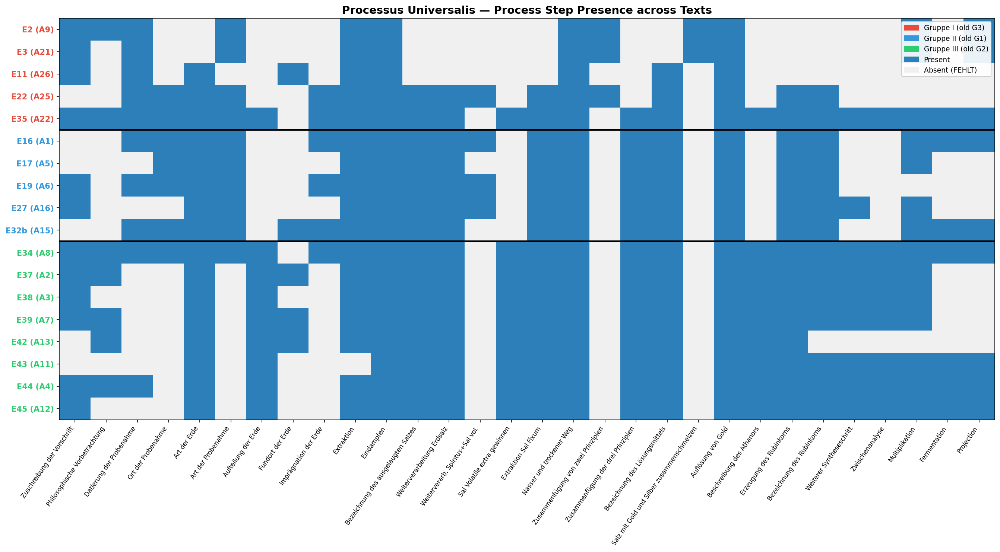

---

### Figure 2: Process Step Frequency (by Gruppe)

**File:** `processus_fig2_category_bars.png`

**Technical description:**
A horizontal stacked bar chart. For each of the 30 categories, the total number of texts that include it is shown as a bar, broken down by group contribution (stacked segments in group colours). Categories are sorted from most to least frequent. The number at the end of each bar is the total count out of 18.

**In plain language:** *This chart answers the question: "How common is each process step across all the recipes?" The bars are stacked by group colour, so you can also see whether a step is common across all groups or mainly found in one. Steps at the top (like "Eindampfen" — evaporation) appear in all 18 recipes. Steps at the bottom (like "Salz mit Gold und Silber zusammenschmelzen" — melting salt with gold and silver) appear in only 2 recipes, both from Gruppe I. This tells us which parts of the recipe were considered essential by all scribes and which were more specialised or controversial.*

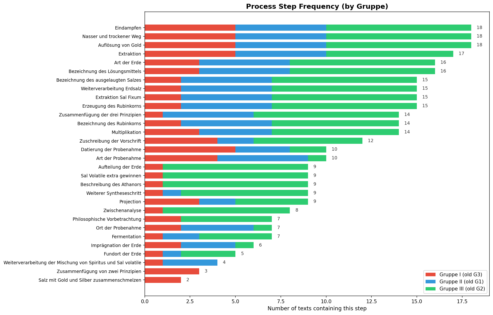

---

### Figure 3: Hierarchical Clustering Dendrogram

**File:** `processus_fig3_dendrogram.png`

**Technical description:**
The dendrogram is produced by hierarchical agglomerative clustering using Ward's method on a value-level Jaccard distance matrix. The distance between two texts is computed as follows:

1. For each text, collect all (category, value) pairs — e.g., ("Art der Erde", "fette schwarze Erde"). This creates a set of specific annotations.
2. Compute the Jaccard distance between two texts: 1 minus the size of the intersection of their annotation sets divided by the size of the union. A Jaccard distance of 0 means the texts share all the same annotations; a distance of 1 means they share none.
3. Ward's linkage method then groups texts bottom-up, at each step merging the two clusters that result in the smallest increase in total within-cluster variance.

Leaf labels are coloured by group.

**In plain language:** *This is a "family tree" of the recipes, built by measuring how similar their expert annotations are. The computer looks at every specific detail the scholars tagged — not just "is this step present?" but "what exactly did they say about this step?" — and calculates a similarity score for every pair of recipes.*

*Recipes that share very similar annotations get grouped together first (connected at the bottom of the tree). Recipes that are quite different get connected only at a higher level (further up the tree). The coloured labels show the scholarly group assignments. When the computer's grouping matches the scholars' grouping, it's strong evidence that the groups represent genuinely different textual traditions — the differences are systematic, not random.*

*For example, E2 and E3 (both Gruppe I, both dated 1618) are nearly identical in their annotations and cluster tightly together. E35 (officially Gruppe I) clusters with Gruppe III texts, suggesting it may be more closely related to that tradition.*

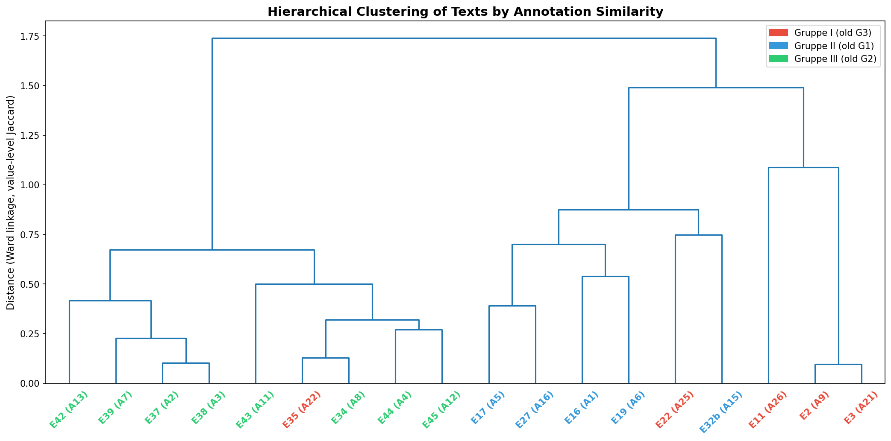

---

### Figure 4: Pairwise Similarity Heatmap

**File:** `processus_fig4_similarity.png`

**Technical description:**
An 18×18 matrix where each cell (i, j) shows the Jaccard similarity (1 − Jaccard distance) between texts i and j, based on their annotation value sets. The value ranges from 0 (no shared annotations) to 1 (identical annotations). Texts are ordered according to the dendrogram leaf order from Figure 3 (so that similar texts are adjacent). The colour scale runs from dark red (low similarity) through yellow to dark green (high similarity).

**In plain language:** *This is a colour-coded table of how similar every recipe is to every other recipe. Green means very similar, red means very different. The recipes are arranged in the same order as the family tree (Figure 3), so you can see clusters as green blocks along the diagonal. The clear block-diagonal structure — green squares along the diagonal, red in the corners — visually confirms that the three groups are genuinely distinct: recipes within the same group look alike, recipes from different groups look different.*

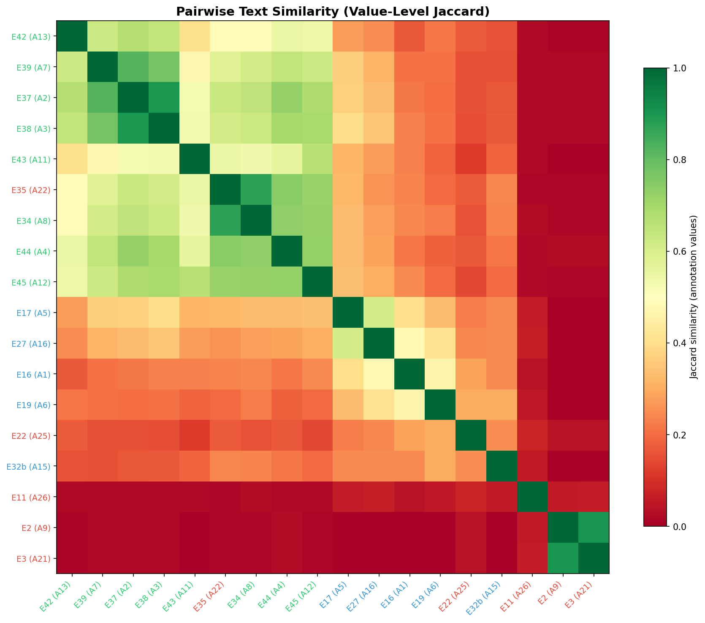

---

### Figure 5: Text Completeness and Word Count

**File:** `processus_fig5_completeness.png`

**Technical description:**
Two side-by-side horizontal bar charts. The left chart shows the number of categories marked as present (out of 30) for each text, sorted from most to least complete. The right chart shows the word count of each text's plain-text transcription, sorted independently. Bars are coloured by group.

**In plain language:** *The left chart shows how "complete" each recipe is — how many of the 30 possible process steps it covers. The right chart shows how long each recipe is in words. Comparing the two reveals whether completeness tracks with length. Some recipes are long but still miss steps (they may describe the steps they include in great detail); others are short but cover many steps (they may be summaries). The group colours show that Gruppe I texts (red) tend to be the least complete, while Gruppe III texts (green) are generally the most complete.*

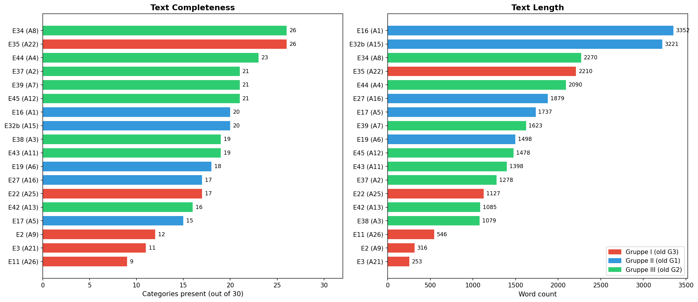

---

### Figure 6: Group-Distinctive Process Steps

**File:** `processus_fig6_group_profiles.png`

**Technical description:**
Three side-by-side diverging bar charts (one per group). For each group, every category's "distinctiveness" is computed as the difference between the group's presence rate and the presence rate in all other texts combined:

    distinctiveness = (fraction present in this group) − (fraction present in other groups)

A positive value means this step is more common in this group than elsewhere; a negative value means it's rarer. Bars extending right (in the group's colour) are the group's "signature" steps; bars extending left (in grey) are steps this group tends to omit.

**In plain language:** *These charts show what makes each group special. For each group, the bars extending to the right show process steps that are especially characteristic of that group — steps it describes more often than the others do. The bars extending to the left show steps that this group tends to leave out. For instance, Gruppe III's strongest signature is the "Aufteilung der Erde" (division of earth), "Sal Volatile extra gewinnen" (extra volatile salt extraction), and "Beschreibung des Athanors" (description of the furnace) — all present in nearly 100% of Gruppe III texts but rare in the others. This tells us these steps were central to one particular tradition of transmitting the recipe but not others.*

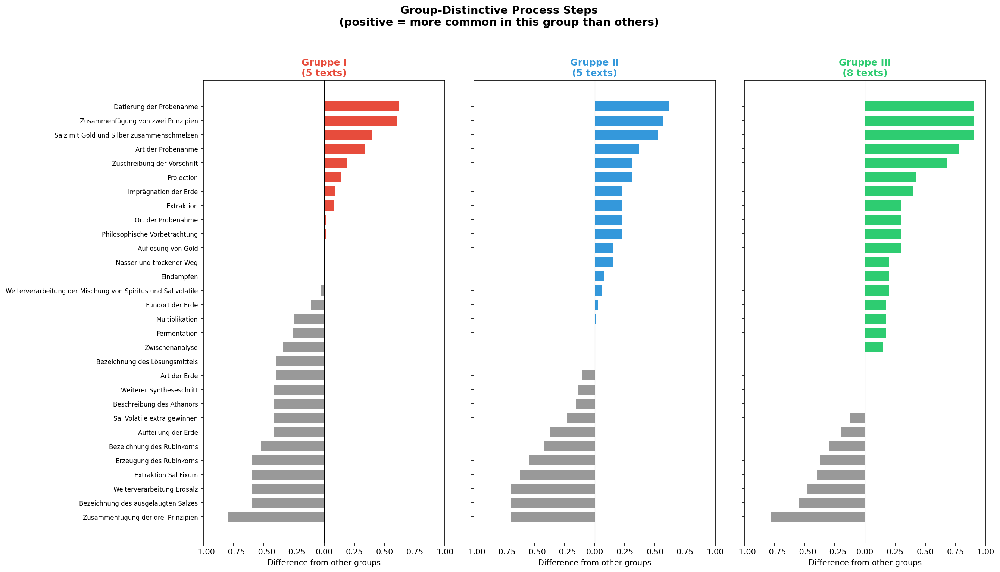

---

## 4. Evolution-Focused Visualisations

**Script:** `visualize_evolution.py`

### Figure A: Recipe Process Flow — Group Agreement at Each Step

**File:** `processus_figA_flow_divergence.png`

**Technical description:**
A two-panel figure. **Top panel:** A grouped bar chart with 30 positions (one per category in recipe-chronological order). At each position, three bars show the fraction of texts in each group that include this step (0.0 = no texts, 1.0 = all texts). The bars are positioned side-by-side using a bar width of 0.25 and offset by group index. Background shading divides the x-axis into five recipe phases (Preface, Earth & Sampling, Extraction & Salt Work, Recombination & Gold Work, Philosopher's Stone & Projection).

**Bottom panel:** For each step, the "max group divergence" is computed as the difference between the highest and lowest group presence rate. For example, if Gruppe I has 100% presence, Gruppe II has 60%, and Gruppe III has 25%, the divergence is 100% − 25% = 75%. Bars are coloured green (divergence < 0.3, i.e. groups mostly agree), orange (0.3–0.6), or red (> 0.6, i.e. groups strongly disagree). A cubic polynomial trend line is fitted to show the overall shape of divergence across the recipe flow. The polynomial is fitted using `numpy.polynomial.polynomial.polyfit` with degree 3, then evaluated on a smooth x-grid for plotting.

**In plain language:** *This figure reads the recipe from left to right, step by step, and asks: "Do the three groups agree on whether this step should be included?" The top panel shows the three groups' inclusion rates side by side. The bottom panel distils this into a single number: how much do the groups disagree? A tall red bar means one group almost always includes this step while another almost never does.*

*The trend line in the bottom panel helps you see the big picture. If the hypothesis is correct that recipe groups diverge more towards the end (because the later, more difficult chemical steps were less well understood and therefore more prone to variation), you'd expect the trend line to rise from left to right. What the data actually shows is more nuanced — divergence is not steadily increasing but spikes at certain points (earth preparation, spirit processing) and dips at others (basic extraction, gold dissolution), revealing that the points of disagreement are more about specific procedural choices than a simple "the further you go, the less they agree."*

---

### Figure B: Pairwise Group Divergence across Recipe Flow

**File:** `processus_figB_pairwise_divergence.png`

**Technical description:**
Three line plots, one for each pair of groups (I vs II, I vs III, II vs III). For each pair and each recipe step, the absolute difference in presence rate is computed. These raw values are shown as faint dots. A rolling average with window size 3 is computed using `numpy.convolve` with a uniform kernel (`np.ones(window)/window`, mode='valid'), smoothing out step-to-step noise to reveal broader trends. The rolling average is plotted as a solid coloured line.

**In plain language:** *Figure A showed the overall disagreement between all three groups. This figure breaks it down: which specific pairs of groups disagree at which points? Each coloured line tracks how different two groups are from each other as you move through the recipe steps. The smoothing (rolling average) is like looking through slightly blurred glasses — it helps you see the broader trend rather than getting distracted by step-to-step fluctuations.*

*For example, if the purple line (Gruppe I vs II) spikes in the "Earth & Sampling" phase, it means these two groups handle earth preparation very differently. If the teal line (Gruppe II vs III) stays low throughout, those two groups are relatively similar in what they include, even if they use different words.*

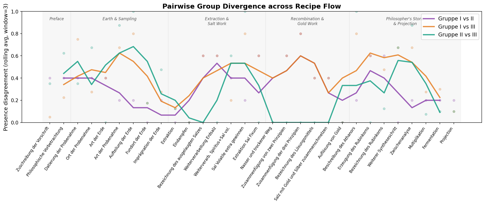

---

### Figure C: Recipe Coverage per Text

**File:** `processus_figC_coverage.png`

**Technical description:**
A grid where each row is one text and each column is one recipe step (in chronological order). Cells are drawn as coloured rectangles using `matplotlib.patches.Rectangle` — filled with the group colour if the step is present, light grey if absent. Texts are sorted within each group by completeness (most complete first). A red arrow marker is placed after the last present step for texts that don't cover the full recipe, highlighting where they "stop."

Vertical grey lines mark the boundaries between recipe phases (using the same 5-phase division as Figure A). A secondary x-axis at the top shows phase labels. Horizontal black lines separate the three groups.

**In plain language:** *This is like Figure 1, but designed to answer a specific question: "Where does each recipe stop or leave gaps?" Reading left to right follows the recipe from beginning to end. A red arrow shows where each text's coverage ends. You can see at a glance that several Gruppe I texts (red) stop early — they describe the earth sampling and extraction but don't get to the philosopher's stone. Most Gruppe III texts (green) cover the full recipe. Within Gruppe II (blue), there's a characteristic pattern: they consistently skip certain middle steps (like "Aufteilung der Erde" and "Beschreibung des Athanors") but include the later stages, suggesting a deliberate editorial choice rather than a truncated manuscript.*

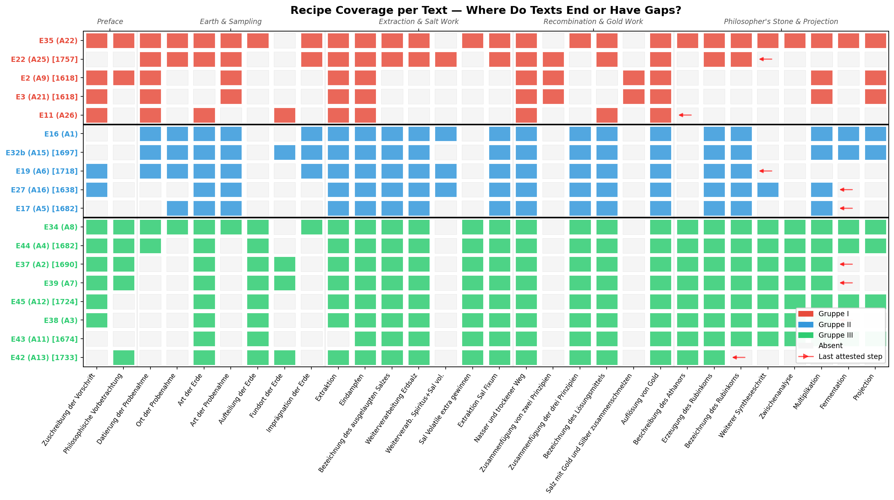

---

### Figure D: Text Relationship Network on Approximate Timeline

**File:** `processus_figD_network_timeline.png`

**Technical description:**
A network graph overlaid on a timeline. Nodes represent texts; edges represent similarity.

**Node placement:**
- The y-axis has three horizontal "lanes," one per group (Gruppe I at top, II in middle, III at bottom)
- The x-axis represents approximate date. For dated texts (those with a `when` attribute in the XML), the x-position is the year.
- For undated texts, the x-position is estimated by finding the most similar dated text (highest value-level Jaccard similarity) and placing the undated text at the same x-position. If multiple texts end up at the same (group, x) position, they are spread apart slightly using evenly-spaced jitter offsets.
- Dated texts are drawn as circles with black edges; undated texts are squares with grey edges.

**Node size:** Proportional to completeness — `150 + (number of present categories) × 20` pixels.

**Edges:**
- Solid lines connect each text to its "nearest neighbour" — the single most similar text in the entire corpus (highest Jaccard similarity on annotation values). This creates a nearest-neighbour graph, an approximation of what in textual scholarship is called a stemma (a family tree of manuscript relationships).
- Dashed lines are drawn for any additional text pairs with Jaccard similarity > 0.7 that aren't already connected by a nearest-neighbour edge. These show secondary relationships.
- Edge thickness and opacity are proportional to similarity.
- Similarity values > 0.6 are labelled at the edge midpoint.

**In plain language:** *This visualisation tries to answer: "Which recipes might have been copied from or inspired by which others?" Each recipe is placed on a rough timeline (left = older, right = newer) and in its group's row. Lines connect recipes that share the most annotations. Thicker lines mean more similar.*

*Think of it as a simplified family tree of the texts. When two recipes are connected by a thick line, their expert annotations match closely, suggesting one may have been copied from the other, or both from a common source. Square nodes are undated — the code has estimated their position based on which dated texts they most resemble. The node size shows how complete each recipe is, so you can see whether shorter, fragmentary texts cluster near more complete ones (which might suggest they are excerpts).*

*Crucially, lines crossing between group lanes (connecting different-coloured nodes) reveal potential inter-group transmission. For instance, E35 (Gruppe I) has a strong connection to E34 (Gruppe III), suggesting these two texts share a significant amount of procedural detail despite being assigned to different groups.*

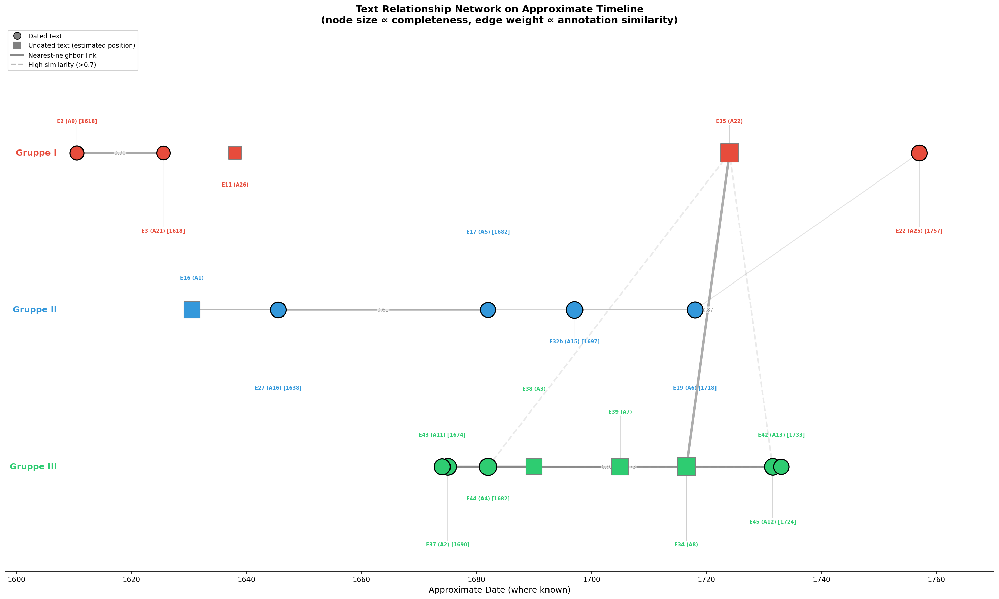

---

### Figure E: Shared vs Group-Unique Annotation Values by Recipe Phase

**File:** `processus_figE_shared_values.png`

**Technical description:**
Five panels, one per recipe phase. For each phase, the script collects all distinct (category, value) pairs used by any text in each group. It then partitions these into seven mutually exclusive subsets using set operations:

- **All 3**: values found in at least one text of every group (intersection of all three sets: `g1 ∩ g2 ∩ g3`)
- **I∩II**: values shared by Gruppe I and II but not III (`(g1 ∩ g2) − g3`)
- **I∩III**: values shared by Gruppe I and III but not II (`(g1 ∩ g3) − g2`)
- **II∩III**: values shared by Gruppe II and III but not I (`(g2 ∩ g3) − g1`)
- **Only I**: values found only in Gruppe I (`g1 − g2 − g3`)
- **Only II**: values found only in Gruppe II (`g2 − g1 − g3`)
- **Only III**: values found only in Gruppe III (`g3 − g1 − g2`)

These counts are shown as a bar chart for each phase. A text annotation shows the total number of distinct values and the percentage shared by all three groups.

**In plain language:** *This figure asks: "At each stage of the recipe, how much do the three groups share in terms of specific chemical details, and how much is unique to each?" For example, in the "Extraction & Salt Work" phase, there are 105 distinct annotation values across all texts. But only 14% of these are shared by all three groups — each group describes this phase with a lot of its own specific terminology and procedural detail.*

*This is significant for understanding recipe evolution. If all three groups descended from a single original text, you'd expect a large shared core of values (things everyone copied faithfully) with smaller amounts of unique additions. The pattern we see — large "Only II" bars in the later phases — suggests that Gruppe II in particular elaborated on the procedural details, either from additional sources or from their own experimental experience.*

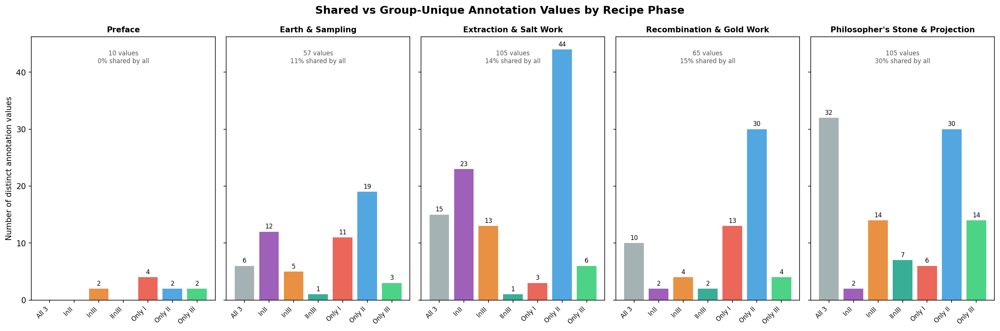

---

### Figure F: Text Reuse vs Annotation Similarity

**File:** `processus_figF_text_reuse.png`

**Technical description:**
Two side-by-side heatmaps comparing two different types of similarity across the same 18 texts.

**Left panel — Text Reuse (word 4-gram overlap):**
The plain text of each recipe is extracted from the XML (stripping all tags), lowercased, and split into words. For each text, a set of all consecutive 4-word sequences (4-grams) is generated. The 4-gram Jaccard similarity between two texts is then: `|4grams_A ∩ 4grams_B| / |4grams_A ∪ 4grams_B|`. A 4-gram match means four consecutive words appear in exactly the same order in both texts — this is a strong indicator of direct text reuse or copying, since it's unlikely to happen by coincidence.

The colour scale is capped at 0.5 (rather than 1.0) because text reuse scores are naturally lower than annotation similarity scores — even closely related manuscripts may use slightly different wording.

**Right panel — Annotation Similarity (value-level Jaccard):**
The same Jaccard similarity on expert-annotated (category, value) pairs as used in Figures 3 and 4, for direct comparison.

Texts are ordered by group (I, II, III) on both axes.

**In plain language:** *This figure places two different ways of measuring similarity side by side to answer the question: "Do shared words mean shared chemistry?"*

*The left heatmap measures verbatim text reuse — how many four-word phrases appear in both recipes. This detects direct copying. The right heatmap measures whether the expert annotations match — whether two recipes describe the same chemical procedures with the same specific details, regardless of exact wording.*

*Comparing the two is revealing. When both heatmaps show high similarity for a pair of texts (both squares are warm-coloured), it means these recipes share both the same words and the same chemical content — strong evidence of direct copying. When the annotation heatmap shows similarity but the text-reuse heatmap does not, it means the recipes describe the same procedures but in different words — suggesting independent transmission of the same chemical knowledge, perhaps through oral teaching, laboratory demonstration, or deliberate rewriting.*

*The fact that the annotation similarity (right) shows clearer group structure than the text reuse (left) tells us something important: the chemical procedures were transmitted more consistently than the exact wording. Scribes felt free to rephrase, but the underlying experimental steps remained recognisable — which is exactly what the scholars of the Gotha Alchemy Network found in their chemical and historical analysis.*

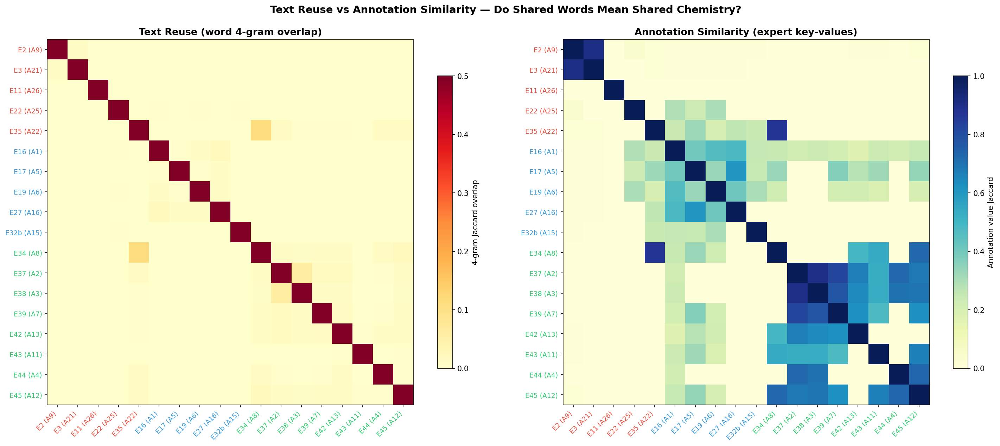

---

## 5. Text Reuse Analysis

**Script:** `text_reuse_analysis.py`

This script addresses the central question: *If we built a "family tree" of these recipes using only their words (without expert annotations), would it match the one built from expert annotations?* It uses 17 clean lowercase text files from the `processus_prev_work/` directory (E43/A11 is missing a text file) and compares three similarity measures across all text pairs.

### Three Similarity Measures

1. **Raw word 4-grams:** Each text is split into words and all consecutive 4-word sequences are collected as a set. Jaccard similarity between these sets detects verbatim text reuse.
2. **Phonetic 4-grams (Cologne encoding):** Before building 4-grams, each word is converted to a phonetic code using the *Kölner Phonetik* (Cologne phonetic encoding) — a German-language equivalent of Soundex. This collapses spelling variants like "prussiat" / "prussiat" / "prussyat" to the same code, revealing text reuse hidden by orthographic variation in Early Modern German.
3. **Annotation values (expert):** The Jaccard similarity on all (category, value) pairs from the expert XML annotations, as used in Figures 3–4.

### Key Results

| Comparison | Pearson r | Interpretation |
|---|---|---|
| Raw text ↔ Annotations | 0.569 | Moderate correlation — text sharing partially predicts annotation similarity |
| Phonetic ↔ Annotations | 0.585 | Slightly better — phonetic normalisation helps |
| Raw text ↔ Phonetic | 0.981 | Near-identical — most text reuse is already captured at the raw level |
| Tree topology (raw ↔ anno) | 0.170 | Weak — the clustering *trees* don't match well |
| Tree topology (phon ↔ anno) | 0.305 | Better but still weak — tree structure is harder to recover |

**Nearest-neighbour agreement:** For 12 of 17 texts (71%), the raw text's closest match is the same as the annotation's closest match. This means automated text analysis correctly identifies the most closely related manuscript in the majority of cases.

**Within- vs between-group separation:** Text reuse actually shows *stronger* group separation than annotations: within-group text similarity is 3.9–4.3× higher than between-group (compared to 2.5× for annotations). This means the group structure is real and detectable from the text alone.

---

### Figure G: Three Similarity Measures Compared

**File:** `processus_figG_three_similarities.png`

**Technical description:**
Three side-by-side heatmaps showing the same 17×17 text pairs measured three different ways: raw word 4-gram Jaccard (left), phonetic 4-gram Jaccard (centre), and annotation value Jaccard (right). Texts are ordered alphabetically by E-name, with axis labels coloured by group (red = Gruppe I, blue = Gruppe II, green = Gruppe III). The diagonal is excluded (self-similarity = 1.0). The text-based heatmaps share a colour scale (0–0.35); the annotation heatmap uses a separate scale (0–1.0) because annotation similarity values are much higher.

**In plain language:** *This figure places three different "lenses" on the same set of texts side by side. The left two panels ask "do these recipes share the same words?"; the right panel asks "do these recipes describe the same chemistry?"*

*The most striking observation is that the block structure visible in the annotation heatmap (right) — the clear group clusters — also appears in the text-based heatmaps (left and centre), though more faintly. The Gruppe III texts (E34, E35, E37, E38, E39, E42, E44, E45) form the most prominent cluster in all three views. This means the group structure identified by human experts is independently confirmed by simple word-level text comparison.*

*The phonetic heatmap (centre) shows slightly more off-diagonal warmth than the raw text heatmap (left), indicating that phonetic normalisation is revealing some additional text reuse that exact word matching misses — but the effect is subtle rather than dramatic.*

---

### Figure H: Phonetic Normalisation Gain

**File:** `processus_figH_phonetic_gain.png`

**Technical description:**
A scatter plot where each point represents one pair of texts. The x-axis is the raw word 4-gram Jaccard similarity; the y-axis is the phonetic 4-gram Jaccard similarity. A diagonal dashed line marks "no gain" — points above this line have higher phonetic similarity than raw text similarity, meaning the Cologne encoding revealed additional matches hidden by spelling variation. Points are coloured by relationship: within-group pairs use group colours (circles), between-group pairs are grey crosses.

**In plain language:** *This figure answers: "Does phonetic normalisation actually help?" Each dot is a pair of recipes. If a dot sits above the dashed line, it means the phonetic encoding found more shared word sequences than exact text matching — the two recipes share passages that were previously hidden by different spellings of the same words.*

*Most points sit above the diagonal, confirming that phonetic normalisation consistently reveals additional text reuse. The gain is largest for the Gruppe III pairs (green dots), which makes sense — Gruppe III contains texts from diverse sources that may have been copied through different scribal traditions, each with its own spelling habits.*

*However, the gain is relatively modest overall. The near-perfect correlation between raw and phonetic similarities (r = 0.981) means that for this corpus, most text reuse is detectable from exact word matches alone. Phonetic normalisation helps at the margins but does not fundamentally change the picture.*

---

### Figure I: Comparative Dendrograms

**File:** `processus_figI_comparative_dendrograms.png`

**Technical description:**
Three dendrograms (hierarchical clustering trees) produced from the same 17 texts using three different distance measures: raw word 4-gram distance (left), phonetic 4-gram distance (centre), and annotation value distance (right). All three use Ward's linkage method. Leaf labels show E-name with A-name and group in parentheses, coloured by group. The y-axis shows Ward distance (not directly comparable across panels due to different input scales).

**In plain language:** *This is the core comparison for the research question. If the text-based trees (left and centre) look like the annotation tree (right), it means automated text analysis can reconstruct the relationships that human experts identified through careful chemical analysis.*

*The annotation tree (right) shows the clearest group separation: Gruppe III texts cluster together tightly, and Gruppe I/II texts form their own subtrees. The text-based trees (left and centre) partially recover this structure — Gruppe III texts generally cluster together — but with notable differences. For example, the position of E35 (Gruppe I) varies across the three trees, and some within-group relationships change order.*

*The cophenetic correlation between these trees (see Figure K) quantifies this: the tree topologies correlate at r = 0.17 (raw text) and r = 0.31 (phonetic), meaning the overall tree shapes are only weakly similar. This tells us something important: while text analysis correctly identifies *which pairs* of texts are most similar (71% nearest-neighbour agreement), the global tree structure — the deeper branching pattern that would tell us about the historical transmission pathway — is not reliably recovered from text alone. This is where human expert knowledge adds irreplaceable value.*

---

### Figure J: Nearest-Neighbour Comparison Graph

**File:** `processus_figJ_nn_comparison.png`

**Technical description:**
A network graph showing each text as a node (coloured and shaped by group: squares for Gruppe I, circles for Gruppe II, rounded squares for Gruppe III). For each text, two edges are drawn:

- **Solid grey line:** connects the text to its nearest neighbour by annotation similarity (the text most similar according to expert-annotated chemical content)
- **Dashed orange line:** connects the text to its nearest neighbour by phonetic 4-gram similarity (where this differs from the annotation-based nearest neighbour)

If both methods agree on the nearest neighbour, only the solid grey line appears. Node positions are determined by a spring-layout algorithm, so spatially close nodes tend to be more similar.

The table printed to console alongside this figure shows, for each text, who its nearest neighbour is according to each of the three methods, and whether they agree.

**In plain language:** *This figure shows "closest relative" assignments — for each recipe, which other recipe is most similar to it? — and compares two different ways of determining this.*

*Solid grey lines show the expert-annotated "closest relative." Dashed orange lines show where the automated text analysis disagrees and points to a different closest relative. When there is no dashed line, the two methods agree.*

*The agreement rate is 71% (12 out of 17 texts), which is encouraging. The automated method correctly identifies the closest relative for the majority of texts. The five disagreements (E11, E22, E27, E32b, E45) tend to involve texts that are relatively isolated or sit at group boundaries, where the difference between the top two candidates is small.*

*This suggests that for well-connected texts with clear relationships, automated text comparison can reliably identify the most closely related manuscript. For edge cases and boundary texts, human expertise remains essential.*

---

### Figure K: Cophenetic Distance Correlation

**File:** `processus_figK_cophenetic.png`

**Technical description:**
Two scatter plots comparing the cophenetic distances from the text-based clustering trees to those from the annotation-based tree. Cophenetic distance is the height in the dendrogram at which two items first join the same cluster — it represents how "far apart" two items are in the tree structure.

- **Left panel:** cophenetic distances from the raw text tree (x) vs the annotation tree (y)
- **Right panel:** cophenetic distances from the phonetic text tree (x) vs the annotation tree (y)

Each point is one pair of texts. Points are coloured by group relationship: within-group pairs use the group colour (circles), between-group pairs are grey crosses. The Pearson correlation r is shown in the title.

**In plain language:** *This figure asks the most rigorous version of the question: "Do the text-based family trees and the annotation-based family tree have the same shape?" Rather than just checking if nearest neighbours agree (Figure J), this checks whether the *entire branching structure* matches.*

*The answer is sobering: the raw text tree correlates with the annotation tree at only r = 0.170, meaning the two tree shapes are only very weakly related. The phonetic tree does better (r = 0.305) but is still far from a strong match. The scatter of points confirms this visually — there is no tight linear relationship.*

*What this means in practical terms: automated text analysis can tell you which pairs of texts are closely related (it gets the nearest-neighbour right 71% of the time), but it cannot reliably reconstruct the *overall family tree* of manuscript transmission. The branching order — which text descended from which, and through what intermediate copies — requires the kind of domain knowledge that the expert annotators bring: understanding of chemical procedures, laboratory practices, and the intellectual traditions behind the recipes.*

*This is a meaningful finding for the digital humanities: simple automated methods can provide a useful first pass for identifying candidate relationships in a large corpus, but they cannot replace close expert reading for reconstructing complex transmission histories.*

---

## 6. Key Concepts Explained

This section explains the computational concepts used in the analyses for readers without a technical background.

### Jaccard Similarity

The Jaccard similarity is one of the simplest and most intuitive ways to compare two sets of items. Imagine two recipes each have a list of features (like ingredients, or process steps). The Jaccard similarity is:

    (number of features they share) / (total number of features mentioned by either)

If two recipes both mention 10 of the same features and have 15 features in total between them, the Jaccard similarity is 10/15 ≈ 0.67. If they share nothing, it's 0. If they're identical, it's 1.

In this project, Jaccard similarity is used in two ways:
- **Presence-level Jaccard:** Compares which process steps are present or absent (a set of 30 yes/no decisions)
- **Value-level Jaccard:** Compares the specific annotation values — e.g., not just "does this recipe describe the type of earth?" but "does it specifically say 'fette schwarze Erde'?" This is more fine-grained and produces a much larger set of items to compare.

### Hierarchical Clustering and Dendrograms

Hierarchical clustering is a method for grouping items by similarity, producing a tree-like diagram called a dendrogram. The algorithm works bottom-up:

1. Start with each text as its own cluster
2. Find the two most similar clusters and merge them
3. Repeat until everything is in one cluster

The height at which two clusters are joined in the dendrogram represents how different they are — items joined low down are very similar; items joined high up are quite different.

**Ward's method** (used here) is a specific strategy for deciding how to measure the distance between clusters. It merges clusters in a way that minimises the total internal variation. In practice, this tends to produce compact, evenly-sized clusters and is well-suited for detecting natural groupings.

For textual scholars, the dendrogram is analogous to a stemma codicum (a family tree of manuscripts), though with an important difference: a stemma implies actual historical descent, while a clustering dendrogram only shows similarity. Similar texts *may* descend from the same source, but they could also have arrived at similar content independently.

### N-gram Overlap

An "n-gram" is a sequence of n consecutive words. For example, in the sentence "Die Erde soll man ausbreiten," the 4-grams are: ("Die", "Erde", "soll", "man"), ("Erde", "soll", "man", "ausbreiten").

Two texts that share a 4-gram contain the exact same sequence of four words somewhere in their text. This is a strong signal of direct copying or close textual dependence, because the probability of four specific words appearing in the same order by chance is very low.

The 4-gram Jaccard similarity between two texts is computed exactly like the annotation Jaccard above, but the "features" being compared are these word sequences rather than annotation labels. Lower n-gram values (like 2 or 3) would capture more matches but also more coincidental ones; higher values (like 5 or 6) are more conservative but may miss lightly edited passages. The value of 4 is a standard choice in text-reuse detection that balances sensitivity and specificity.

### Rolling Average

A rolling (or moving) average smooths out short-term fluctuations to reveal underlying trends. With a window of 3, each point on the smoothed line is the average of itself and its two immediate neighbours. This is used in Figure B to make the divergence trends across recipe steps easier to read, since individual steps may have noisy values due to the small corpus size (only 5–8 texts per group).

### Divergence

In Figure A, "divergence" at each recipe step is defined as the difference between the group with the highest inclusion rate and the group with the lowest. This is a simple and interpretable measure: a divergence of 0 means all groups agree perfectly (either all include or all exclude the step); a divergence of 1 means at least one group always includes it while another never does.

---

### Cologne Phonetic Encoding (Kölner Phonetik)

The Cologne phonetic encoding is a phonetic algorithm designed specifically for German (unlike Soundex, which is designed for English). It maps each word to a numeric code based on how it sounds, collapsing spelling variants to the same representation. For example:

- Consonant clusters like "sch", "ph", "dt" are mapped to single codes
- Vowels are generally ignored (mapped to 0 and then removed)
- Context-dependent letters like "c" are handled (e.g., "c" before "a,o,u" sounds different than before "e,i")
- German-specific characters (ä, ö, ü, ß) are mapped to their phonetic equivalents

This is essential for Early Modern German texts, where standardised spelling did not yet exist. A scribe in Gotha might spell a word differently from a scribe in Leipzig, but the phonetic code will match if they meant the same word. By comparing phonetic 4-grams rather than raw word 4-grams, we can detect text reuse that would otherwise be hidden by spelling variation.

### Cophenetic Distance

The cophenetic distance between two items in a dendrogram is the height (y-axis value) at which they first join the same cluster. Items that merge early (low cophenetic distance) are closely related in the tree; items that merge late (high cophenetic distance) are distantly related. By correlating the cophenetic distances from two different dendrograms (e.g., one built from text similarity and one from annotation similarity), we can measure how similar the two tree topologies are overall — not just at the leaf level (nearest neighbours) but through the entire branching structure.

---

## 7. Output Files Reference

| File | Format | Contents |
|---|---|---|
| `processus_annotations.csv` | CSV | 540 rows (18 texts × 30 categories). Columns: text identifiers (both nomenclatures), group (both nomenclatures), date, category, presence flag, value count, values. |
| `processus_matrix.csv` | CSV | 18 rows × 30+ columns. Binary presence/absence matrix with metadata columns. |
| `processus_data.json` | JSON | Full structured data: nomenclature mappings, master vocabulary, and all text annotations with values. Used as input by both visualisation scripts. |
| `processus_nomenclature.csv` | CSV | 22 rows. A↔E name equivalency table. Flags which texts are present in the XML corpus. |
| `processus-universalis-graphics/processus_fig1_heatmap.png` | PNG | Presence/absence grid, grouped by Gruppe. |
| `processus-universalis-graphics/processus_fig2_category_bars.png` | PNG | Category frequency, stacked by group. |
| `processus-universalis-graphics/processus_fig3_dendrogram.png` | PNG | Hierarchical clustering tree. |
| `processus-universalis-graphics/processus_fig4_similarity.png` | PNG | Pairwise similarity heatmap. |
| `processus-universalis-graphics/processus_fig5_completeness.png` | PNG | Completeness and word count side-by-side. |
| `processus-universalis-graphics/processus_fig6_group_profiles.png` | PNG | Group-distinctive process steps. |
| `processus-universalis-graphics/processus_figA_flow_divergence.png` | PNG | Group agreement at each recipe step + divergence trend. |
| `processus-universalis-graphics/processus_figB_pairwise_divergence.png` | PNG | Pairwise group divergence across recipe flow. |
| `processus-universalis-graphics/processus_figC_coverage.png` | PNG | Per-text coverage grid showing gaps and truncation. |
| `processus-universalis-graphics/processus_figD_network_timeline.png` | PNG | Nearest-neighbour network on approximate timeline. |
| `processus-universalis-graphics/processus_figE_shared_values.png` | PNG | Shared vs unique annotation values by recipe phase. |
| `processus-universalis-graphics/processus_figF_text_reuse.png` | PNG | Text reuse (4-gram) vs annotation similarity comparison. |
| `processus-universalis-graphics/processus_figG_three_similarities.png` | PNG | Three-way similarity comparison (raw text, phonetic, annotations). |
| `processus-universalis-graphics/processus_figH_phonetic_gain.png` | PNG | Phonetic normalisation gain scatter plot. |
| `processus-universalis-graphics/processus_figI_comparative_dendrograms.png` | PNG | Three comparative dendrograms (text vs annotation clustering). |
| `processus-universalis-graphics/processus_figJ_nn_comparison.png` | PNG | Nearest-neighbour agreement network graph. |
| `processus-universalis-graphics/processus_figK_cophenetic.png` | PNG | Cophenetic distance correlation (tree topology comparison). |

---

*Documentation generated for the Processus Universalis analysis pipeline. All scripts and outputs are in `/Users/slang/claude/`.*
