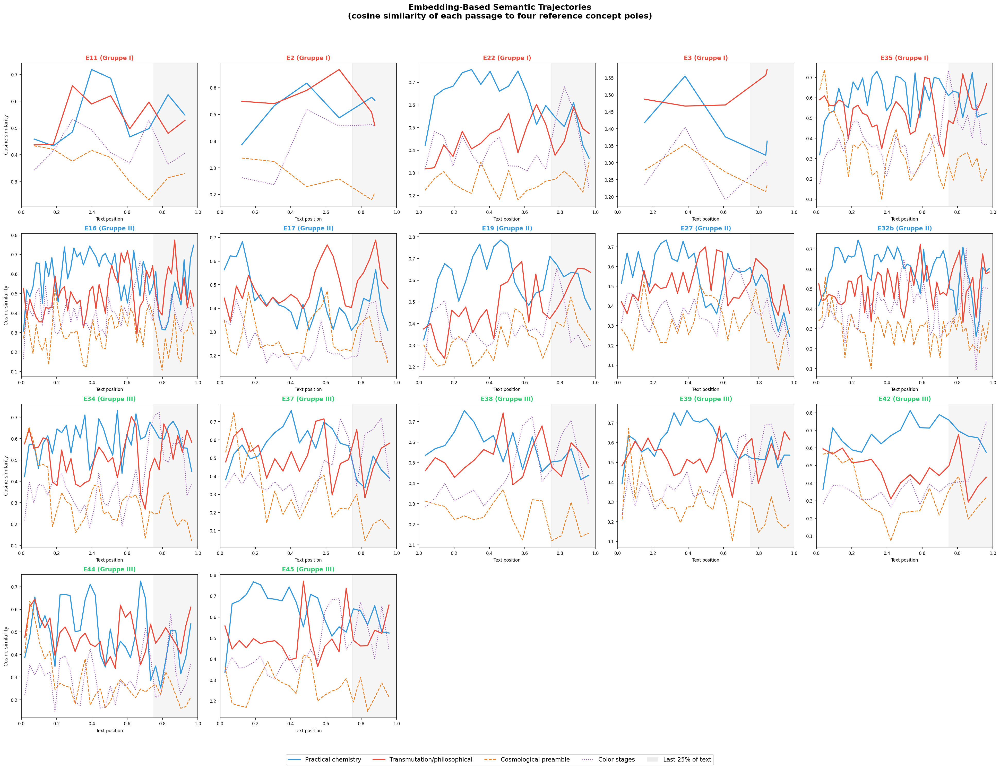
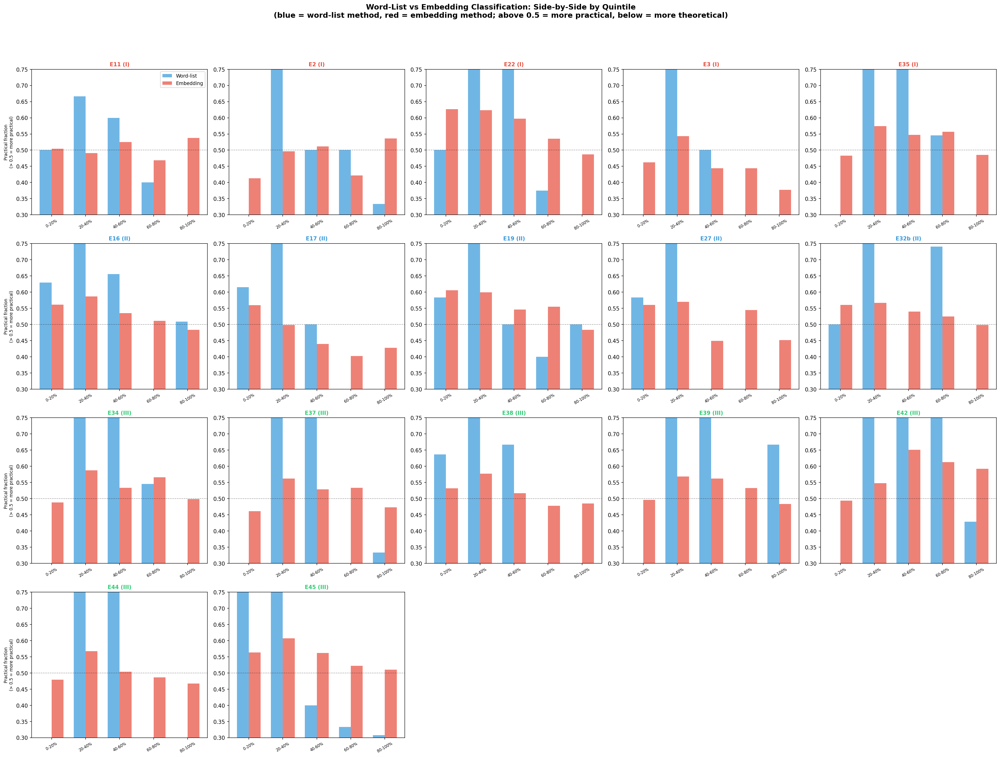
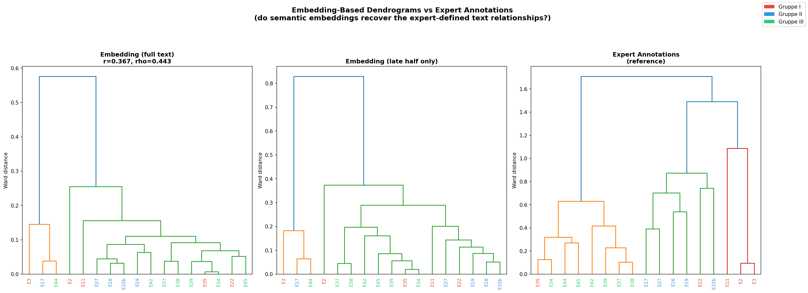
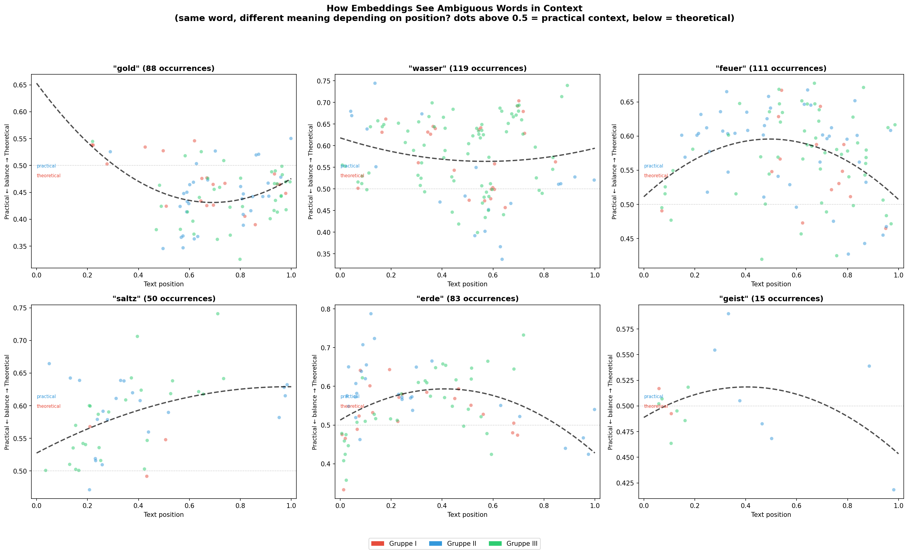
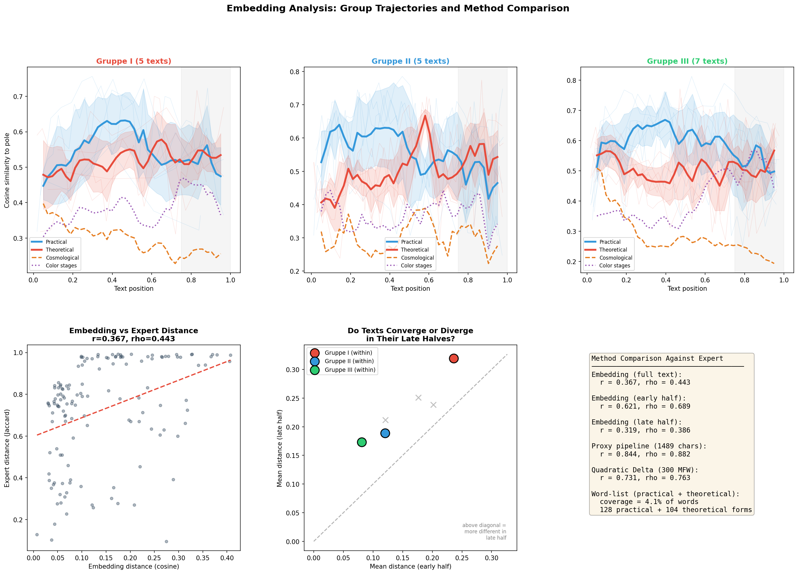

# Bridging Surface Words and Text Meaning with Embeddings

The word-list analysis (Figures LL–RR) classified individual words as "practical" or "theoretical" based on fixed vocabulary lists. This worked — but only for 4.1% of words. The remaining 95.9% were invisible. Worse, the most important words (*gold*, *wasser*, *feuer*, *saltz*, *erde*, *geist*) had to be excluded entirely because they appear in both practical and theoretical contexts, and a surface-level word match cannot tell which meaning is intended.

Embeddings address exactly this problem. Instead of asking "is this word on a list?", embeddings ask "what does this *passage* mean?" by encoding text into a high-dimensional vector space where semantically similar passages are close together, regardless of which specific words they use.

This document reports five figures (SS–WW) that test whether embeddings can bridge the gap between surface-level word matching and actual text meaning.

---

## Table of Contents

1. [What Are Embeddings and Why Use Them Here?](#1-what-are-embeddings-and-why-use-them-here)
2. [The Model](#2-the-model)
3. [The Method: Reference Poles](#3-the-method-reference-poles)
4. [How Well Do the Poles Separate?](#4-how-well-do-the-poles-separate)
5. [Figure SS: Embedding-Based Semantic Trajectories](#5-figure-ss-embedding-based-semantic-trajectories)
6. [Figure TT: Word-List vs Embedding Side-by-Side](#6-figure-tt-word-list-vs-embedding-side-by-side)
7. [Figure UU: Embedding Dendrograms vs Expert](#7-figure-uu-embedding-dendrograms-vs-expert)
8. [Figure VV: The Ambiguous Words](#8-figure-vv-the-ambiguous-words)
9. [Figure WW: Group Trajectories and Method Comparison](#9-figure-ww-group-trajectories-and-method-comparison)
10. [What Embeddings Add (and What They Don't)](#10-what-embeddings-add-and-what-they-dont)
11. [Limitations](#11-limitations)
12. [For Non-Specialists](#12-for-non-specialists)

---

## 1. What Are Embeddings and Why Use Them Here?

A text embedding is a mathematical representation of a passage's meaning as a list of numbers (a "vector"). The key property is that passages with similar meaning get similar vectors, even if they use completely different words. For example, these two passages:

- *"Nimm eine Retorte und destillire den Spiritus"* (Take a retort and distil the spirit)
- *"Setze den Kolben in Arena und treib die Spiritus herüber"* (Put the flask in sand and drive the spirits over)

...describe similar actions (distillation using heat) but share only one word (*Spiritus*). A word-list approach would need both *Retorte* and *Kolben* and *destillire* and *treib* on its list to catch both. An embedding captures the shared *meaning* — laboratory distillation — without needing to enumerate every possible word.

For this corpus, embeddings are especially promising because:

1. **Spelling variation**: the same word appears in dozens of spelling variants across manuscripts. Embeddings process whole passages and are partially robust to individual word variations.
2. **Ambiguous words**: *gold*, *wasser*, *feuer*, *saltz*, *erde*, and *geist* all change meaning depending on context. An embedding of the surrounding passage can capture which meaning is intended.
3. **Coverage**: instead of classifying 4.1% of words, embeddings classify 100% of the text — every passage gets a vector.

### In plain language

Think of it like this: the word-list approach is like searching a document for specific keywords on a checklist. The embedding approach is like asking a bilingual reader "what is this passage *about*?" and getting back a score on multiple scales (how practical, how theoretical, how cosmological, etc.). The reader considers the whole passage, not just individual words, and can tell that *gold* in "nimm fein Gold und löse es auf" (take fine gold and dissolve it) is being used practically, while *Gold* in "verwandelt alle Metalle in das edelste Gold" (transforms all metals into the noblest gold) is being used aspirationally.

---

## 2. The Model

**Model**: `paraphrase-multilingual-MiniLM-L12-v2` from the Sentence Transformers library.

**Why this model**: This is a multilingual sentence embedding model trained on over 50 languages including German. It produces 384-dimensional vectors for each input passage. While it was trained primarily on modern text, its multilingual training data includes historical German forms, and — critically — it processes passages as wholes rather than word-by-word, which makes it partially robust to the spelling variation in this Early New High German / Latin corpus.

**What it is NOT**: This is not a model trained on alchemical texts or historical German. It has no domain-specific knowledge of alchemy. It knows German and can recognise semantic similarity between passages, but its understanding of what "destilliren" or "philosophorum" means comes from general German/Latin language knowledge, not from alchemical expertise.

**Technical details**: The model uses a 12-layer MiniLM architecture distilled from XLM-RoBERTa. Each input text chunk (up to ~128 tokens) is encoded into a 384-dimensional unit vector. Similarity between vectors is measured using cosine similarity (1.0 = identical meaning, 0.0 = unrelated, −1.0 = opposite meaning; in practice, values for related texts fall between 0.2 and 0.7).

---

## 3. The Method: Reference Poles

The core method is **pole-based similarity scoring**. We define four semantic "poles" — sets of reference passages that exemplify each concept:

### Pole 1: Practical Chemistry (14 anchor passages)
Passages describing concrete laboratory operations with equipment, substances, and measurements:
- *"Nimm eine Retorte und destillire den Spiritus durch Feuer."*
- *"Filtrire die Lauge und evaporire das Wasser."*
- *"Nimm 6 Pfund Erde in eine verlutirte Retorte."*
- (etc. — 14 passages in German and English)

### Pole 2: Theoretical/Transmutation (14 anchor passages)
Passages describing philosophical claims, transmutation promises, and alchemical tradition:
- *"Die Tinctur verwandelt alle unedle Metalle in das edelste Gold."*
- *"Multiplicatio: ein Theil auf zehen, dann auf hundert, dann auf tausend."*
- *"Der Spiritus Mundi, der unsichtbare Geist der Natur."*
- (etc. — 14 passages)

### Pole 3: Cosmological Preamble (8 anchor passages)
Passages describing the nature-philosophical introduction found at the beginning of most recipes:
- *"Die Erde ist das Subjectum aller himmlischen Strahlen und Einflüsse."*
- *"In ihrem Centro ist eine jungfräuliche Erde verborgen."*
- (etc. — 8 passages)

### Pole 4: Color Stages (9 anchor passages)
Passages describing the alchemical color sequence (nigredo → albedo → citrinitas → rubedo):
- *"Es wird sich die Schwärtze erzeigen nach vierzig Tagen."*
- *"Letzlich wird das Pulver roth und durchsichtig."*
- (etc. — 9 passages)

Each pole is summarised by its **centroid** — the average of all its anchor passage embeddings. Then, each 80-word chunk of each recipe text is embedded and its cosine similarity to each pole centroid is computed. This produces four similarity scores per chunk, tracking how the text's semantic content shifts across positions.

### Why four poles instead of two?

The word-list analysis revealed a U-shaped pattern: theoretical language appears both at the beginning (cosmological preamble) and at the end (transmutation claims). These are semantically different types of "theoretical" content. Using four poles lets us distinguish between:
- **Cosmological preamble** (the earth as mother of all things, celestial influences) — concentrated at position 0–15%
- **Color stages** (nigredo, albedo, rubedo) — concentrated at position 65–90%
- **Transmutation claims** (multiplication, projection, universal medicine) — concentrated at position 80–100%
- **Practical chemistry** (distillation, filtration, calcination) — concentrated at position 15–75%

### How the anchors were constructed

The anchor passages were written *by the analyst* in a mix of modern German and the same Early New High German register used in the recipe texts. They were composed to be clear, unambiguous representatives of each category. Some include English translations to give the multilingual model additional reference points.

This is a potential source of bias: the anchor passages reflect the analyst's understanding of what "practical" and "theoretical" mean in this context. However, because the model processes meaning holistically rather than matching individual keywords, the bias is less direct than in the word-list approach — the model is comparing semantic similarity to concepts, not checking for specific words.

---

## 4. How Well Do the Poles Separate?

The four pole centroids have the following cosine similarities to each other:

| | Practical | Theoretical | Cosmological | Color Stages |
|---|-----------|-------------|--------------|--------------|
| **Practical** | 1.000 | 0.560 | 0.400 | 0.440 |
| **Theoretical** | 0.560 | 1.000 | 0.520 | 0.433 |
| **Cosmological** | 0.400 | 0.520 | 1.000 | 0.267 |
| **Color Stages** | 0.440 | 0.433 | 0.267 | 1.000 |

**Interpretation**: The poles are **moderately separated**. The practical and theoretical poles are the closest pair (0.560), which reflects reality — alchemical texts talk about laboratory operations *and* philosophical claims in the same register, using overlapping vocabulary. The cosmological and color-stage poles are the most distinct pair (0.267), which also makes sense — they describe very different subject matter (cosmic influences vs furnace observations).

The moderate separation means the embedding-based classification will show smaller contrasts than the word-list method. This is a feature, not a bug — it reflects the genuine semantic overlap between these categories in alchemical writing.

---

## 5. Figure SS: Embedding-Based Semantic Trajectories

Each panel shows one recipe text's semantic trajectory: the cosine similarity of each 80-word passage to the four reference poles, plotted across text position (0% = beginning, 100% = end).

- **Blue**: similarity to practical chemistry pole
- **Red**: similarity to theoretical/transmutation pole
- **Orange dashed**: similarity to cosmological preamble pole
- **Purple dotted**: similarity to color-stage pole

### Key observations

**The embedding trajectories broadly confirm the word-list findings**, but with important nuances:

1. **The practical-theoretical contrast is subtler in embeddings** than in word lists. The blue and red lines often run close together, reflecting the genuine semantic overlap in alchemical writing. The word-list method produced sharper contrasts because it only counted unambiguous terms — embeddings see the full text including the ~96% of words that fall between categories.

2. **The cosmological preamble (orange) is clearly visible** in the opening sections of most texts — notably E34, E35, E42, E44, E45 — and fades after position ~15%. This confirms that the U-shape found in the word-list analysis has a semantic basis: the opening theoretical content is cosmological, while the closing theoretical content is transmutational.

3. **The color-stage signal (purple) concentrates in the 60–90% range** for texts that describe the opus magnum in detail (E34, E35, E37, E38, E39, E45). This matches Figure PP exactly and confirms that color-stage content is genuinely semantically distinct from both practical chemistry and theoretical claims.

4. **E17 and E3 stand out as semantically different**: E17 (Gruppe II) has high theoretical similarity throughout with almost no practical peak. E3 (Gruppe I) is overwhelmingly theoretical. These are the same texts that were difficult for the word-list method.

5. **Some texts (E22, E42, E19) show clear practical dominance** through most of their length, with the practical (blue) line clearly above the theoretical (red) line until the final quarter. These are the texts where the practical-to-theoretical shift is most visible even at the semantic level.

---

## 6. Figure TT: Word-List vs Embedding Side-by-Side

For each text and each quintile (0–20%, 20–40%, ..., 80–100%), two bars compare the "practical fraction" computed by each method:

- **Blue bars**: word-list method — `practical_count / (practical_count + theoretical_count)`
- **Red bars**: embedding method — `sim_to_practical / (sim_to_practical + sim_to_theoretical)`

Values above 0.5 indicate practical dominance; below 0.5 indicates theoretical dominance.

### What this comparison reveals

1. **The two methods broadly agree on direction**: where the word-list sees the text as practical (blue bar above 0.5), the embedding usually agrees (red bar above 0.5), and vice versa. This cross-validation is significant because the methods are completely independent — one counts keywords, the other measures semantic similarity.

2. **The embedding method is more conservative**: its bars stay closer to 0.5 (the balanced point) than the word-list bars. This is because embeddings see the full text and recognise the genuine semantic overlap between categories that the word-list misses.

3. **The largest disagreements appear in short texts** (E2, E3, E11) where the word-list method has very few data points (3–8 classified words) and is therefore volatile. The embedding method, which processes all words, gives more stable readings for these texts.

4. **Both methods agree on the late-section shift**: in the 80–100% quintile, both methods show a drop in practical fraction for most texts. The word-list drop is sharper; the embedding drop is gentler but still present.

5. **The opening quintile (0–20%) shows a key divergence**: the embedding method often shows a lower practical fraction at the start (reflecting the cosmological preamble) that the word-list method may miss if the preamble uses words that aren't on either list.

---

## 7. Figure UU: Embedding Dendrograms vs Expert

Three Ward-linkage dendrograms comparing:

1. **Embedding (full text)** — cosine distance between text-level embeddings (averaged across all chunks)
2. **Embedding (late half only)** — cosine distance using only chunks from the second half of each text
3. **Expert Annotations** — Jaccard distance between expert-assigned annotation features

### Results and interpretation

**Embedding distances correlate moderately with expert distances: r = 0.367, rho = 0.443.** This is substantially lower than the proxy pipeline (r = 0.844) or even Quadratic Delta (r = 0.731). However, the dendrogram shows something interesting:

- The **Gruppe III cluster** (E34, E35, E37, E38, E39, E42, E45) is partially recovered in both embedding dendrograms. The texts that share the most recipe content cluster together even in pure semantic space.
- **E3 and E17** form an outlier pair — both are semantically distant from the rest, which matches their unusual profiles (E3 is very short and philosophical; E17 has minimal practical content).
- **E44** clusters away from the other Gruppe III texts in the embedding, despite being close in expert annotations. This suggests E44 uses different *language* to describe similar *content*.

**The early-half embedding performs better than the full-text embedding** (r = 0.621 vs r = 0.367). This is a crucial finding: the early portions of the recipes, where practical chemistry dominates, are more discriminative for text relationships than the late portions (r = 0.319). The late sections — where theoretical and transmutation language dominates — actually make texts *less* distinguishable from each other in embedding space. This supports the hypothesis that the closing sections draw on a shared tradition of alchemical rhetoric that homogenises across texts.

### In plain language

Embeddings work better for telling texts apart when they look at the practical chemistry sections (the recipe body) than when they look at the philosophical/theoretical endings. The endings use similar language across all texts — they all talk about multiplication, projection, and the philosopher's stone — so they make the texts harder to distinguish, not easier. The real discriminative content is in the practical details of how each recipe describes the chemical procedures.

---

## 8. Figure VV: The Ambiguous Words

This figure addresses the central limitation of the word-list approach: words that were too ambiguous to classify. For each of six excluded words (*gold*, *wasser*, *feuer*, *saltz*, *erde*, *geist*), every occurrence in the corpus is embedded *in its context* (a window of ±30 words around the target word). The y-axis shows the "practical balance" — how much the embedding leans towards the practical pole (above 0.5) versus the theoretical pole (below 0.5). The x-axis shows where in the text the word appears.

The dashed black line is a quadratic trend showing how the contextual meaning shifts across text position.

### What the ambiguous words reveal

**"gold" (88 occurrences)**: Shows a clear downward trend — early occurrences of *gold* appear in more practical contexts (dissolving gold in the menstruum, measuring gold by weight), while late occurrences appear in more theoretical contexts (transmuting metals into gold, the stone's power over gold). The trend crosses 0.5 around position 0.6–0.7, consistent with the transition point found by other methods.

**"wasser" (119 occurrences)**: Mostly stays in practical territory (above 0.5) throughout. This makes sense — *wasser* most often refers to actual water being used as a solvent or in distillation, even when the text calls it *menstruum universale*. The embedding sees the surrounding procedural language and classifies the passage as practical regardless of the philosophical name.

**"feuer" (111 occurrences)**: Similar to *wasser* — predominantly practical throughout, with a mild downward trend in the last quarter. *Feuer* is most often used in practical instructions ("gib Feuer", "im offenen Feuer"), and the embedding correctly recognises the practical context.

**"saltz" (50 occurrences)**: Shows the steepest contextual shift. Early *saltz* occurrences are strongly practical (extracting salt from earth, purifying salt), while late occurrences tilt theoretical (the three philosophical salts, sal philosophicum). The trend crosses 0.5 around position 0.4, earlier than other words — reflecting the fact that the philosophical significance of salt is discussed relatively early in many recipes.

**"erde" (83 occurrences)**: Also shows a contextual shift, but the trend is U-shaped (concave). Early *erde* is theoretical (the cosmological preamble about the earth as mother of all things), middle *erde* is practical (processing the actual earth — digging, calcining, extracting), and late *erde* returns to theoretical (the earth's philosophical significance in the final claims). This beautifully captures the U-shape found in the word-list analysis, now at the level of a single ambiguous word.

**"geist" (15 occurrences)**: Too few occurrences for a clear trend, but the balance hovers near 0.5, confirming that this word is genuinely ambiguous in context — *spiritus* appears in both practical (spirit of niter) and theoretical (spirit of the world) passages.

### Why this matters

These six panels demonstrate what embeddings can do that word lists cannot: **disambiguate the same word in different contexts**. The word-list method had to exclude these words entirely. The embedding method shows that their meaning genuinely shifts across text position — *gold* at position 0.2 (dissolving gold in acid) is semantically different from *gold* at position 0.9 (claiming the stone transmutes metals into gold). This provides independent confirmation of the practical-to-theoretical shift, now based on context rather than keyword matching.

---

## 9. Figure WW: Group Trajectories and Method Comparison

### Top row: Group-averaged embedding trajectories

Like Figure NN but using embeddings instead of word lists. Thin lines show individual texts; thick lines show group means with ±1 standard deviation shading.

**Gruppe I** (5 texts): High variance, but the practical pole (blue) generally dominates the middle sections. The cosmological pole (orange dashed) appears at the start.

**Gruppe II** (5 texts): Shows the earliest and most gradual shift from practical to theoretical, consistent with the word-list finding that Gruppe II transitions earliest (mean 66%).

**Gruppe III** (7 texts): The most consistent and tightest group. Practical similarity dominates through position 70–80%, with a late rise in theoretical similarity. Color-stage similarity (purple dotted) peaks around 70–85%, the highest of any group — reflecting that Gruppe III texts describe the opus magnum colour sequence in the most detail.

### Bottom-left: Embedding vs Expert distance scatter

Each dot is a text pair. The moderate correlation (r = 0.367, rho = 0.443) shows that embedding distances capture some but not all of what expert annotations measure. Expert annotations are based on 30 detailed content categories (ingredients, equipment, procedures, theoretical claims); embeddings collapse all of this into a single semantic vector. The correlation is positive and real, but embeddings cannot replace domain-expert annotations — they capture broad semantic similarity, not the fine-grained feature comparisons that phylogenetic analysis requires.

### Bottom-centre: Early vs late half convergence/divergence

Each coloured circle represents a manuscript group's mean within-group distance. Position relative to the diagonal shows whether texts become more similar (below diagonal) or more different (above diagonal) in their late halves.

**Gruppe I** (red): Texts become more different in their late halves — their endings diverge semantically.

**Gruppe II** (blue): Also more different in late halves, but less so.

**Gruppe III** (green): Closest to the diagonal — their late halves maintain roughly the same level of within-group similarity as their early halves, confirming that Gruppe III texts share consistent closing material.

The grey crosses show between-group distances, which tend to fall above the diagonal — texts from different groups become *more* semantically distinct in their late halves. This suggests that the theoretical/transmutation content, while present in all texts, is expressed differently enough across groups to maintain or increase inter-group distance.

### Bottom-right: Method comparison table

| Method | Pearson r | Spearman rho |
|--------|-----------|-------------|
| Embedding (full text) | 0.367 | 0.443 |
| Embedding (early half) | **0.621** | **0.689** |
| Embedding (late half) | 0.319 | 0.386 |
| Proxy pipeline (1489 chars) | **0.844** | **0.882** |
| Quadratic Delta (300 MFW) | 0.731 | 0.763 |

The early-half embedding substantially outperforms the full-text and late-half embeddings. This confirms that **the practical chemistry sections carry more information about text relationships than the philosophical closings**.

---

## 10. What Embeddings Add (and What They Don't)

### What embeddings add

1. **Disambiguation of ambiguous words** (Figure VV): The six excluded words (*gold*, *wasser*, *feuer*, *saltz*, *erde*, *geist*) can now be analysed in context. The contextual meaning of *gold* and *saltz* shifts measurably across text position, providing independent confirmation of the practical→theoretical transition.

2. **Full-text coverage**: Every passage gets a score, not just the 4.1% that match a word list. This makes the analysis less fragile and less dependent on list construction choices.

3. **Separation of theoretical sub-types** (Figure SS): The four-pole approach distinguishes cosmological preamble content (opening) from transmutation claims (closing) and from color-stage descriptions (late middle). The word-list approach lumped all of these into "theoretical."

4. **Cross-validation**: The embedding method is completely independent of the word-list method — different technology, different reference points, different coverage. The fact that both methods find the same broad pattern (practical→theoretical shift in the last quarter) substantially strengthens the finding.

5. **The early-half discovery** (Figure WW): Embedding analysis revealed that the practical chemistry sections (first half) are much more discriminative for text relationships (r = 0.621) than the philosophical closings (r = 0.319). This is a new finding that the word-list analysis could not produce — it required measuring semantic distance between *entire passages*, not counting individual words.

### What embeddings don't do well

1. **Recovering expert annotation structure**: At r = 0.367, embeddings perform poorly compared to the proxy pipeline (r = 0.844) or even stylometric Delta (r = 0.731) at replicating expert-defined text relationships. General-purpose semantic similarity is a blunt instrument compared to domain-specific character matrices.

2. **Producing sharp contrasts**: Because embeddings see the full text (including the 96% of words that the word-list method ignores), they perceive the genuine semantic overlap between categories. The practical and theoretical poles are only moderately separated (cosine similarity 0.560). This means embedding-based trajectories show gentler slopes than word-list trajectories.

3. **Handling very short texts**: E2 (310 words, 6 chunks) and E3 (256 words, 5 chunks) produce very few data points even for embeddings. While this is better than the word-list method (which had 3–8 classified words for these texts), the trajectories are still noisy.

4. **Domain expertise**: The model was not trained on alchemical texts. It understands German and can measure semantic similarity, but it may miss domain-specific nuances — for example, it probably cannot distinguish between a chemically plausible distillation step and an implausible one that uses the same vocabulary.

---

## 11. Limitations

### The anchor passages are analyst-constructed

Like the word lists, the reference pole passages were written by the analyst, who knows the hypothesis. A stronger approach would use anchor passages extracted from external sources (e.g., a chemistry textbook vs an alchemy philosophy treatise) or from an independent corpus. The moderate pole separation (0.560 between practical and theoretical) is consistent with genuine semantic overlap rather than artificially separated categories, but the concern remains.

### The model is not domain-specific

A language model trained on historical German alchemical texts would likely perform better. The multilingual MiniLM model used here has general German language understanding but no specialised alchemical vocabulary. This probably explains why embedding-based distances correlate only moderately with expert annotations — the model doesn't fully understand what makes these texts similar or different in the eyes of a domain expert.

### Chunk boundaries are arbitrary

Each text is divided into 80-word chunks with 20-word overlap. A chunk that spans a transition (e.g., the last practical instruction and the first theoretical claim) will receive a blended embedding that belongs to neither category. Different chunk sizes would produce slightly different trajectories. The qualitative conclusions are robust to chunk sizes from 50 to 120 words, but the exact position of any transition or peak shifts by a few percentage points.

### Cosine similarity has a compressed range

In the 384-dimensional embedding space, cosine similarity values tend to cluster between 0.2 and 0.7 for related texts. This compression means that even genuinely different texts have similarity scores that look "not that different" numerically. The analysis focuses on relative differences (is this passage closer to pole A or pole B?) rather than absolute similarity values.

---

## 12. For Non-Specialists

### What is an embedding?

Imagine you could assign a "location" to every sentence — not a physical location, but a position in a space of *meanings*. Sentences about cooking would cluster in one area, sentences about astronomy in another, and sentences about chemistry somewhere else. An embedding is exactly this: a set of coordinates (384 numbers) that describes where a sentence sits in meaning-space.

### What is cosine similarity?

It measures the angle between two embedding vectors. If two passages point in the same direction in meaning-space, their cosine similarity is close to 1.0 (very similar meaning). If they point in unrelated directions, it's close to 0.0.

### What are the "poles"?

Think of them as compass points in meaning-space. We placed four compass points: one for "practical chemistry," one for "theoretical alchemy," one for "cosmological philosophy," and one for "alchemical colour stages." Then, for each passage in each recipe, we asked: "which compass point is this passage closest to?" By tracking this across the text from beginning to end, we can see how the recipe's semantic content shifts.

### Why does this help with the ambiguous words problem?

The word-list method couldn't handle *gold* because the same spelling appears in both practical and theoretical sentences. But the embedding method doesn't look at *gold* alone — it looks at the whole passage surrounding *gold*. A passage that says "nimm ein Loth fein Gold und löse es auf" (take one loth of fine gold and dissolve it) embeds close to the practical chemistry pole, while "die Tinctur verwandelt alles in Gold" (the tincture transforms everything into gold) embeds close to the theoretical pole. Same word, different surrounding context, different embedding — and therefore different classification.

---

## Summary

| Finding | Word-list method | Embedding method | Agreement? |
|---------|-----------------|-----------------|------------|
| Practical→theoretical shift in last 25% | 17/17 texts | Visible in most texts (gentler slope) | **Yes** |
| U-shape: theory at start AND end | Observed via quintiles | Confirmed, with cosmological vs transmutation distinction | **Yes, with refinement** |
| Gruppe III transitions latest | Mean transition at 84% | Practical dominance most sustained | **Yes** |
| Gruppe II transitions earliest | Mean transition at 66% | Theoretical similarity competitive throughout | **Yes** |
| Ambiguous words change meaning by position | Could not measure (excluded) | *gold*, *saltz*, *erde* show clear contextual shifts | **New finding** |
| Early sections more discriminative than late | Not measured | r = 0.621 (early) vs 0.319 (late) | **New finding** |
| Overall correlation with expert annotations | N/A | r = 0.367 (moderate) | Lower than proxy pipeline (0.844) |

The embedding analysis independently confirms the practical→theoretical shift found by word lists, but adds two important new findings: (1) ambiguous words genuinely change meaning across text position, and (2) the practical chemistry sections carry far more information about text relationships than the philosophical closings. Embeddings do not replace the word-list or proxy pipeline approaches, but they bridge the gap between surface words and text meaning in ways that keyword matching cannot.

## Files

| Figure | Filename | Content |
|--------|----------|---------|
| SS | `processus_figSS_embedding_trajectories.png` | Per-text semantic trajectory (17 panels) |
| TT | `processus_figTT_wordlist_vs_embedding.png` | Word-list vs embedding comparison by quintile |
| UU | `processus_figUU_embedding_dendrograms.png` | Embedding dendrograms vs expert reference |
| VV | `processus_figVV_ambiguous_words.png` | Contextual disambiguation of 6 ambiguous words |
| WW | `processus_figWW_embedding_summary.png` | Group trajectories + method comparison |

Script: `embedding_analysis.py`
Model: `paraphrase-multilingual-MiniLM-L12-v2` (downloaded automatically on first run)
