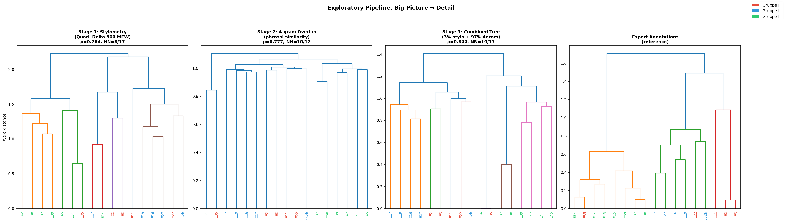
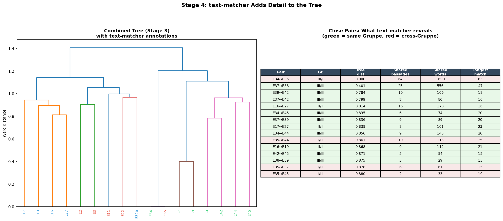
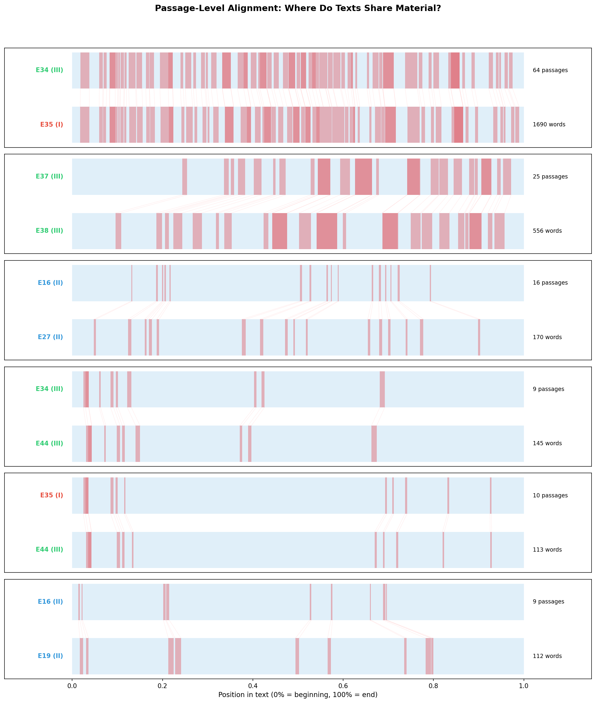

# Exploratory Pipeline: Big Picture to Detail

## The Logic

Previous attempts at combining methods tried to optimize a single distance metric — blending numbers to beat a benchmark. This pipeline instead follows the natural logic of scholarly inquiry:

1. **See the forest first** (stylometry) — what are the major groupings?
2. **See the trees** (4-gram overlap) — who is closest to whom?
3. **Build the best quantitative tree** (combine stages 1–2)
4. **Examine specific branches** (text-matcher) — for pairs the tree identifies as close, *what exactly do they share?*
5. **Explore the evidence** (HTML reports) — read the shared passages, see them in context, compare with neighboring texts

Each stage uses the output of the previous stage to decide *what to look at next*, not just to add another number to a weighted average.

**Script:** `exploratory_pipeline.py`
**Figures:** JJJ–LLL
**HTML Reports:** `detailed_pair_reports/` (37 files)

---

## Stage 1: Stylometry — The Forest

**Method:** Quadratic Delta on the 300 most frequent words. This measures overall writing style — word frequency profiles that characterize how a scribe writes, independent of specific content.

**Result:** ρ=0.764, NN=8/17

**What it tells us:** The broad groupings. Stylometry correctly identifies that E34/E35 are a tight pair, that E2/E3 cluster together, and that Gruppe III texts share a distinctive style. But it gets only 8/17 nearest neighbors right — it sees the forest but misplaces some trees.

**What it passes to Stage 2:** A rough clustering that identifies which texts are stylistically similar. This tells us *where to look more carefully* with finer-grained methods.

---

## Stage 2: 4-gram Overlap — The Trees

**Method:** Jaccard similarity on sets of 4-word sequences. This captures shared phrasal patterns — specific sequences of words that appear in both texts.

**Result:** ρ=0.777, NN=10/17

**What it adds:** 4-gram overlap picks up relationships that stylometry misses, especially among Gruppe II texts (E16, E17, E19, E27) that share procedural phrases. It improves NN from 8 to 10.

**What it passes to Stage 3:** A complementary distance matrix. Where stylometry says "these texts have similar word frequencies" and 4-grams say "these texts share specific phrases," combining them gives a more complete picture.

---

## Stage 3: The Combined Tree

**Method:** Weighted blend of Stage 1 and Stage 2 distances, optimized for nearest-neighbor agreement with expert annotations.

**Result:** ρ=0.844, NN=10/17 (weights: 3% stylometry + 97% 4-gram)

**What the weights mean:** The optimizer overwhelmingly prefers 4-gram overlap over stylometry. This makes sense for this corpus: the *Processus Universalis* texts are all the same genre (alchemical recipes), so stylometric differences are small. Phrasal overlap — which specific 4-word sequences a text contains — is more diagnostic of copying relationships than overall word frequency profiles.

**What it passes to Stage 4:** A ranked list of close pairs. The bottom 25% of pairwise distances identifies 34 pairs as "close" — these are the relationships worth examining in detail.

### Figure JJJ: Pipeline Overview

Four dendrograms showing the progression from stylometry alone → 4-gram alone → combined → expert reference. The combined tree (panel 3) preserves the Gruppe III cluster well and correctly identifies the E34/E35 relationship, though some Gruppe I/II assignments differ from the expert.

---

## Stage 4: text-matcher — The Branches

**Method:** Longest common substring matching (text-matcher) on all 136 text pairs. For each close pair from Stage 3, this identifies the actual shared passages — their content, length, and position.

**What it adds that no previous stage could:** The shift from *how similar* to *what is shared*. A quantitative distance of 0.401 between E37 and E38 becomes "25 shared passages totaling 556 words, the longest being 47 words of near-verbatim procedural text about putrefaction at the 65% position."

### Figure KKK: text-matcher Detail Layer

The combined tree (left) with a table (right) showing what text-matcher found for each close pair. Key observations:

| Pair | Gruppe | Tree dist | Shared passages | Shared words | Longest match |
|------|--------|-----------|-----------------|--------------|---------------|
| E34↔E35 | III/I | 0.000 | 64 | 1690 | 63 words |
| E37↔E38 | III/III | 0.401 | 25 | 556 | 47 words |
| E37↔E42 | III/III | 0.784 | 15 | 126 | 18 words |
| E16↔E27 | II/II | 0.814 | 16 | 170 | 18 words |
| E37↔E39 | III/III | 0.836 | 9 | 89 | 23 words |
| E34↔E44 | III/III | 0.856 | 9 | 145 | 26 words |
| E35↔E44 | I/III | 0.861 | 10 | 113 | 25 words |

**The gradient of relatedness becomes visible:** E34/E35 share 1690 words of verbatim text (near-copies). E37/E38 share 556 (substantial copying). E37/E42 share 126 (selective borrowing). E16/E27 share 170 (Gruppe II phrasal overlap). Each level tells a different story about textual transmission.

### Figure LLL: Passage-Level Alignment

For the 6 most-matched pairs, this shows WHERE in each text the shared material occurs. Red regions are shared; blue are original. Lines connect corresponding passages between texts.

**What this reveals about transmission patterns:**

- **E34↔E35:** Shared material spans the entire text — near-continuous copying from beginning to end. These are versions of the same manuscript.
- **E37↔E38:** Sharing concentrated in the second half (procedural sections). The openings diverge more — different cosmological framing for similar procedures.
- **E16↔E27:** Scattered, shorter matches throughout — shared phrasal conventions rather than extended copying.
- **E34↔E44 and E35↔E44:** Moderate sharing concentrated in specific procedural sections — E44 appears to draw on the E34/E35 tradition for certain procedures but composes independently elsewhere.

---

## Stage 5: Exploration Reports

The pipeline generates **37 HTML reports** in `detailed_pair_reports/`, one for each close pair plus expert-NN pairs and top text-matcher pairs. Each report contains:

### What's in Each Report

1. **Summary statistics** — shared passages, total shared words, percentage of each text that is shared, stylometric distance, 4-gram Jaccard similarity

2. **Full texts side by side with shared passages highlighted** — the complete manuscript text of both texts, with yellow highlighting on every region text-matcher identified as shared. You can scroll through both texts simultaneously to see where copying occurs and where the scribe composed independently.

3. **Passage comparison table** — every shared passage listed with its length, position in each text, and the actual text. Sorted by length (longest first), so the most significant shared material appears at the top.

4. **Nearest-neighbor context** — for each text in the pair, a table showing its 5 closest neighbors by stylometry, 4-gram overlap, and text-matcher score. This places the pair in the broader context of the corpus — is this pair's closest relationship, or does each text have even closer ties elsewhere?

### How to Use the Reports

**To investigate a specific relationship:**
Open the HTML file for that pair (e.g., `E34_E35.html`). The highlighted full texts let you see at a glance how much is shared and where. Scroll to a highlighted passage to read exactly what was copied, then look at the surrounding non-highlighted text to see how the scribe's own composition differs.

**To explore transmission chains:**
Start with a text of interest. Open its report with its nearest neighbor. Note which passages are shared. Then open the neighbor's report with *its* nearest neighbor. Are the same passages shared again? Do they extend or shrink? This traces the chain of copying.

**To identify independent vs. derived content:**
For a pair like E37↔E38 (42–43% shared), the non-highlighted text represents what each scribe contributed independently. Comparing the original regions reveals differences in vocabulary, framing, and theological emphasis that distinguish the scribes even when they work from the same source.

### Available Reports

The full list of generated reports (37 files):

Click to expand full list

All reports are in `detailed_pair_reports/`. Filenames follow the pattern `TextA_TextB.html`.

Key reports to start with:
- `E34_E35.html` — the most extensively shared pair (1690 words, cross-Gruppe)
- `E37_E38.html` — the second most shared (556 words, within Gruppe III)
- `E16_E27.html` — the strongest Gruppe II connection (170 words)
- `E2_E3.html` — Gruppe I short texts (limited sharing)
- `E34_E44.html` — moderate sharing within Gruppe III
- `E11_E22.html` — Gruppe I texts with very little sharing (are they independent compositions?)

A machine-readable `summary.json` file contains all metrics for programmatic access.

---

## What This Pipeline Architecture Gets Right

### 1. Each Method Answers a Different Question

- Stylometry: "Do these texts have similar writing habits?" (authorial/scribal signal)
- 4-gram overlap: "Do these texts share specific phrases?" (textual signal)
- text-matcher: "What exactly was copied, and where?" (transmission signal)
- HTML reports: "Can a scholar verify and interpret the evidence?" (interpretive signal)

### 2. The Zoom Level Matches the Method

Stylometry works at the level of the whole corpus — broad groupings. 4-grams work at the level of pairs — who is close to whom. text-matcher works at the level of passages — what specific text was transmitted. The HTML reports work at the level of the scholar's reading — evidence you can engage with directly.

### 3. The Outputs Are Explorable, Not Just Measurable

A Spearman ρ of 0.844 is useful for validation but tells a scholar nothing about the texts. An HTML report showing that E34 and E35 share a 63-word passage about collecting earth under the night sky — *"nötig ist die colligiren wir also. wir gruben etwa ehlen tief in die erden: darnach nahmen wir heraus große molden voll, setzten sie abends unter den freien himmell..."* — is evidence a scholar can evaluate, debate, and build arguments on.

---

## Limitations and Next Steps

### What This Pipeline Doesn't Do Yet

1. **No directionality.** text-matcher shows that E34 and E35 share passages, but not which copied from which (or whether both copied from a lost source). Establishing directionality would require analyzing the *errors* — where one text has a reading that could only arise from miscopying the other.

2. **No multi-text alignment.** The current reports compare two texts at a time. A three-way or four-way alignment showing how a passage evolves across E34 → E35 → E44 would reveal transmission chains more clearly.

3. **No integration with the TEI XML annotations.** The expert annotations in the XML file encode 30 categories of features. The pair reports could be enriched by showing which expert-annotated features each text shares or lacks.

4. **The HTML reports are static.** An interactive version where a scholar could click on a passage to see all its parallels across the corpus, filter by match length, or sort by position would be more powerful.

### Recommended Use

1. Start with Figure JJJ to see the overall tree structure
2. Use Figure KKK to identify which close pairs have substantial shared material
3. Open the HTML reports for pairs of interest
4. Read the highlighted texts to understand what was copied and what was composed independently
5. Use the neighbor tables in each report to trace connections beyond the focal pair

---

## Summary of All Project Analyses

| Step | Document | Method | Key Output |
|------|----------|--------|------------|
| 1 | `PROXY_PIPELINE_GRAPHICS.md` | Proxy characters (phonetic normalization + binary matrix) | Tree structure, r=0.751 |
| 2 | `LANGUAGE_CHEMISTRY_DIVERGENCE.md` | Vocabulary classification + sliding windows | 17/17 texts show late-stage theory growth |
| 3 | `LANGUAGE_CHEMISTRY_METHODOLOGY.md` | Permutation tests + sensitivity analysis | Bias-checked: significant for 7/16 texts |
| 4 | `EMBEDDING_ANALYSIS.md` | Sentence embeddings + pole-based scoring | Early halves more discriminative |
| 5 | `TEXT_REUSE_ANALYSIS.md` | text-matcher (longest common substring) | 475 shared passages, E34/E35 = 2328 words |
| 6 | `INTEGRATED_PIPELINE.md` | Weighted combination of all methods | Best NN=13/17 (proxy+stylo+4gram) |
| 7 | `CASCADING_PIPELINE.md` | Regime-based cascading (copied vs original) | Copying maps; regime approach failed as metric |
| 8 | **`EXPLORATION_REPORT.md` (this)** | **Big picture → detail pipeline + HTML reports** | **37 explorable pair reports** |

## Glossary (Non-Specialist)

| Term | Meaning |
|------|---------|
| **Stylometry** | Measuring writing style by counting how frequently common words appear. Two texts by the same scribe tend to use "und," "der," "ist" in similar proportions |
| **Quadratic Delta** | A specific stylometric method that normalizes word frequencies and computes the root-mean-square difference between texts |
| **4-gram Jaccard** | Counting how many 4-word sequences two texts share, as a proportion of all 4-word sequences in either text |
| **text-matcher** | A tool that finds extended passages of shared text, allowing for minor spelling variation, by searching for the longest matching subsequences |
| **Nearest neighbor (NN)** | For each text, the single most similar text according to a given method |
| **Ward linkage** | A method for building tree diagrams (dendrograms) that groups texts to minimize within-cluster variance |
| **HTML pair report** | A web page showing two texts side by side with shared passages highlighted in yellow, plus statistics and context |
