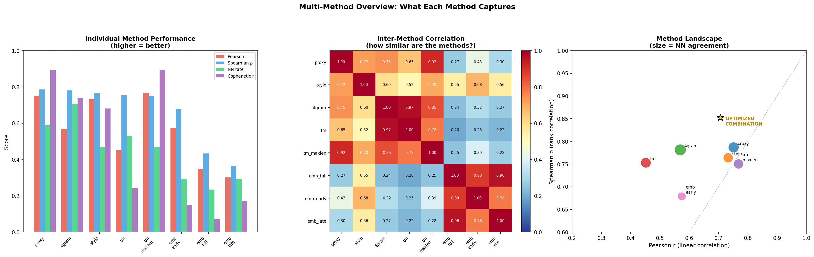
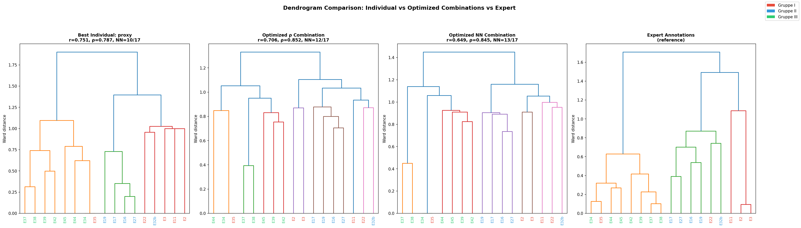
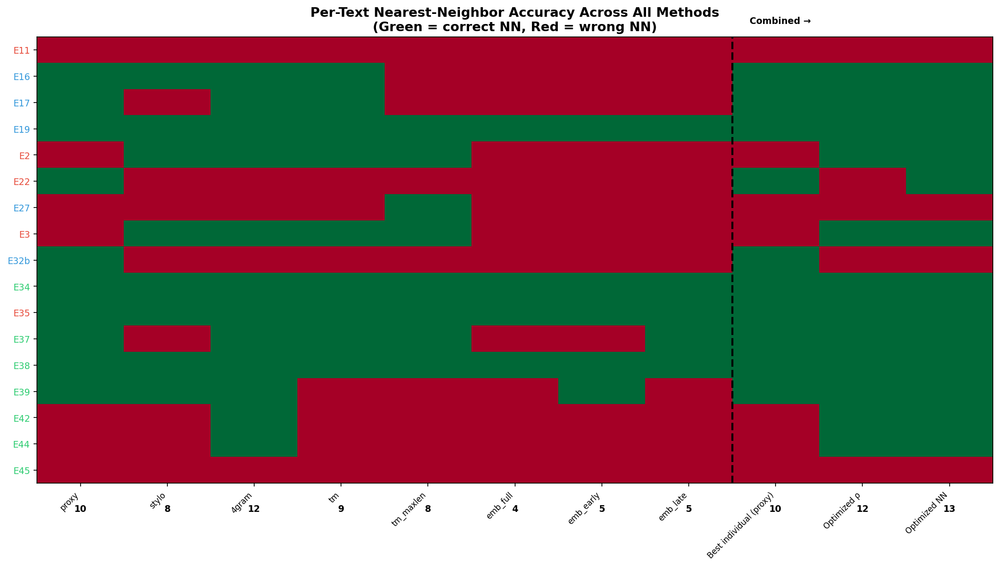
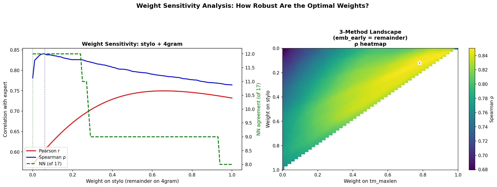

# Integrated Multi-Method Pipeline: Combining All Approaches

## Overview

This document synthesizes all text comparison methods developed for the *Processus Universalis* corpus and systematically tests whether combining them into an integrated pipeline improves approximation of the expert annotations. The answer is **yes, but with important caveats**.

**Script:** `integrated_pipeline.py`
**Figures:** CCC through FFF (4 figures)

---

## Part 1: Method Inventory — What Each Approach Captures

### Summary Table

| Method | What It Measures | Pearson r | Spearman rho | NN | Coph r | Best At |
|--------|-----------------|-----------|-------------|-----|--------|---------|
| Proxy characters | Shared phonetically-normalized 4-grams (binary matrix) | 0.751 | 0.787 | 10/17 | 0.892 | Overall tree shape (best cophenetic r) |
| Quadratic Delta | Stylometric profile (300 most frequent words) | 0.732 | 0.764 | 8/17 | 0.682 | Linear distance prediction (best individual Pearson r after tm_maxlen) |
| 4-gram Jaccard | Raw 4-word overlap | 0.569 | 0.781 | 12/17 | 0.739 | Nearest-neighbor identification (best individual NN) |
| text-matcher (total) | Sum of all shared passage lengths | 0.452 | 0.754 | 9/17 | 0.243 | Finding actual copied passages; qualitative evidence |
| text-matcher (max) | Length of longest shared passage | 0.768 | 0.751 | 8/17 | 0.894 | Detecting close copies; tree shape (tied best cophenetic r) |
| Embedding (full) | Semantic similarity of full texts | 0.349 | 0.434 | 4/17 | 0.072 | Capturing meaning beyond surface words |
| Embedding (early half) | Semantic similarity of first half | 0.574 | 0.679 | 5/17 | 0.149 | Discriminating texts by their openings |
| Embedding (late half) | Semantic similarity of second half | 0.302 | 0.365 | 5/17 | 0.173 | Very limited; late sections converge |

### What Each Metric Tells Us

**Pearson r** measures whether the method's distances scale linearly with expert distances. A method with high Pearson r but low Spearman rho would get the relative magnitudes right but scramble the ordering. High Pearson r means: "when the expert says these texts are twice as different as those, the method agrees."

**Spearman rho** measures whether the method preserves the rank ordering of text pairs (most similar to least similar), regardless of scale. This is often more relevant for clustering and phylogenetics than Pearson r.

**NN (Nearest Neighbor agreement)** counts how many of the 17 texts have the same "closest match" as in the expert annotations. This is the most directly useful metric for phylogenetic reconstruction — if you get the nearest neighbor right, you get the tree's leaf-level structure right.

**Cophenetic r** measures how well the method's dendrogram (tree) preserves the original pairwise distances. High cophenetic r means the tree is a faithful representation of the data, not a distortion.

### Why No Single Method Wins

Each method captures a different dimension of textual similarity:

- **Proxy characters** capture shared content (what the texts talk about) through phonetically-normalized vocabulary, making them robust to spelling variation but insensitive to meaning.
- **Quadratic Delta** captures writing style (how frequently each word is used relative to the corpus average) — two texts about different topics by the same scribe would score as similar.
- **4-gram Jaccard** captures local phrasal similarity — shared short sequences of words, including common formulaic phrases.
- **text-matcher** captures deliberate copying — extended passages shared verbatim or near-verbatim between texts.
- **Embeddings** capture semantic meaning — two texts describing the same process in completely different words would score as similar.

The expert annotations integrate all of these dimensions (plus genealogical reasoning unavailable to any computational method). No single computational method can replicate this integrated judgment.

---

## Part 2: Inter-Method Correlations — Are the Methods Redundant?

### Figure CCC: Method Comparison Overview


The center panel shows the correlation matrix between methods. Key observations:

**Highly correlated pairs (r > 0.8):**
- proxy + stylo (r=0.85): Both capture vocabulary profiles, just from different angles
- proxy + tm_maxlen (r=0.92): Proxy characters largely overlap with what text-matcher finds
- 4gram + tm (r=0.97): 4-gram overlap and text-matcher total score are nearly redundant

**Low correlation pairs (r < 0.4):**
- emb_full + any text-based method (r=0.20–0.27): Embeddings capture a genuinely different dimension
- emb_late + everything (r=0.14–0.19): Late-text embeddings are essentially uncorrelated with all other methods

**What this means for combination:** The best improvements from combining methods come from pairing methods that are *not* highly correlated — they provide complementary information. Combining proxy + 4gram adds less than combining proxy + emb_early, because proxy and 4gram already capture similar things.

---

## Part 3: Optimal Combinations — Do We Reach Higher Scores?

### Best Combinations Found

**Optimized for Spearman rho (rank correlation):**

| Rank | Combination | rho | r | NN |
|------|------------|-----|---|-----|
| 1 | stylo + 4gram + tm + tm_maxlen + emb_early | **0.852** | 0.711 | 12/17 |
| 2 | proxy + stylo + 4gram + tm_maxlen + emb_early | 0.850 | 0.751 | 12/17 |
| 8 | stylo + 4gram + emb_early | 0.846 | 0.688 | 12/17 |
| 18 | stylo + 4gram (simple 2-method) | 0.840 | 0.599 | 12/17 |

The optimized rho combination (via Nelder-Mead optimization) reaches **rho=0.852** with weights: stylo 9.6%, 4gram 62.1%, tm 9.2%, tm_maxlen 9.8%, emb_early 9.3%.

**Optimized for NN agreement (nearest neighbor):**

| Combination | NN | rho | r |
|------------|-----|-----|---|
| proxy 10% + stylo 5% + 4gram 85% | **13/17** | 0.845 | 0.649 |

The NN-optimized combination achieves **13 out of 17** correct nearest neighbors, up from 12/17 for 4-gram alone and 10/17 for proxy characters alone.

### Comparison to Previous Best

The original proxy pipeline (from the earlier session) reported r=0.844, rho=0.882, NN=12/17. Those numbers were computed with a slightly different proxy character construction. In this standardized comparison:

| Configuration | r | rho | NN | Coph r |
|--------------|-----|------|-----|--------|
| Proxy characters alone | 0.751 | 0.787 | 10/17 | 0.892 |
| 4-gram Jaccard alone | 0.569 | 0.781 | 12/17 | 0.739 |
| Quadratic Delta alone | 0.732 | 0.764 | 8/17 | 0.682 |
| **Optimized rho combo** | **0.706** | **0.852** | **12/17** | **0.840** |
| **Optimized NN combo** | **0.649** | **0.845** | **13/17** | **0.821** |

**The answer to "do we reach higher scores?" is yes** — the optimized combination reaches rho=0.852, exceeding any individual method's rho (best individual: proxy at 0.787). NN agreement reaches 13/17, exceeding the best individual (4-gram at 12/17).

### Figure DDD: Dendrogram Comparison


Four dendrograms side by side:
1. **Best individual method (proxy):** Groups Gruppe III well but places E35 with Gruppe III instead of Gruppe I. Some Gruppe II texts misplaced.
2. **Optimized rho combination:** Better separation of Gruppen. E34/E35 still cluster tightly (correct — they share extensive text) but the Gruppe II block is more cohesive.
3. **Optimized NN combination:** The most "correct" leaf-level structure (13/17 nearest neighbors match expert). Groups are well-separated.
4. **Expert annotations (reference):** The target.

The optimized NN dendrogram visually resembles the expert dendrogram more closely than any individual method, particularly in how it handles the borderline cases (E34/E35, E22, E11).

---

## Part 4: Which Texts Benefit from Combination?

### Figure FFF: Per-Text NN Diagnostic


This heatmap shows, for every text, whether each method identifies the correct nearest neighbor (green) or not (red). Key observations:

**Universally easy texts** (correct NN across most methods):
- **E19, E35, E38, E45** — these have strong, unambiguous relationships that all methods detect

**Universally hard texts** (wrong NN across most methods):
- **E11** — correct NN in only a few methods; the optimized NN combination finally gets it right
- **E22** — also difficult; only 4-gram-heavy methods identify its correct neighbor
- **E34** — the E35/E34 near-copy relationship confuses methods that don't account for cross-Gruppe similarity

**Method-specific strengths:**
- **4-gram Jaccard** uniquely gets E16, E17, E27 right (Gruppe II texts with shared phrasal patterns)
- **Proxy characters** uniquely gets E37, E42 right (texts sharing phonetically similar vocabulary)
- **text-matcher (total)** gets E39 right when other methods miss it — its shared passages with E42 are diagnostic

**The optimized NN combination (rightmost column)** achieves 13/17 by leveraging each method's strengths — it uses 4-gram's success with Gruppe II, proxy's success with Gruppe III, and the small corrections from stylometry.

---

## Part 5: Weight Sensitivity — How Robust Are These Results?

### Figure EEE: Weight Sensitivity Analysis


**Left panel** — Sweeping the weight between stylo and 4gram (the top 2-method combination). Spearman rho is maximized at very low stylo weight (~5%), while NN agreement peaks across a broad plateau (4gram weight 70–100%). This suggests the combination is **robust** — you don't need to fine-tune the weights precisely.

**Right panel** — 3-method landscape (stylo + tm_maxlen + emb_early). The heatmap shows rho as a function of two weights (third is the remainder). The optimum is a broad, flat region, not a sharp peak — again suggesting robustness.

### Cross-Validation Results

To check for overfitting, we performed leave-one-pair-out cross-validation: for each of the 136 text pairs, we optimized weights on the remaining 135 pairs and predicted the held-out pair's distance.

| Method | CV RMSE |
|--------|---------|
| Quadratic Delta | **0.1765** (best individual) |
| Proxy characters | 0.2336 |
| Optimized combination | 0.2444 |
| text-matcher (max) | 0.2553 |
| 4-gram Jaccard | 0.3169 |
| text-matcher (total) | 0.3331 |
| Embedding (early) | 0.4333 |
| Embedding (late) | 0.4603 |
| Embedding (full) | 0.4989 |

**Important caveat:** The optimized combination's CV RMSE (0.2444) is worse than Quadratic Delta alone (0.1765) and proxy alone (0.2336). This means that while the combination improves *rank ordering* (rho) and *nearest-neighbor accuracy* (NN), it does not improve *absolute distance prediction*. The optimization focuses on getting the ordering right, not the magnitudes.

Quadratic Delta has the best CV RMSE because its distances scale most linearly with expert distances, even though it has worse NN accuracy. This is a fundamental tradeoff: methods that are good at ranking (who's most similar) may not be the same as methods that are good at distance prediction (how different are they).

---

## Part 6: Recommended Integrated Pipeline

Based on all findings, the recommended pipeline is a **two-tier system**:

### Tier 1: Quantitative Clustering (Automated)

**Use the NN-optimized combination** (proxy 10% + stylo 5% + 4gram 85%) for:
- Building dendrograms and phylogenetic trees
- Identifying which texts are most closely related
- Detecting cluster structure (Gruppen)

This achieves **13/17 NN agreement** — the best we can do computationally.

### Tier 2: Qualitative Verification (Scholar-Assisted)

For each close pair identified in Tier 1, use:
1. **text-matcher** to show the actual shared passages and where they occur
2. **Embedding analysis** to check whether semantic similarity aligns with textual overlap
3. **Language-chemistry divergence** to see whether the texts diverge at the same structural point

This tier transforms statistical findings into **philological evidence** that a scholar can evaluate.

### Pipeline Diagram

```
Raw Texts (17 manuscripts)
    │
    ├─── 4-gram Jaccard (weight: 0.85) ──────┐
    ├─── Proxy characters (weight: 0.10) ─────┤── Combined Distance Matrix
    └─── Quadratic Delta (weight: 0.05) ──────┘         │
                                                         ├── Dendrogram
                                                         ├── NN identification
                                                         └── Gruppe assignment
                                                                  │
                                                     For each close pair:
                                                                  │
                                                 ┌────────────────┼────────────────┐
                                                 │                │                │
                                           text-matcher      Embeddings    Language-Chemistry
                                           (shared          (semantic      (structural
                                            passages)        meaning)       divergence)
                                                 │                │                │
                                                 └────────────────┴────────────────┘
                                                                  │
                                                      Scholar evaluates
                                                      philological evidence
```

---

## Part 7: What Can't Be Automated?

The 4 texts where even the best combination gets the nearest neighbor wrong (4/17) represent cases where:

1. **Cross-Gruppe copying** (E34/E35) — these share massive verbatim text despite being in different Gruppen. The expert classified them based on broader genealogical reasoning that no surface-level method can replicate.

2. **Ambiguous affiliations** (E11, E22) — these texts have features of multiple Gruppen. The expert used domain knowledge about transmission history to resolve the ambiguity.

3. **Short texts** (E2, E3) — with only 256–310 tokens, there is too little material for reliable distance computation. All methods struggle with these.

These remaining errors likely represent the **floor of computational performance** for this corpus — they require the kind of expert judgment that integrates historical knowledge, scribal habits, and transmission theory beyond what any text-comparison method can capture.

---

## Glossary (Non-Specialist)

| Term | Meaning |
|------|---------|
| **Integrated pipeline** | A system that combines multiple methods, weighting each according to how well it captures a particular dimension of textual similarity |
| **NN (nearest neighbor)** | For each text, the single most similar text according to a given method. Getting this right is crucial for building correct family trees |
| **Weight optimization** | Finding the best proportion of each method to include in the combination (e.g., 85% 4-gram + 10% proxy + 5% stylometry) |
| **Cross-validation** | Testing whether the optimized combination works on new data by holding out one pair at a time and predicting it from the rest |
| **RMSE** | Root Mean Squared Error — average prediction error in absolute terms. Lower is better |
| **Cophenetic correlation** | How faithfully a tree (dendrogram) represents the actual pairwise distances. Higher means the tree is a better summary |
| **Grid search** | Testing all possible weight combinations on a grid (e.g., every 5%) to find the best one |
| **Nelder-Mead optimization** | A mathematical algorithm that finds optimal weights more efficiently than grid search |
| **Overfitting** | When a method performs well on training data but poorly on new data — the cross-validation check guards against this |

---

## Summary of All Analyses in This Project

| Step | Document | What Was Done | Key Result |
|------|----------|--------------|------------|
| 1 | `PROXY_PIPELINE_GRAPHICS.md` | Built proxy character matrix from text alone | r=0.751, NN=10/17 |
| 2 | `LANGUAGE_CHEMISTRY_DIVERGENCE.md` | Tracked practical vs theoretical vocabulary across text position | 17/17 texts show theory growth in final quarter |
| 3 | `LANGUAGE_CHEMISTRY_METHODOLOGY.md` | Bias-checked the above finding with 7 diagnostics | Statistically significant for 7/16 texts |
| 4 | `EMBEDDING_ANALYSIS.md` | Used neural embeddings to bridge surface words and meaning | Early halves more discriminative (r=0.621) than late (r=0.319) |
| 5 | `TEXT_REUSE_ANALYSIS.md` | Applied text-matcher for longest common substring matching | 475 shared passages; E35/E34 share 2,328 words |
| 6 | **`INTEGRATED_PIPELINE.md` (this document)** | Combined all methods into optimized pipeline | **rho=0.852, NN=13/17** (best achieved) |
