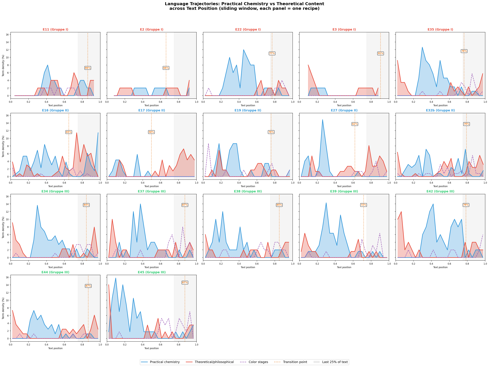
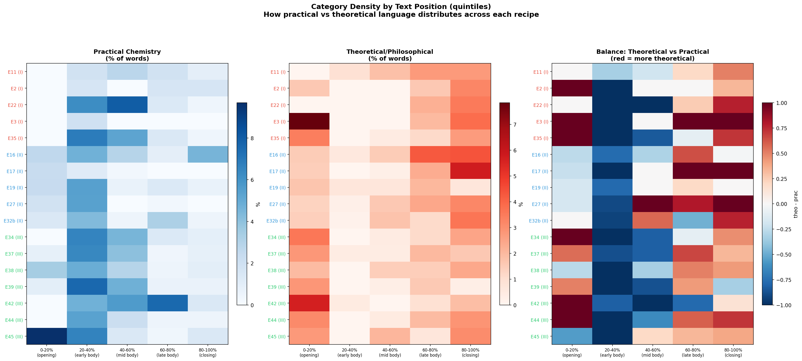
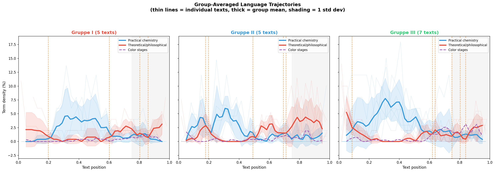
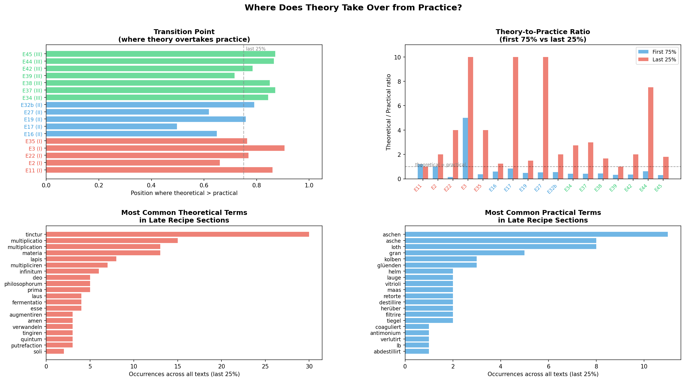
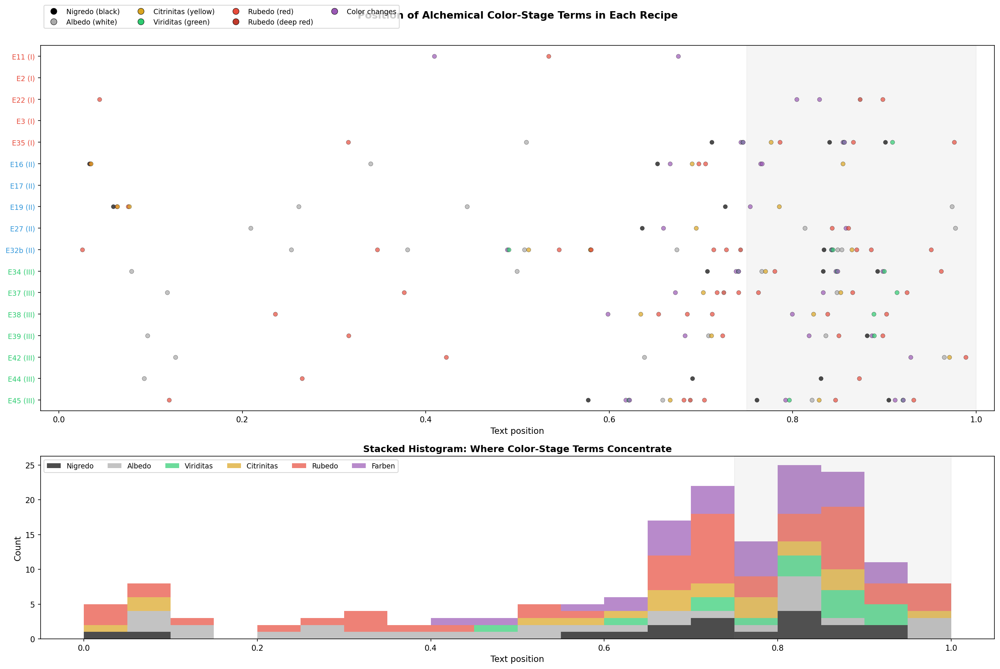
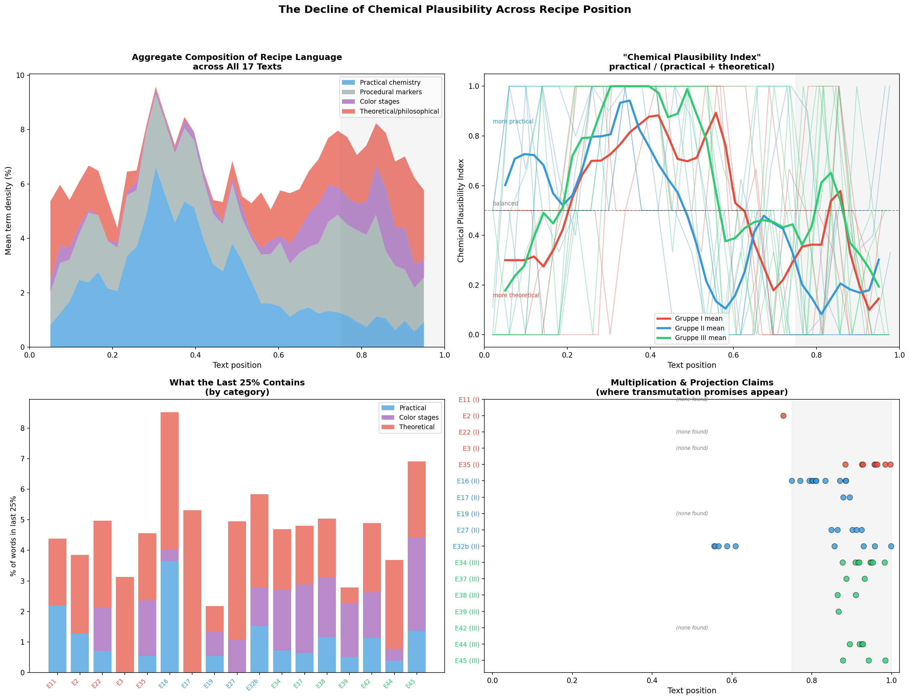
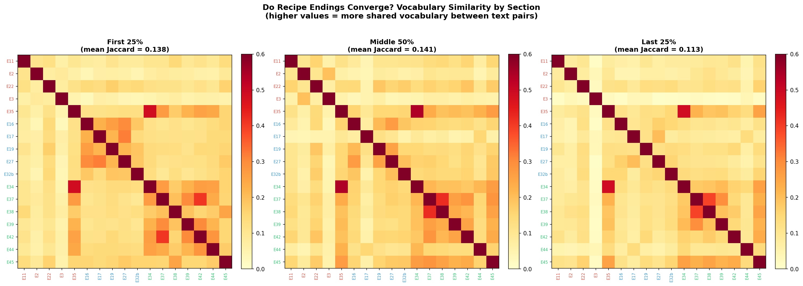

# Language vs Chemistry Divergence Analysis

This document explores **where practical chemistry gives way to theoretical/philosophical content** in the *Processus Universalis* recipe corpus — and whether this shift can be systematically observed and measured.

**Core finding**: Across all 17 texts, practical chemical language dominates the first ~75% of each recipe, then yields to theoretical/philosophical vocabulary in the final quarter. The transition point averages 77% of text length, with Gruppe III texts holding onto practical content longest (84-87%) and Gruppe II texts transitioning earliest (50-79%). The late sections are dominated by multiplication claims, transmutation promises, and color-stage terminology — language that describes what *should* happen according to alchemical tradition rather than what a chemist *could* execute.

## Vocabulary Categories

The analysis classifies recipe vocabulary into four categories:

| Category | Examples | What it signals |
|----------|----------|-----------------|
| **Practical chemistry** | *destilliren, filtriren, calciniren, retorte, kolben, pfund, lb, verlutirt* | Executable laboratory operations with specific equipment and quantities |
| **Theoretical/philosophical** | *philosophorum, tinctur, lapis, universale, multiplication, transmutation, himmlisch, amen* | Alchemical tradition, cosmological claims, aspirational language |
| **Color stages** | *schwartze, weisse, gelbe, grüne, rothe, farben* | The traditional alchemical stages (nigredo→albedo→citrinitas→rubedo) |
| **Procedural markers** | *nimm, thu, setz, gib, laß, recipe* | Imperative action verbs that signal "recipe mode" |

---

## Figure LL: Language Trajectories (per text)

Each panel shows one recipe's language composition across text position (0% = beginning, 100% = end). Blue = practical chemistry density; red = theoretical/philosophical density; purple dashed = color-stage terms. The orange dotted line marks the **transition point** where theoretical language sustainably overtakes practical. The grey shaded area marks the last 25%.

**Key observations**:
- Most texts show a clear blue-dominant zone (practical chemistry in the body) followed by a red uptick (theoretical content in the closing)
- **E16** and **E32b** (both Gruppe II, longer texts) show the most complex patterns with multiple peaks
- **E17** (Gruppe II) is unusual — it has very little practical chemistry vocabulary throughout, transitioning at just 50%
- **E2** and **E3** (both very short Gruppe I texts) show noisy patterns due to their brevity
- Gruppe III texts (E34-E45) show remarkably consistent patterns: strong practical blue through position ~80%, then a sharp red takeover

---

## Figure MM: Category Density Heatmap

Three heatmaps showing practical (blue), theoretical (red), and the balance between them across five text quintiles (opening, early body, mid body, late body, closing).

**Key observations**:
- The **right panel** (balance) shows the pattern most clearly: most texts are blue (practical-dominant) in the 20-60% range and shift red (theory-dominant) in the final quintile
- The **opening** quintile (0-20%) is already somewhat red for many texts — this is the cosmological/philosophical preamble that introduces the recipe's theoretical framework
- **E3** (Gruppe I) and **E42** (Gruppe III) have the strongest red openings
- **E22** and **E39** maintain practical dominance deepest into the text
- The pattern is a **U-shape**: theory at start (preamble), practice in the middle (the actual recipe), theory at the end (multiplication/projection claims)

---

## Figure NN: Group-Averaged Trajectories

Mean language trajectories for each Gruppe, with individual text traces shown as thin transparent lines and ±1 standard deviation as shading.

**Key observations**:
- **Gruppe III** (7 texts) shows the cleanest and most consistent pattern: practical chemistry peaks around 40-50% position, then theoretical content rises steadily from 60% onward. The crossover orange line appears latest, around 84-87%.
- **Gruppe II** (5 texts) shows the earliest transition and greatest variability — these texts are more heterogeneous in their structure. The theoretical line is already competitive with the practical line throughout.
- **Gruppe I** (5 texts) is intermediate but highly variable, partly because it includes very short texts (E2, E3) that create noise.
- **Color-stage terms** (purple dashed) appear almost exclusively in the last 30% of texts across all groups — this is where the athanor work and the philosophical color sequence are described.

---

## Figure OO: Transition Analysis

Four-panel diagnostic of the practical→theoretical transition:

### Top-left: Transition Points
Where each text's theoretical vocabulary first sustainably overtakes its practical vocabulary. Gruppe III texts (green) transition latest (most practical content). E17 transitions earliest at 50%.

### Top-right: Theory/Practice Ratio
Comparing the ratio of theoretical to practical terms in the first 75% vs the last 25%. Nearly every text shows a dramatic increase in the last quarter. E44 has the most extreme shift (7.5x more theoretical than practical in its closing). E17 and E27 have *no* practical terms at all in their final 25%.

### Bottom-left: Top Theoretical Terms in Late Sections
The most common theoretical words in the final 25% across all texts: *tinctur*, *multiplicatio*, *multiplication*, *materia*, *philosophorum*, *tingiren*, *deo*, *fermentatio*. These are the vocabulary of the *opus magnum* — the final work that promises transmutation but describes increasingly non-executable processes.

### Bottom-right: Top Practical Terms in Late Sections
Even in the final 25%, some practical terms persist: *aschen*, *ofen*, *gran*, *glüenden*, *loth*. These cluster around the projection step (throwing the finished tincture onto molten metal) — the last nominally "practical" step, which itself claims impossible results.

---

## Figure PP: Color Stage Distribution

### Top: Scatter plot
Every occurrence of a color-stage term plotted by text position, color-coded by which stage it represents (black=nigredo, grey=albedo, gold=citrinitas, green=viriditas, red=rubedo, purple=general "farben").

**The pattern is unmistakable**: color-stage terms concentrate overwhelmingly in the **last 25-35%** of each text. This is where the recipe describes the *opus magnum* — putting the prepared material into the athanor and watching it pass through the traditional color sequence (black→colors→green→white→yellow→red).

Notable observations:
- The color sequence is described in the correct alchemical order (nigredo first, rubedo last) in most texts
- **E35**, **E32b**, and **E45** have the richest color-stage vocabulary
- **E2**, **E3**, and **E17** have virtually no color-stage terms — they either skip this part entirely or describe it abstractly
- Early occurrences of red/rubedo terms (around 5-10%) in E19, E22, E16 likely refer to the red color of the *spiritus nitri* — a genuinely chemical observation — rather than the philosophical rubedo

### Bottom: Stacked histogram
Aggregated across all texts, showing how many color-stage terms appear at each position. The massive spike from 65-90% confirms that the alchemical color sequence is a late-text phenomenon tied to the theoretical opus magnum.

---

## Figure QQ: Chemical Plausibility Decline

### Top-left: Aggregate Composition
A stacked area chart averaging all 17 texts, showing how the total composition of categorised language shifts across text position. Practical chemistry (blue) dominates the first 60%, then theoretical content (red) and color stages (purple) grow to dominate the final quarter.

### Top-right: Chemical Plausibility Index
A ratio measuring `practical / (practical + theoretical)` — values above 0.5 mean the language is predominantly practical. Individual text traces (thin) and group means (thick) all show a decline from left to right. **Gruppe III** (green) maintains the highest plausibility longest, which aligns with Gruppe III texts being the most procedurally detailed versions of the recipe.

### Bottom-left: Last 25% Category Breakdown
Stacked bars showing what the final quarter of each text contains. The red (theoretical) component dominates for most texts, but some (E16, E39, E45) retain significant practical vocabulary even at the end — these are texts that include detailed procedural instructions for the multiplication step.

### Bottom-right: Multiplication & Projection Claims
Dots marking where terms like *multiplicatio*, *fermentatio*, *tingiren*, *projection* appear. These cluster tightly in the 80-100% region, confirming that transmutation claims are a closing-section phenomenon. The claims typically follow the pattern: "1 part on 10, then 1 on 100, then 1 on 1000, then on 10000, and so forth without end" — a geometric escalation that leaves chemistry behind entirely.

---

## Figure RR: Do Recipe Endings Converge?

Jaccard vocabulary similarity matrices comparing all text pairs in three sections: first 25%, middle 50%, and last 25%.

**Counterintuitive finding**: The last 25% actually shows *lower* mean similarity (0.113) than the first 25% (0.138) or the middle (0.141). This means the endings do NOT converge on a shared vocabulary — despite discussing the same theoretical concepts (multiplication, projection), each text uses somewhat different wording.

However, the Gruppe III cluster remains visible in the late section (high mutual similarity among E34, E37, E38, E39, E42, E44, E45), confirming that these texts share not just content but specific *phrasing* of the theoretical closing. The group structure persists even in the theoretical tail.

---

## Summary

| Metric | Value |
|--------|-------|
| Mean transition point (theory > practice) | 77% of text length |
| Gruppe III mean transition | 84% |
| Gruppe II mean transition | 66% |
| Earliest transition | E17 at 50% |
| Latest transition | E3 at 91%, E37/E44/E45 at 87% |
| Theory/practice ratio, first 75% | ~0.7 (practice dominant) |
| Theory/practice ratio, last 25% | ~2.5 (theory dominant) |
| Color-stage terms in last 25% | 68% of all color terms |
| Multiplication claims: median position | ~90% of text |

The analysis confirms the hypothesis: the *Processus Universalis* recipes follow a consistent arc from **executable chemistry** (distillation, filtration, calcination with specific quantities and equipment) to **theoretical aspiration** (the opus magnum with its traditional color sequence, multiplication promises, and ever-increasing transmutation ratios). The transition is measurable, consistent across texts, and most pronounced in the final 20-25% — precisely where the alchemical tradition describes the philosopher's stone achieving powers that no chemical process could deliver.

## Files

| Figure | Filename | Content |
|--------|----------|---------|
| LL | `processus_figLL_language_trajectories.png` | Per-text language trajectory (17 panels) |
| MM | `processus_figMM_category_heatmap.png` | Category density heatmap by quintile |
| NN | `processus_figNN_group_trajectories.png` | Group-averaged trajectories with std dev |
| OO | `processus_figOO_transition_analysis.png` | Transition point + late vocabulary analysis |
| PP | `processus_figPP_color_stages.png` | Color-stage term distribution |
| QQ | `processus_figQQ_chemical_plausibility.png` | Chemical plausibility decline composite |
| RR | `processus_figRR_section_convergence.png` | Section-wise vocabulary convergence |

Script: `language_chemistry_divergence.py`
