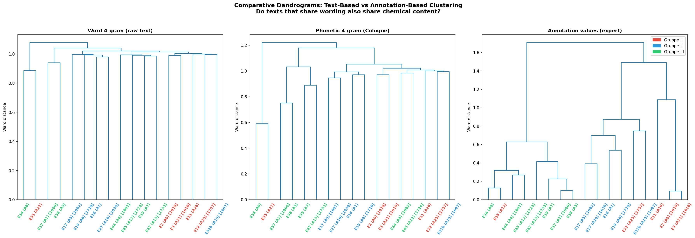
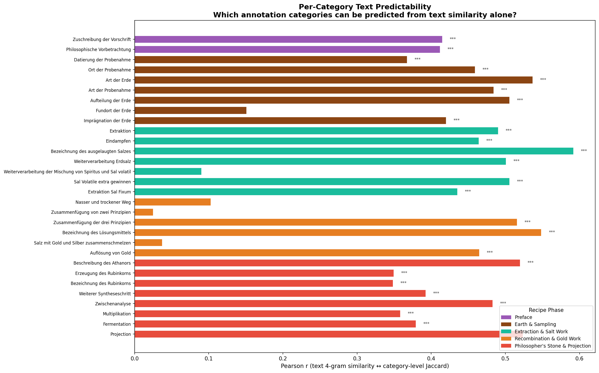
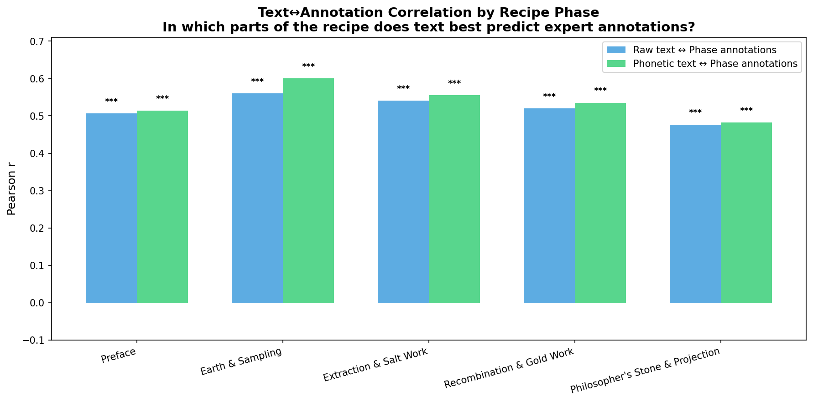
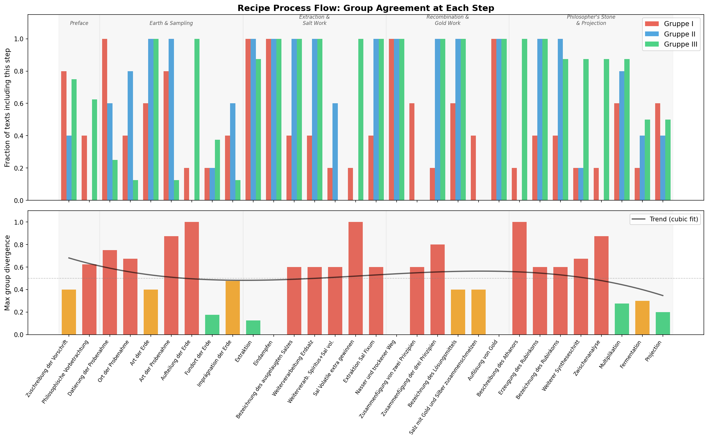
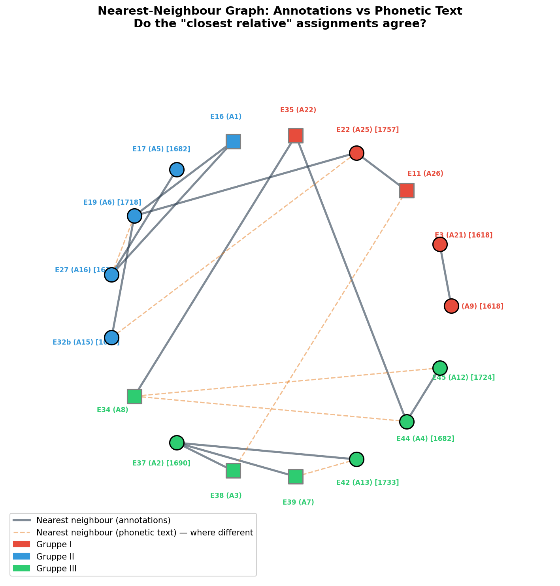
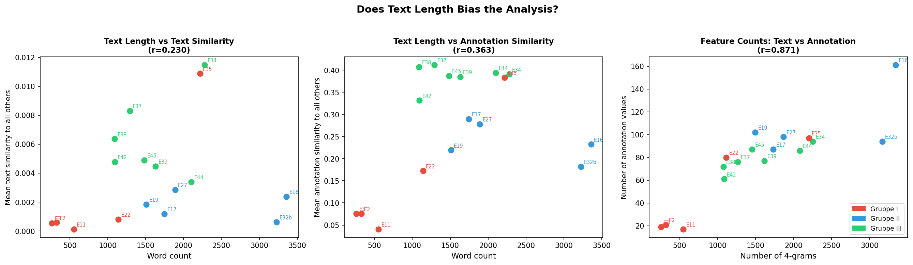
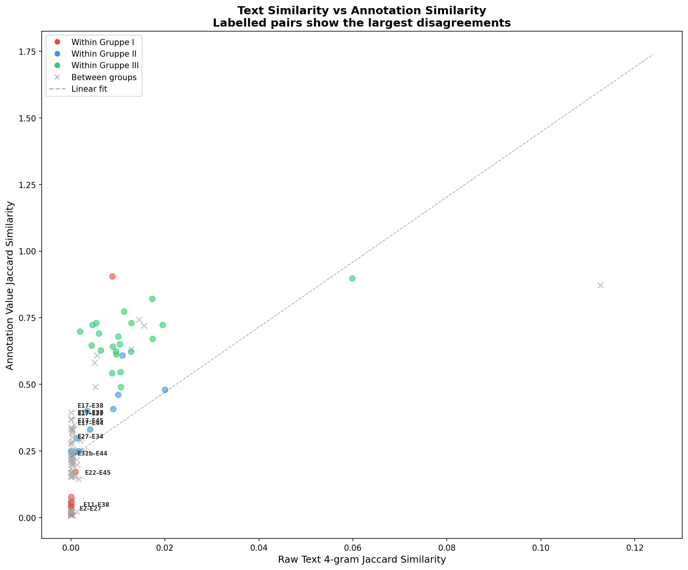
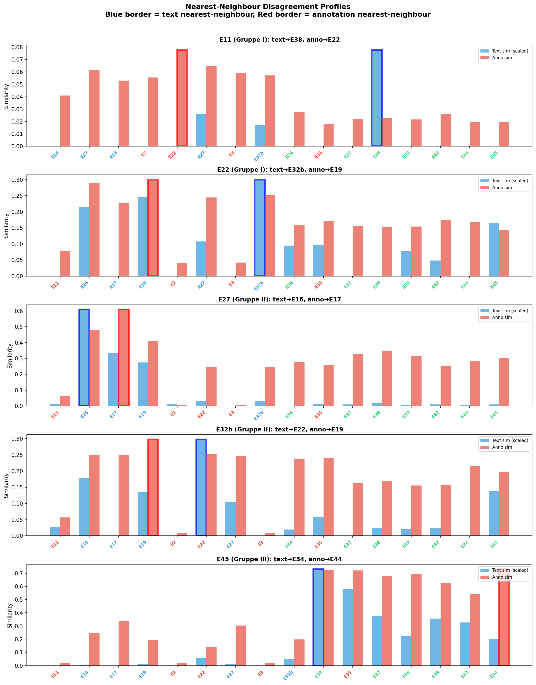

# How Close Can Automated Methods Get to Expert Annotations?

## A Systematic Evaluation Across Five Approaches to the *Processus Universalis* Corpus

This document synthesises all quantitative results from the text reuse analysis (`text_reuse_analysis.py`, `text_reuse_divergence.py`), the automated pipeline (`automated_pipeline.py`), the method comparison (`method_comparison_detailed.py`), and the four-Delta comparison (`delta_comparison.py`) into a single argument about which computational methods best replicate the relationships that expert annotators identified — and, critically, where and why they fail.

---

## Table of Contents

1. [What the experts did](#1-what-the-experts-did)
2. [What we are comparing against](#2-what-we-are-comparing-against)
3. [The five automated methods](#3-the-five-automated-methods)
4. [Summary scorecard](#4-summary-scorecard)
5. [Where does the match work well?](#5-where-does-the-match-work-well)
6. [Where does the match fail?](#6-where-does-the-match-fail)
7. [Why the failures happen: three mechanisms](#7-why-the-failures-happen)
8. [The four hardest texts](#8-the-four-hardest-texts)
9. [What "best" means and why it depends on the question](#9-what-best-means)
10. [Conclusions](#10-conclusions)

---

## 1. What the experts did

Domain experts read 18 Early Modern German alchemical recipe texts describing variants of the *Processus Universalis* (a procedure for creating the philosopher's stone from common earth). They annotated each text for 30 categories of chemical content — what type of earth is used, how it is sampled, what extraction and distillation procedures are described, how gold is dissolved, and so on. Each category can take multiple specific values (e.g., "Art der Erde" might be "ordinary garden earth" or "virgin earth from a field").

These annotations capture **what the recipe describes** at the level of chemical procedure, regardless of how it phrases it. Two texts could use entirely different words and still receive identical annotations if they describe the same chemistry. Conversely, two texts could share many words but differ in their annotations if the shared words are boilerplate rather than procedural content.

From these annotations, the experts grouped the texts into three families (**Gruppe I, II, III**) reflecting shared source traditions. The annotation-based Jaccard similarity (treating each text as a set of (category, value) pairs) provides a continuous measure of how similar any two texts are according to this expert reading.

This expert similarity matrix — 136 unique pairwise distances across 17 texts — is our reference standard.

---

## 2. What we are comparing against

Four evaluation criteria, each testing a different aspect of replication:

| Criterion | What it asks | Why it matters |
|-----------|-------------|----------------|
| **Pearson r** | Does the method agree with experts about the *magnitude* of pairwise distances? | Tests whether the overall landscape of relationships matches — are the close pairs close, the distant pairs distant? |
| **Spearman ρ** | Does it get the *rank order* right? | More robust than Pearson — only asks whether the method correctly orders pairs from most to least similar, without assuming a linear relationship. |
| **Nearest-neighbour agreement** | For each text, does the method identify the same *closest relative* as the experts? | The most practical test: in stemmatic analysis, correctly identifying each manuscript's nearest relative is the first step. |
| **Cophenetic correlation** | Does the method produce the same *family tree*? | The hardest test: do the hierarchical clustering trees (dendrograms built with Ward's method) have the same branching structure? |

There is no single "best" — a method that excels at nearest-neighbour identification (finding the right closest relative) may fail at tree reconstruction (getting the deeper branching right), and vice versa.

---

## 3. The five automated methods

### 3.1 Word 4-gram comparison

**What it does:** Splits each text into all consecutive four-word sequences, collects them as a set, and computes Jaccard similarity (shared 4-grams ÷ total distinct 4-grams in either text).

**What it detects:** Verbatim copying. If two texts share a four-word phrase, it is overwhelmingly likely that one was copied from the other (or both from a common source). The method cannot detect paraphrasing, rewriting, or oral transmission — only direct textual reuse.

**Example:** E34 and E35 share 451 four-word phrases, including passages like:
```
"3 tropffen eingegeben treibt"     (3 drops administered drives)
"50 tagen eine weiße"              (50 days a white)
"einen kolben, und destillire"     (a flask, and distil)
```

### 3.2 Phonetic 4-gram comparison

**What it does:** Same as word 4-grams, but first normalises each word through the Cologne phonetic encoding (Kölner Phonetik), which maps spelling variants to the same code. "Prussian" / "preußisch" → same code; "saltz" / "salz" → same code.

**What it detects:** Same as word 4-grams but tolerant of spelling variation. In theory, this should help with Early Modern German texts where orthography was unstandardised. In practice, the gain was modest for this corpus (Pearson r improves from 0.569 to 0.585).

### 3.3 Keyword-based automatic step detection

**What it does:** For each of the 30 annotation categories, a list of diagnostic keywords was defined (e.g., "erde" and "erdreich" for "Art der Erde"; "phiole" and "kolben" for "Beschreibung des Athanors"). A sliding window scans each text; if enough keywords for a category appear within a window, that category is marked as "detected." The result is a 17×30 binary matrix comparable to the expert presence/absence matrix. Similarity is then Jaccard on these binary vectors.

**What it detects:** Whether the vocabulary associated with a recipe step appears in the text. A rough proxy for procedural content. F1 agreement with expert annotations: 0.748. But it cannot distinguish whether keywords appear in the right *context* — "erde" might appear in a metaphorical passage rather than an actual earth-sampling description.

### 3.4 Burrows'/Eder's/Quadratic Delta (Manhattan/Euclidean stylometry)

**What they do:** Count the relative frequency of the N most frequent words (MFW) across all texts, z-score normalise, and compute distances between z-score vectors. Burrows' Delta uses Manhattan distance (mean absolute difference); Quadratic Delta uses Euclidean distance; Eder's Delta uses Manhattan with rank-based feature weighting (most frequent words weighted more heavily).

**What they detect:** Shared writing style — unconscious patterns in how frequently function words are used. Texts copied from the same source inherit the source's linguistic habits. At higher MFW counts (300+), content words enter the feature set and the method transitions to a hybrid of style and content measurement.

**Key finding from the four-Delta comparison:** Burrows' and Eder's Delta are nearly identical for this corpus (r = 0.997 at 200 MFW). Eder's rank-weighting, designed for authorship attribution, provides essentially no advantage for recipe transmission analysis.

### 3.5 Cosine Delta (Würzburg Delta)

**What it does:** Same z-score normalisation as Burrows', but uses cosine distance (1 − cosine similarity) instead of Manhattan distance. This measures only the *angle* between z-score vectors, ignoring their magnitude.

**What it detects:** The *shape* of the word-frequency profile, not its intensity. Two texts that use the same *proportions* of function words but at different overall rates are treated as identical.

**Why it differs:** In authorship attribution on large corpora, Cosine Delta often outperforms Burrows' Delta because it is more robust in high dimensions. For this small corpus (17 texts), it performs worse on correlation metrics but is more *stable* across MFW sizes.

---

## 4. Summary scorecard

The table below collects the best result for each method across all MFW sizes tested (50–1000), evaluated against the expert annotation distance matrix.

| Method | Best Pearson r | Best Spearman ρ | Best NN agreement | Best Cophenetic r |
|--------|---------------|----------------|-------------------|------------------|
| **Word 4-gram** | 0.569 | **0.781** | **12/17 (71%)** | 0.170 |
| **Phonetic 4-gram** | 0.585 | 0.788 | 12/17 (71%) | 0.305 |
| **Keyword step detection** | 0.676 | — | — | — |
| **Burrows' Delta** (best: 200 MFW) | 0.723 | 0.756 | 10/17 (59%) | 0.689 |
| **Eder's Delta** (best: 200–300 MFW) | 0.722 | 0.754 | 10/17 (59%) | 0.696 |
| **Quadratic Delta** (best: 300 MFW) | **0.731** | 0.763 | 8/17 (47%) | **0.707** |
| **Cosine Delta** (best: 300–500 MFW) | 0.565 | 0.429 | 9/17 (53%) | 0.659 |

### What this tells us at a glance

No method dominates all criteria. The results split into two complementary strengths:

- **4-gram methods win at nearest-neighbour identification** (71%) and rank-order correlation (ρ = 0.78). If you need to find each text's closest relative, verbatim overlap is the strongest signal.
- **Delta methods (especially Quadratic/Burrows') win at overall distance correlation** (r = 0.73) and **tree topology** (cophenetic r = 0.71). If you need to reconstruct the full family tree, stylometry is far superior.

The keyword step detection falls in between — better than 4-grams for Pearson r (0.676 vs 0.569) but worse than Deltas. Its weakness is poor group separation (within-group similarity only 1.12× between-group), making it unreliable for structural analysis.

### Visualising the comparison

**Figure BB** shows how the four Delta variants perform across MFW sizes on all four criteria:


Key observations from this figure:
- **Top-left (Pearson r):** Burrows'/Eder's peak around MFW 200, then decline sharply. Quadratic Delta peaks later (300) and declines more gracefully. Cosine is flat and low.
- **Top-right (Spearman ρ):** The 4-gram baseline (green dashed line at 0.781) is hard to beat. Only Quadratic 200–300 comes close.
- **Bottom-left (NN agreement):** Noisy and inconclusive — all Delta methods fluctuate between 0.3 and 0.6, well below the 4-gram baseline at 0.71.
- **Bottom-right (Cophenetic r):** All four Deltas massively outperform 4-grams (0.17). The methods converge at high MFW. This is the most robust finding.

**Figure Y** shows the same MFW sweep for the original two-Delta comparison:


---

## 5. Where does the match work well?

### 5.1 Group structure is strongly recoverable

All methods correctly identify the three Gruppen as distinct clusters. The within-group vs between-group similarity ratio ranges from 1.12× (keyword steps) to 3.91× (word 4-grams):

| Method | Within-group avg | Between-group avg | Ratio |
|--------|-----------------|-------------------|-------|
| Text 4-gram | 0.0080 | 0.0021 | 3.91× |
| Annotation values | 0.4704 | 0.1888 | 2.49× |
| Cosine Δ 200 | 0.3000 | 0.1806 | 1.66× |
| Burrows' Δ 200 | 0.3463 | 0.2466 | 1.40× |

The expert-annotated group structure (Gruppen I, II, III) emerges from purely textual analysis with no expert input. This is the most unambiguous success: if you had only the raw texts, you would still discover that these 17 recipes fall into three families.

**Figure I** shows three dendrograms (word 4-gram, phonetic 4-gram, expert annotations) side by side, demonstrating this:



### 5.2 Named entities and concrete materials are well-predicted

The per-category analysis (Figure M) reveals which *kinds* of expert annotation are recoverable from text:



The five most text-predictable categories (Pearson r between text 4-gram similarity and category-specific annotation similarity):

| Category | r | What it describes |
|----------|---|-------------------|
| Bezeichnung des ausgelaugten Salzes | 0.59 | Name of the leached salt |
| Bezeichnung des Lösungsmittels | 0.55 | Name of the solvent |
| Art der Erde | 0.54 | Type of earth |
| Projection | 0.52 | Projection of the stone onto metals |
| Beschreibung des Athanors | 0.52 | Description of the furnace |

These categories involve **specific named things** — types of earth, names of salts, descriptions of equipment. When a recipe mentions "gemeine gartenerde" (common garden earth), that exact phrase tends to be copied verbatim across related manuscripts. The word-matching algorithm detects this reliably because the thing and its name travel together through the transmission chain.

### 5.3 Early recipe phases are more predictable than late ones

The per-phase analysis (Figure O) shows a clear decline in text-annotation correlation across the five recipe phases:



| Phase | r (raw text) | r (phonetic) |
|-------|-------------|--------------|
| Preface | 0.507 | 0.514 |
| Earth & Sampling | 0.561 | 0.600 |
| Extraction & Salt Work | 0.541 | 0.555 |
| Recombination & Gold Work | 0.520 | 0.535 |
| Philosopher's Stone & Projection | 0.477 | 0.482 |

The early, concrete phases (selecting earth, sampling, basic extraction) use specific and consistent vocabulary that transfers well between copies. The late, theoretical phases (philosopher's stone, projection onto metals) are more abstract, more variable between texts, and more likely to be described in idiosyncratic or deliberately obscure language.

This matches the finding from the group divergence analysis (Figure A) that the three Gruppen agree most on the early phases and diverge most on the late ones:



### 5.4 Tree topology is recoverable by stylometry

The most important structural finding is that Delta methods recover dendrogram topology far better than text reuse methods:

| Method | Cophenetic r |
|--------|-------------|
| Word 4-gram | 0.170 |
| Phonetic 4-gram | 0.305 |
| Cosine Delta (best) | 0.659 |
| Burrows' Delta 200 | 0.689 |
| Eder's Delta 300 | 0.696 |
| Quadratic Delta 1000 | 0.707 |

**Figure CC** shows six dendrograms — the four Delta variants at their best MFW, text 4-grams, and expert annotations — demonstrating how closely the stylometric trees match the expert tree:


The cophenetic correlation of 0.70–0.71 means the stylometric dendrogram shares roughly 70% of its branching structure with the expert dendrogram. This is a strong result: the function-word frequencies of these 17th/18th-century recipe texts encode enough information about their transmission history to reconstruct most of the family tree that experts identified through close chemical reading.

The 4-gram dendrogram, by contrast, has a cophenetic correlation of only 0.17 — its tree topology is essentially unrelated to the expert tree. This makes sense: verbatim overlap can identify nearest neighbours but does not provide the graded, multi-scale distance information needed for hierarchical clustering.

---

## 6. Where does the match fail?

### 6.1 Nearest-neighbour identification by stylometry is mediocre

Despite excelling at tree topology, the Delta methods are surprisingly poor at identifying the single closest relative of each text:

| Method | Correct nearest neighbours |
|--------|---------------------------|
| Word 4-gram | 12/17 (71%) |
| Phonetic 4-gram | 12/17 (71%) |
| Burrows' Delta 200 | 10/17 (59%) |
| Eder's Delta 300 | 10/17 (59%) |
| Cosine Delta 150 | 9/17 (53%) |
| Quadratic Delta 300 | 8/17 (47%) |

This is a paradox: how can a method recover the tree structure but not the nearest neighbours? The answer lies in what each metric measures. Cophenetic correlation evaluates the entire tree — all branching points, all cluster memberships. Nearest-neighbour agreement evaluates only the single closest match per text — a binary, local criterion. A method can get the broad structure right (which sub-groups exist, where they branch) while occasionally swapping two close candidates within a sub-group.

The text 4-gram method has the opposite profile: it finds the right closest relative 71% of the time because verbatim textual overlap is the strongest possible evidence of a direct relationship. But this local accuracy does not extend to the global tree.

**Figure J** shows the nearest-neighbour comparison visually:



### 6.2 Complex procedures are opaque to all automated methods

The five least text-predictable annotation categories (Figure M):

| Category | r | What it describes |
|----------|---|-------------------|
| Fundort der Erde | 0.15 | Location where earth is found |
| Nasser und trockener Weg | 0.10 | Wet vs dry processing path |
| Weiterverarbeitung (Spiritus/Sal) | 0.09 | Further processing of spirit/salt mixture |
| Salz mit Gold/Silber zusammenschmelzen | 0.04 | Melting salt with gold/silver |
| Zusammenfügung von zwei Prinzipien | 0.03 | Combination of two principles |

These categories describe multi-step procedures or abstract distinctions that scribes routinely paraphrased. "Zusammenfügung von zwei Prinzipien" (combination of two principles) is an alchemical concept that can be expressed in dozens of different ways — through metaphor, through specific procedural instructions, through references to other texts. An expert chemist recognises them as the same operation; a word-matching algorithm sees completely different texts.

This is not merely a limitation of 4-gram matching — even stylometric methods cannot predict these categories, because the variation is in the *content words* that describe the procedure, not in the function words that carry stylistic signal.

### 6.3 Keyword step detection has poor discriminative power

The automated keyword step detection achieves F1 = 0.748 against expert annotations at the individual category level — superficially impressive. But when these step detections are used to compute inter-text similarity, the resulting similarity matrix has almost no group separation (within-group similarity only 1.12× between-group). Most texts trigger most keywords, producing homogeneous profiles that fail to distinguish the three families.

**Figure R** shows this visually — the auto-detected step matrix (centre panel) is much more uniform than the expert annotation matrix (left panel):


The problem is that keyword presence is not the same as procedural detail. Nearly all recipes mention "erde" (earth), "salz" (salt), "destillir" (distil) — these keywords are ubiquitous. What distinguishes the groups is *which specific earth*, *what kind of salt*, *how the distillation is performed* — details that keywords alone cannot capture.

### 6.4 The method comparison diverges most at high MFW counts

**Figure BB** (top-left panel) shows a dramatic divergence above 300 MFW: Burrows' Delta's Pearson r drops from 0.72 (at 200 MFW) to 0.38 (at 1000 MFW), while Quadratic Delta remains at 0.66. This happens because Manhattan distance in high dimensions is dominated by the cumulative effect of many small, noisy differences in low-frequency words. Euclidean distance (Quadratic Delta) is less susceptible because squaring amplifies large differences over small ones — it focuses on the features that actually differ rather than averaging in noise.

This has a practical implication: **if you must use a single method at a single MFW setting, Quadratic Delta at 300 MFW is the safest choice** (Pearson r = 0.731, Spearman ρ = 0.763, cophenetic r = 0.685). It provides near-optimal performance across all criteria and degrades gracefully if the MFW setting is imperfect.

---

## 7. Why the failures happen: three mechanisms

The divergences between automated methods and expert annotations are not random. They cluster into three distinct patterns, each revealing something about how these recipes were transmitted.

### 7.1 Same chemistry, different words

**Pattern:** Expert annotations match, but texts share no words.

**Example:** E11 and E22 share **zero** 4-grams — not a single four-word phrase in common. Yet the expert annotations identify them as nearest neighbours, because both describe similar earth-sampling and extraction procedures.

**What it reveals:** The chemical knowledge was transmitted through a non-textual channel. Possible pathways include oral instruction (a teacher describing a procedure that students write down independently), laboratory demonstration (watching a procedure and writing it up in your own words), or independent composition from a shared tradition (both authors drawing on the same school of alchemical practice without copying each other's texts).

This mechanism is most common in the later recipe phases (philosopher's stone and projection), where the groups diverge most (Figure O) and the text-annotation correlation drops below 0.50.

### 7.2 Same words, different chemistry

**Pattern:** Texts share phrases, but expert annotations differ.

**Example:** E32b and E22 share 12 four-grams — enough for text-based nearest-neighbour assignment. But these shared phrases are generic laboratory language:

```
"einen kolben, und destillire"     (a flask, and distil)
"es in eine phiole"                (it into a vial)
"hermetice, und setze sie"         (hermetically, and place it)
```

These describe universal procedures (sealing a vial, distilling in a flask) that appear in many recipe traditions. They do not indicate a shared chemical lineage — merely a shared vocabulary of laboratory practice.

**What it reveals:** Shared text does not always mean shared content. Technical vocabulary is formulaic: alchemists across traditions describe the same physical operations using the same phrases. This "boilerplate" inflates text similarity without reflecting genuine procedural kinship.

This mechanism primarily affects the longest texts (E32b at 3226 words, E19 at 2543 words), where the sheer volume of text creates more opportunities for spurious 4-gram matches.

**Figure Q** shows the weak but present length bias:



### 7.3 Textual lineage vs chemical lineage

**Pattern:** Text reuse points to one relative, expert annotations point to another, and both are meaningful.

**Example:** E27 shares more exact text with E16 (Jaccard 0.020 vs 0.011) but more chemical content with E17 (annotation Jaccard 0.609 vs 0.480). The text method picks E16; the experts pick E17.

**What it reveals:** E27 and E16 share a *textual* lineage — they were likely copied from the same source manuscript, preserving many exact phrases. But E27 and E17 share a *chemical* lineage — they describe the same specific procedures, even though the wording differs. The two lineages have diverged: the scribe of E27 (or an intermediate copy) rewrote the text while preserving the chemistry.

This is arguably the most informative type of disagreement, because it reveals a transmission event that neither method alone could identify. Only by comparing the text-based and annotation-based nearest neighbours can we see that textual descent and chemical descent have split.

**Figure L** maps these divergences across all 136 text pairs:



**Figure N** shows detailed profiles for the five disagreement cases:



---

## 8. The four hardest texts

Four texts are consistently misidentified by every automated method — no combination of 4-grams, stylometry, or keyword detection finds the correct nearest neighbour:

### E22 (Gruppe I)

- **Expert nearest neighbour:** E19
- **All automated methods say:** E32b or E16
- **Why:** E22 shares chemical concepts with E19 in completely different words. Its text overlaps more with E32b through generic laboratory language.

### E27 (Gruppe II)

- **Expert nearest neighbour:** E17
- **All automated methods say:** E16 or E39
- **Why:** Textual lineage (shared manuscript tradition with E16) diverges from chemical lineage (shared laboratory practice with E17).

### E32b (Gruppe II)

- **Expert nearest neighbour:** E19
- **All automated methods say:** E22, E27, or E16
- **Why:** E32b is the second-longest text (3226 words). Its length generates many spurious 4-gram matches and inflates stylometric noise, making its automated nearest-neighbour assignment unreliable.

### E45 (Gruppe III)

- **Expert nearest neighbour:** E44
- **All automated methods say:** E34 or E37
- **Why:** E45 shares 71 four-grams with E34 but only 19 with E44 — strong evidence of direct copying from E34. But its annotation similarity to E44 (0.730) is nearly identical to E34 (0.724). The text was likely copied from E34 but independently converged with E44 in chemical content.

These four texts represent the ceiling of what automated methods can achieve without expert knowledge. They are "boundary texts" where textual and chemical transmission have diverged, and only domain expertise can resolve which relationship is primary.

---

## 9. What "best" means and why it depends on the question

A method's ranking changes depending on what you want to do with the results:

### "I want to find each text's closest relative" → Use word 4-grams

Nearest-neighbour agreement: **12/17 (71%)**. No other method comes close. Direct verbatim overlap is the strongest possible evidence that two texts are closely related — it means words were literally copied from one to the other. For building a first-pass stemma or identifying candidate source relationships, this is the right starting point.

**But beware:** the 4-gram method tells you nothing about the deeper structure. Its dendrogram topology is essentially random (cophenetic r = 0.17).

### "I want to reconstruct the family tree" → Use Quadratic Delta at 300–1000 MFW

Cophenetic correlation: **0.707**. The stylometric family tree shares 70% of its branching structure with the expert tree. Burrows'/Eder's Delta are nearly as good (0.69–0.70) but degrade at high MFW counts, while Quadratic Delta remains stable.

**But beware:** these methods are mediocre at nearest-neighbour identification (47–59%). The tree is approximately right, but individual branch tips may be misplaced.

### "I want to rank all pairs by similarity" → Use Quadratic Delta at 200–300 MFW

Spearman ρ: **0.763**. The rank ordering of text pairs by Quadratic Delta matches the expert rank ordering better than any other stylometric method. (Text 4-grams do even better at ρ = 0.781, but only for rank-order — their Pearson r is lower at 0.569.)

### "I want a quick screening of a new corpus" → Use word 4-grams + Burrows' Delta 200

The combination of 4-grams (for nearest-neighbour identification) and Burrows'/Quadratic Delta (for tree topology) provides the most complete picture. Where they agree, confidence is high. Where they disagree, you have identified a text that warrants expert attention — and you know roughly what kind of disagreement it is (textual vs chemical lineage divergence).

---

## 10. Conclusions

### How close did we get?

The best automated methods replicate expert annotations at:
- **r = 0.73** for pairwise distance magnitude (Quadratic Delta 300 MFW)
- **ρ = 0.78** for pairwise distance rank order (text 4-grams)
- **71%** for nearest-neighbour identification (text 4-grams)
- **0.71** for tree topology (Quadratic Delta 1000 MFW)

These are substantial correlations. An automated analysis, requiring no domain expertise and running in seconds, recovers roughly 70% of the structure that experts identified through years of close chemical reading.

### What remains out of reach?

The remaining 30% is not randomly distributed. It concentrates in:
1. **Later recipe phases** (philosopher's stone, projection) where procedures are described in variable, idiosyncratic, or deliberately obscure language.
2. **Procedurally complex categories** (multi-step processes, abstract distinctions) where the same operation can be expressed in many different ways.
3. **Boundary texts** (E22, E27, E32b, E45) where textual and chemical transmission have diverged — the text was copied from one source but the chemistry matches another.

These are precisely the cases where expert knowledge is most valuable. Automated methods can handle the routine cases (70%); experts should focus their time on the difficult 30%.

### The divergences are informative

The most important insight is that **disagreements between automated and expert methods are not just failures — they are evidence**. When text 4-grams say "E27's closest relative is E16" and experts say "it's E17," this reveals that E27 has a textual lineage (shared manuscript tradition with E16) and a separate chemical lineage (shared laboratory practice with E17). Neither method alone would have uncovered this split transmission.

The practical recommendation: **use multiple methods and pay close attention to where they disagree.** Agreement between methods confirms a relationship; disagreement identifies a transmission event that deserves investigation.

### The choice of Delta variant matters less than you might think

Burrows', Eder's, and Quadratic Delta produce nearly identical results for this corpus. Eder's rank-based weighting, designed for authorship attribution on large corpora, has almost no effect on recipe transmission analysis (Burrows'-Eder's distance correlation r = 0.997). Quadratic Delta is slightly more robust at high MFW counts. Cosine Delta is consistently weaker on correlation metrics but more stable across settings.

For a corpus of this size and type, the choice of MFW size (use 200–300) matters more than the choice of Delta formula.

### What the experts know that no algorithm can learn

The expert annotations capture a layer of meaning — **chemical procedural equivalence** — that is invisible to text-surface methods. When a 17th-century alchemist writes "nimm die weisse erde und wasche sie dreimal" (take the white earth and wash it three times) in one manuscript and "die reine erde ist mit wasser zu reinigen bis sie weiss wird" (the pure earth is to be purified with water until it becomes white) in another, an expert chemist recognises the same procedure. No 4-gram match, no stylometric profile, no keyword list will connect these passages. They describe the same chemistry in different words, and only someone who *understands the chemistry* can see the equivalence.

This is not a limitation that better algorithms will overcome. It is a fundamental boundary between **what a text says** and **what a text means** — and it is why expert annotation remains essential for understanding the transmission of technical knowledge.

---

*Synthesis document for the Processus Universalis computational analysis. Based on results from `text_reuse_analysis.py` (Figs G-K), `text_reuse_divergence.py` (Figs L-Q), `automated_pipeline.py` (Figs R-X), `method_comparison_detailed.py` (Figs Y-AA), and `delta_comparison.py` (Figs BB-CC). All figures in `processus-universalis-graphics/`. Data in `processus_data.json`.*
