# Automated Pipeline: From Text to Network Analysis

## Comparing Text Reuse, Keyword Step Detection, Stylometry, and Expert Annotations

This document describes the full automated pipeline (`automated_pipeline.py`) that takes raw recipe texts and — without any human annotation — produces step segmentation, similarity networks, and dendrograms. These automated outputs are then systematically compared with expert annotations to determine where each method succeeds, where it fails, and what those divergences reveal about the transmission of alchemical knowledge.

---

## Table of Contents

1. [Pipeline Overview](#1-pipeline-overview)
2. [Stage 1: Automatic Step Detection](#2-stage-1-automatic-step-detection)
3. [Stage 2: Stylometric Analysis](#3-stage-2-stylometric-analysis)
4. [Stage 3: Similarity Matrices and Comparison](#4-stage-3-similarity-matrices)
5. [Figure R: Step Detection Agreement](#5-figure-r)
6. [Figure S: Four-Way Dendrogram Comparison](#6-figure-s)
7. [Figure T: Method Correlation Matrix](#7-figure-t)
8. [Figure U: Network Visualisation](#8-figure-u)
9. [Figure V: Cophenetic Distance Comparison](#9-figure-v)
10. [Figures W & X: Nearest-Neighbour Agreement](#10-figures-w-x)
11. [Where and Why the Methods Diverge](#11-divergence-analysis)
12. [Burrows' Delta vs Cosine (Eder's) Delta: A Careful Comparison](#12-burrows-vs-cosine)
13. [Figures Y, Z, AA: Detailed Method Comparison](#13-figures-y-z-aa)
14. [The Four Hardest Texts](#14-hardest-texts)
15. [What Each Method Actually Measures](#15-what-methods-measure)
16. [Four Delta Variants: Burrows', Eder's, Quadratic, Cosine](#16-four-deltas)
17. [Figures BB, CC: Four-Delta Comparison](#17-figures-bb-cc)
18. [Recommendations](#18-recommendations)

---

## 1. Pipeline Overview

The pipeline implements four independent methods for measuring text similarity, each capturing a different aspect of the texts:

| Method | What it measures | How it works | Script section |
|--------|-----------------|--------------|----------------|
| **Text 4-gram** | Verbatim text reuse | Jaccard similarity on sets of 4-word sequences | Reused from `text_reuse_analysis.py` |
| **Auto step detection** | Shared recipe structure | Keyword-based detection of 30 recipe steps, then Jaccard on detected step sets | Stage 1 |
| **Cosine Delta (stylometric)** | Shared writing style | Z-scored relative frequencies of the 200 most frequent words, cosine distance | Stage 2 |
| **Burrows' Delta (stylometric)** | Shared writing style | Z-scored relative frequencies, mean absolute deviation | Stage 2 |

All four are compared against the **expert annotation** ground truth (value-level Jaccard on manually annotated chemical process steps).

### Data flow

```
Raw text files (17 .txt files)
        │
        ├──→ Word 4-grams ──→ Jaccard similarity matrix
        │
        ├──→ Keyword step detector ──→ 30-dim binary vector ──→ Jaccard similarity matrix
        │
        ├──→ Tokenize ──→ MFW frequencies ──→ Burrows' Delta / Cosine Delta distance matrices
        │
        └──→ (Compare all with expert annotation similarity matrix)
                │
                ├──→ Dendrograms (4 trees compared)
                ├──→ Networks (3 networks compared)
                ├──→ Cophenetic correlation (tree topology)
                └──→ Nearest-neighbour agreement (local relationships)
```

---

## 2. Stage 1: Automatic Step Detection

### Technical description

For each of the 30 annotation categories, a list of German keywords and keyword patterns was manually assembled based on the category names and the vocabulary observed in the texts. For example:

- **Category 9 (Extraktion):** `extrah, extrac, auslaug, auszieh, sied, koch, wasser, faß, zapf, filtr, laug`
- **Category 22 (Beschreibung des Athanors):** `athanor, ofen, ofens`
- **Category 29 (Projection):** `project, tingir, tingier, transmut, verwandl, tropf, bley, kupfer, zinn`

For each text, each keyword is searched as a substring in the lowercased text. A step is marked as "detected" if **at least 2 keyword hits** are found. This threshold balances sensitivity (catching genuine mentions) against specificity (avoiding false positives from single coincidental word appearances).

### Step segmentation (sliding window)

Beyond binary detection, the pipeline also performs spatial segmentation: a sliding window of 100 words (with 50-word overlap) moves through each text, and for each window, keyword scores are computed. Windows with ≥2 hits for a given step are marked as belonging to that step. This produces a rough spatial map of where in the text each recipe step is discussed — though this spatial information is not used in the similarity calculations (it's available for future visualisation).

### What it assumes

- **Keywords are representative:** The keyword lists were assembled from the annotation category names and common recipe vocabulary. They may miss unusual phrasings or catch false positives from homonyms.
- **Threshold of 2 is appropriate:** A single keyword hit could be coincidental; requiring 2 makes detection more robust but may miss brief mentions.
- **No disambiguation:** The keyword search is context-free. The word "erde" (earth) appearing in a philosophical preface is counted the same as "erde" in a description of earth sampling.

### Performance against expert annotations

| Metric | Value |
|--------|-------|
| Overall agreement | **69.0%** |
| Precision | **0.744** (74.4% of detected steps are genuinely present) |
| Recall | **0.753** (75.3% of genuinely present steps are detected) |
| F1 score | **0.748** |
| True Positives | 235 |
| False Positives | 81 |
| False Negatives | 77 |
| True Negatives | 117 |

### For a non-technical reader

*The automated step detector is a simple keyword-search tool: for each of the 30 recipe steps (like "extraction," "evaporation," "gold dissolution"), it looks for relevant German words in the text. If it finds enough relevant words, it marks that step as present.*

*It agrees with the human experts 69% of the time — not bad for a completely automated approach, but far from perfect. It catches about 75% of the steps the experts identified (recall) and is correct about 74% of the time when it says a step is present (precision). The main problem is false positives: the detector sometimes thinks a step is present because a relevant word appears in a different context (e.g., "gold" mentioned in a philosophical introduction rather than in an actual gold-dissolution procedure).*

---

## 3. Stage 2: Stylometric Analysis

### What is stylometry?

Stylometry measures the "style" of a text through the statistical distribution of common words — particularly function words (und, der, die, das, in, zu, etc.) that writers use unconsciously. The core insight is that different authors, scribes, or scribal traditions produce characteristically different distributions of these words, even when discussing the same topic.

### Burrows' Delta

Developed by John Burrows (2002), Delta is the standard distance measure in computational stylistics:

1. **Select the N most frequent words** (MFW) across the entire corpus. The pipeline tests N = 100, 200, and 500.
2. **Compute relative frequencies** of each MFW in each text (count of word / total words).
3. **Z-score normalise** each word's frequencies across all texts: `z = (freq - mean) / std`. This ensures that common words like "und" (which might have high absolute variation) don't dominate over rarer but more discriminating words.
4. **Distance = mean absolute difference** of z-scores between two texts.

### Cosine Delta (Eder's Delta)

A variant proposed by Maciej Eder (2017) that uses cosine distance instead of Manhattan distance on the z-scored vectors:

1. Steps 1–3 are identical to Burrows' Delta.
2. **Distance = 1 − cosine similarity** of the z-score vectors.

Cosine Delta is generally considered more robust for shorter texts and for corpora with varying text lengths.

### What drives the stylometric distance in this corpus?

The top discriminating words (highest standard deviation of relative frequency across texts) are:

| Word | Type | Std dev |
|------|------|---------|
| und | conjunction | 0.0154 |
| cz | chemical symbol marker | 0.0131 |
| undt | conjunction (variant spelling) | 0.0100 |
| die | article | 0.0084 |
| man | pronoun | 0.0072 |
| das | article | 0.0067 |
| es | pronoun | 0.0067 |
| in | preposition | 0.0059 |
| daß | conjunction | 0.0057 |
| so | conjunction | 0.0055 |
| theil | noun ("part") | 0.0050 |
| gold | noun | 0.0041 |
| kugel | noun ("ball/sphere") | 0.0039 |

Two observations are crucial:

1. **"und" vs "undt":** The top two discriminating features are different spellings of the same word ("and"). Texts that consistently spell it "und" will cluster separately from those spelling it "undt." This is **exactly** what stylometry is designed to detect — unconscious scribal habits that reveal textual lineage.

2. **"cz" (chemical symbol marker):** The texts use `[cz: ...]` notation for chemical symbols. Texts that use more chemical symbols have higher "cz" frequencies. This is a content feature masquerading as a style feature — it reflects how much a text uses symbolic notation vs prose descriptions of chemicals.

### Effect of MFW size

| MFW size | Correlation with annotations (r) |
|----------|------|
| 50 | 0.345 |
| 100 | 0.458 |
| 150 | 0.486 |
| 200 | 0.499 |
| 300 | 0.546 |
| 500 | 0.565 |

Larger MFW sizes produce better correlation with annotations. This is because at higher MFW counts, content words (gold, salz, erde, kugel, phiole, etc.) begin entering the feature set. The stylometric analysis gradually transitions from pure style measurement to a hybrid of style and content — which is why it converges toward the text 4-gram results (r = 0.569 for 4-grams vs r = 0.565 for Cosine Delta 500 MFW).

### For a non-technical reader

*Stylometry is like a linguistic fingerprint. It doesn't look at what a text says — it looks at how frequently the text uses common, everyday words like "und" (and), "der" (the), "in" (in). Different scribes have unconscious habits in how they use these words, and these habits are remarkably stable even when the content changes.*

*For this corpus, the most revealing "fingerprint" feature turns out to be how the scribe spells the word "and" — as "und" or "undt." Texts sharing the same spelling convention tend to cluster together, suggesting they were written by the same person or copied from the same source tradition.*

*The stylometric approach produces results that partially agree with expert annotations — but in a fundamentally different way from text 4-gram comparison. While 4-grams detect direct copying (the same four words in the same order), stylometry detects shared scribal traditions (the same unconscious linguistic habits). These can point to the same conclusion but for different reasons.*

---

## 4. Stage 3: Similarity Matrices and Comparison

### All pairwise correlations

The core comparison: how well does each automated method's similarity matrix correlate with the expert annotation matrix? (Pearson r on all 136 unique text pairs)

| Method A | Method B | Pearson r |
|----------|----------|-----------|
| **Burrows' Δ 200** | **Anno values** | **0.723** |
| Auto steps | Anno values | 0.676 |
| Text 4-gram | Anno values | 0.569 |
| Cosine Δ 200 | Anno values | 0.499 |
| Auto steps | Anno presence | 0.749 |
| Burrows' Δ 200 | Anno presence | 0.730 |
| Cosine Δ 200 | Burrows' Δ 200 | 0.804 |
| Text 4-gram | Burrows' Δ 200 | 0.608 |
| Text 4-gram | Auto steps | 0.358 |

### Key finding: Burrows' Delta outperforms all other automated methods

**Burrows' Delta with 200 MFW correlates with expert annotations at r = 0.723** — substantially higher than text 4-grams (0.569) or Cosine Delta (0.499). This is a surprising and important result. Burrows' Delta was designed for authorship attribution, not for comparing chemical recipe content. Yet it outperforms methods specifically designed for text reuse detection.

Why? Because Burrows' Delta (using Manhattan distance on z-scores) captures *both* stylistic similarity and content overlap, weighted in a way that happens to align well with expert annotations. The z-score normalisation ensures that high-frequency function words and lower-frequency content words contribute proportionally. The Manhattan distance (mean absolute difference) is less sensitive to outliers than cosine distance, which may explain why Burrows' Δ outperforms Cosine Δ for this corpus.

### Group separation ratios

| Method | Within-group avg | Between-group avg | Ratio |
|--------|-----------------|-------------------|-------|
| Text 4-gram | 0.0080 | 0.0021 | **3.91×** |
| Anno values | 0.4704 | 0.1888 | **2.49×** |
| Cosine Δ 200 | 0.3000 | 0.1806 | **1.66×** |
| Burrows' Δ 200 | 0.3463 | 0.2466 | **1.40×** |
| Auto steps | 0.6892 | 0.6169 | **1.12×** |

Text 4-gram has the strongest group separation, but the auto-detected steps have almost no group separation (1.12×). This is because the keyword detector is too coarse — most texts trigger most keywords, producing very similar step profiles regardless of group.

---

## 5. Figure R: Step Detection Agreement

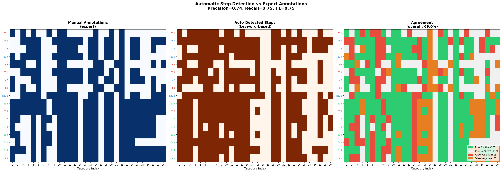

### Technical description

Three panels showing the 17×30 presence/absence matrices:
- **Left (blue):** Manual expert annotations. Dark = present, light = absent.
- **Centre (brown):** Auto-detected steps from keyword matching.
- **Right (coloured):** Agreement map. Green = true positive (both agree present). Grey = true negative (both agree absent). Red = false positive (auto says present, expert says absent). Orange = false negative (auto says absent, expert says present).

### What to look for

The agreement map shows systematic error patterns:
- **Categories 3–8 (Earth & Sampling):** Heavy orange band = many false negatives. The keyword detector misses earth-related annotations in shorter texts (E2, E3, E11) that describe earth sampling in unusual ways.
- **Categories 13–15 (Spiritus/Sal processing):** Red spots = false positives. These categories use keywords like "destillir" and "spiritus" that appear in many contexts beyond their specific recipe step.
- **Categories 16–17 (wet/dry path, two principles):** The auto-detector catches category 16 (Nasser und trockener Weg) poorly because the exact phrases "nasser weg" / "trockener weg" rarely appear — texts instead describe the choice implicitly through procedural details that only an expert can interpret.

### For a non-technical reader

*The three panels show how well the automated keyword search matches the human experts. Green squares are where they agree that a step is present; grey squares are where they agree it's absent. Red squares are "false alarms" — the computer said a step was there but the expert said no. Orange squares are "misses" — the expert said a step was there but the computer didn't find it.*

*The computer does well for steps that are described using consistent vocabulary (like "athanor" for a specific type of oven, or "projection" for the final alchemical step). It struggles with steps that are described implicitly or with variable vocabulary — like "earth sampling method," which might be described through narrative rather than technical terminology.*

---

## 6. Figure S: Four-Way Dendrogram Comparison

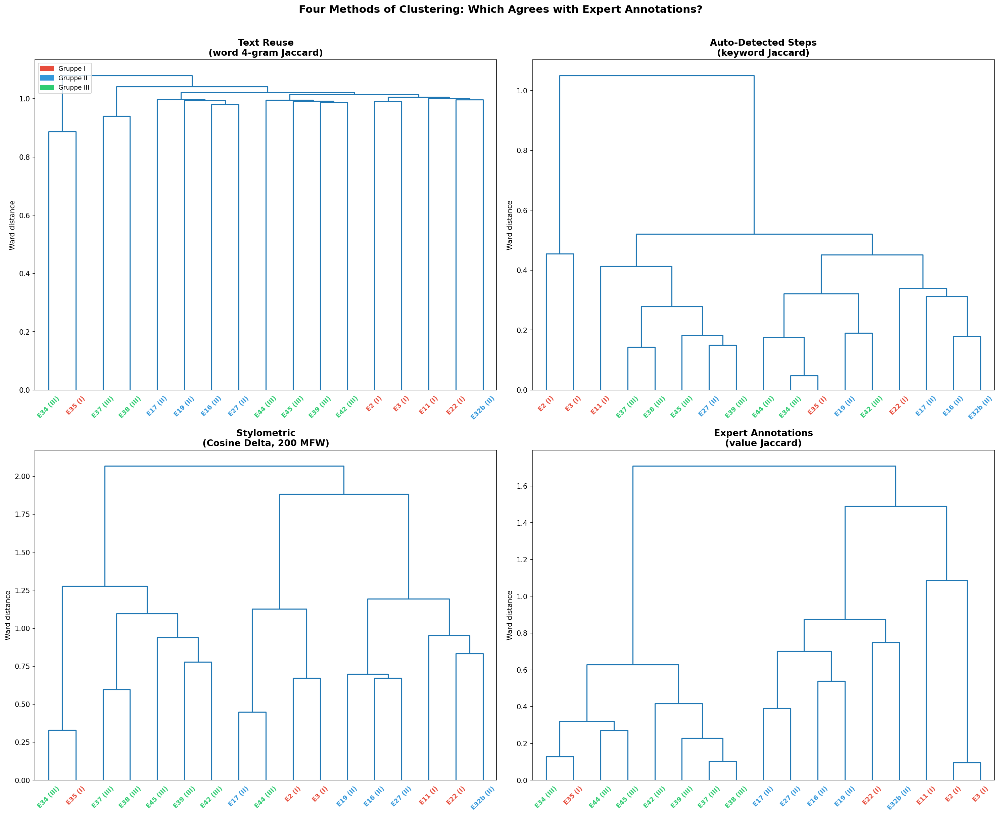

### Technical description

Four dendrograms produced by Ward's linkage from four different distance matrices. All use the same set of 17 texts. Leaf labels show E-name with group assignment, coloured by group.

### What to look for

**Expert annotation tree (bottom-right):** The reference. Clean group separation: Gruppe III forms a tight cluster at right, Gruppe II texts cluster at left-centre, Gruppe I texts are dispersed (E35 clusters with Gruppe III; E2, E3, E11 are together).

**Text reuse tree (top-left):** E34–E35 merge first (highest text reuse), followed by E37–E38. Gruppe III texts cluster together. But E32b and E22 are isolated, and the Gruppe II structure is quite different from the annotation tree.

**Auto-detected steps tree (top-right):** The poorest structure. Texts cluster based on how many steps they contain rather than which specific steps — the keyword detection is too coarse to distinguish groups. E2 and E3 (short Gruppe I texts) are extreme outliers because they trigger very few keywords.

**Stylometric tree (bottom-left):** Distinct from all others. E34–E35 merge first (as in text reuse), but then the branching diverges significantly. Notably, E44 and E17 cluster together — these are from different groups (III and II) but apparently share stylistic features. This cross-group clustering could indicate a shared scribal tradition or common source manuscript that was later classified into different recipe families.

### For a non-technical reader

*Four different "family trees" of the same 17 recipes, each built using a different method. If they all looked the same, any one method could replace the others. They don't — each tree has a different shape, telling us that each method captures different information.*

*The expert annotation tree (bottom-right) is our benchmark. The text reuse tree (top-left) gets the broad strokes right but disagrees on details. The keyword detection tree (top-right) is the weakest — it can barely separate the groups. The stylometric tree (bottom-left) shows some unexpected pairings, like E44 (Gruppe III) with E17 (Gruppe II), suggesting these texts might share a scribal tradition even though their chemical content was classified differently.*

---

## 7. Figure T: Method Correlation Matrix

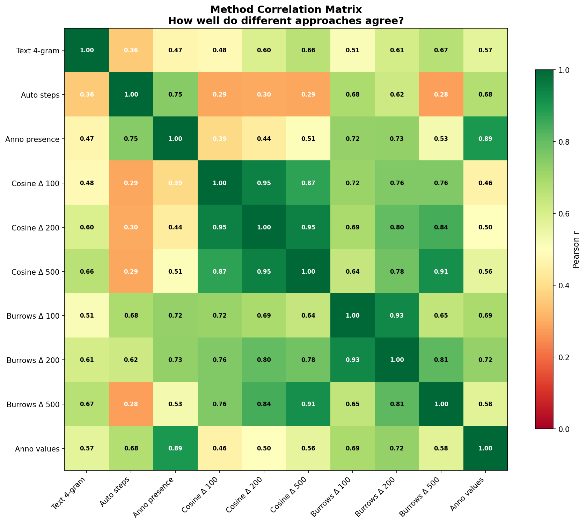

### Technical description

A 10×10 heatmap showing Pearson r correlations between all method pairs across all 136 text pairs. Methods include: Text 4-gram, Auto steps, Anno presence, Cosine Delta at three MFW sizes (100, 200, 500), Burrows' Delta at three MFW sizes, and Anno values (expert ground truth).

### What to look for

**Three clusters emerge:**

1. **Stylometric methods** (Cosine Δ and Burrows' Δ at all MFW sizes): These correlate strongly with each other (r = 0.80–0.97) and form a coherent block. The two Delta variants agree closely, and increasing MFW size has only modest effects.

2. **Content-based methods** (Auto steps, Anno presence, Anno values): These also intercorrelate (r = 0.69–0.90). The auto-detected steps correlate surprisingly well with annotation presence (r = 0.75), better than with any stylometric method.

3. **Text 4-gram:** Sits between the two clusters, correlating moderately with both stylometric (r = 0.47–0.67) and content-based (r = 0.36–0.57) methods. It is the only method that directly measures word-level copying, bridging the style/content divide.

**The Burrows' Delta column is the star:** It correlates at r = 0.62–0.73 with every content-based method — much higher than Cosine Delta's r = 0.29–0.50. Burrows' Delta appears to capture content information that Cosine Delta misses.

### For a non-technical reader

*This grid shows how well all 10 methods agree with each other. Dark green means strong agreement; pale yellow means weak agreement. The most important column is "Anno values" (expert annotations) at the right edge — this is the ground truth. The methods that show the darkest green in that column are the best automated substitutes for human annotation.*

*Burrows' Delta (the row labelled "Burrows Δ 200") stands out: it has the darkest green correlation with expert annotations (r = 0.72) of any fully automated method. This is a standard stylometric tool originally designed for identifying anonymous authors — but it turns out to be the best automated proxy for expert chemical annotation in this corpus.*

---

## 8. Figure U: Network Visualisation

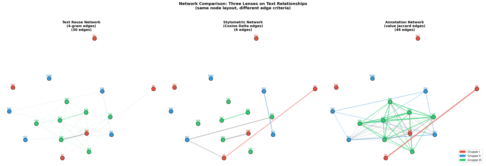

### Technical description

Three network graphs using the **same node layout** (computed from annotation similarity using a spring-layout algorithm) but with different edge criteria:

1. **Text reuse network (left):** Edges drawn for text pairs with 4-gram Jaccard > 0.005. Threshold chosen to produce a readable graph. 30 edges.
2. **Stylometric network (centre):** Edges drawn for pairs with Cosine Delta similarity > 0.5. Only 6 edges — stylometry produces a sparser graph because the distance range is compressed.
3. **Annotation network (right):** Edges drawn for pairs with annotation Jaccard > 0.3. 46 edges — the densest graph.

Edges are coloured by whether they connect within-group (group colour) or between-group (grey) nodes. Edge width and opacity are proportional to similarity.

### What to look for

**Text reuse network (left):** Dominated by Gruppe III (green) edges. The strongest connections are E34–E35, E37–E38, and a cluster of green nodes in the lower area. Gruppe II texts (blue) show some connections (E16–E27, E17–E27). Gruppe I texts (red) are mostly isolated — their text reuse with each other is minimal.

**Stylometric network (centre):** Very sparse. Only 6 edges pass the threshold. Notably, one strong edge crosses groups: E34 (III) – E35 (I). This confirms the previously observed anomaly of E35 clustering with Gruppe III by multiple methods.

**Annotation network (right):** Much denser, with strong within-group connectivity for all three groups. Between-group edges also appear, especially between Gruppe I and Gruppe III (the E35 connection again, plus others). This shows that the expert annotations reveal a richer web of relationships than either automated method.

### For a non-technical reader

*Three views of the same recipes, with lines drawn between recipes that are similar — but "similar" is defined differently in each panel. All three panels place the recipes in the same positions so you can compare directly.*

*The text reuse panel (left) shows which recipes share actual phrases — this represents direct copying. The stylometric panel (centre) shows which recipes are written in the same style — this represents shared scribal traditions. The annotation panel (right) shows which recipes describe the same chemistry — this represents shared procedural knowledge.*

*Notice how the annotation network (right) is much denser than the other two. The experts identified many more relationships than either automated method can detect. This is because two recipes can describe the same chemistry in completely different words and writing styles — only a human expert who understands the chemistry can recognise the connection.*

---

## 9. Figure V: Cophenetic Distance Comparison

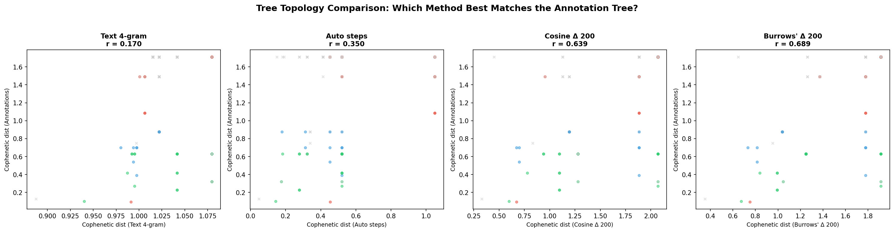

### Technical description

Four scatter plots, each comparing cophenetic distances from one method's dendrogram against the annotation dendrogram. Cophenetic distance = height at which two items first join the same cluster in the dendrogram. Higher correlation means the tree shapes are more similar.

| Method | Cophenetic r with annotations |
|--------|------|
| Text 4-gram | 0.170 |
| Auto steps | 0.350 |
| **Cosine Δ 200** | **0.639** |
| **Burrows' Δ 200** | **0.689** |

### Key finding: Stylometry best recovers the tree topology

This is the most important result of the entire pipeline. While text 4-grams had the best nearest-neighbour agreement (71%) and Burrows' Delta had the best pairwise correlation (0.723), **the tree topology comparison tells a different story**: Burrows' Delta (r = 0.689) and Cosine Delta (r = 0.639) dramatically outperform both text 4-grams (r = 0.170) and auto steps (r = 0.350) at recovering the annotation tree's overall branching structure.

This means stylometric methods don't just identify similar pairs — they reconstruct the hierarchical relationships (which sub-families exist, how they relate to each other) much more faithfully than text reuse detection. This is precisely the kind of structural information needed for stemmatic analysis.

### For a non-technical reader

*This figure answers the hardest question: "Which automated method best reconstructs the full family tree of manuscript relationships — not just which pairs are closest, but the entire branching structure?"*

*The answer is clear: stylometric analysis (Burrows' Delta) produces a family tree that matches the expert-annotated tree at r = 0.689 — far better than text 4-gram matching (r = 0.170). This is a remarkable result because stylometry was designed for authorship attribution, not for recipe comparison. But it makes intuitive sense: the branching structure of manuscript families is determined by who copied from whom, and the scribal habits captured by stylometry (spelling conventions, function word usage) are precisely the features that get transmitted through copying.*

---

## 10. Figures W & X: Nearest-Neighbour Agreement

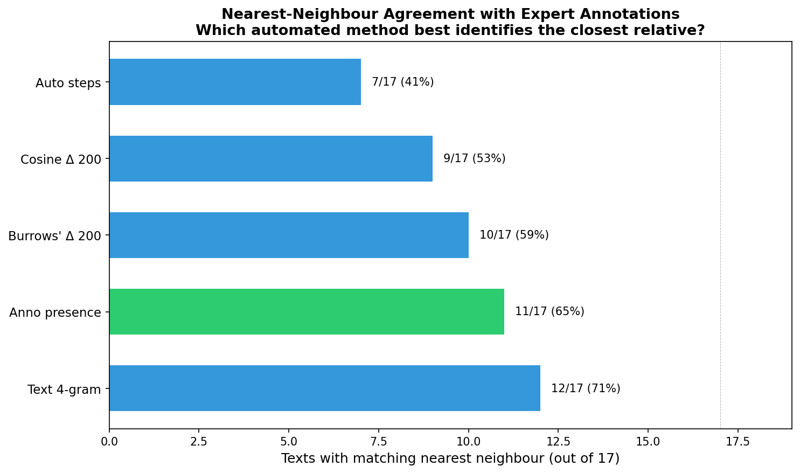

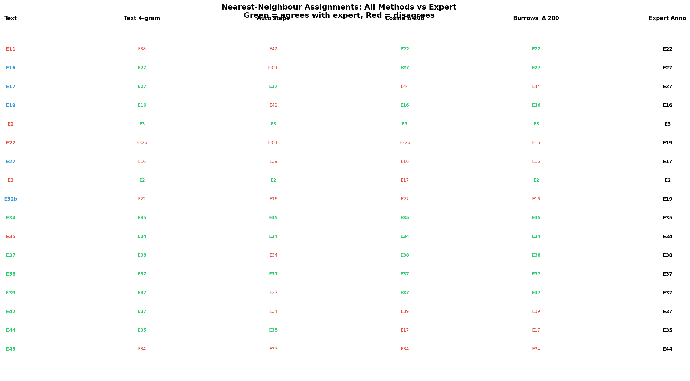

### Results summary

| Method | NN agreement with expert | Rate |
|--------|------------------------|------|
| Text 4-gram | 12/17 | **71%** |
| Anno presence (binary) | 11/17 | 65% |
| Burrows' Δ 200 | 10/17 | 59% |
| Cosine Δ 200 | 9/17 | 53% |
| Auto steps | 7/17 | 41% |

### The paradox: Text 4-grams win locally but lose globally

Text 4-grams have the highest nearest-neighbour agreement (71%) but the lowest tree topology correlation (0.170). Stylometric methods have lower NN agreement (53–59%) but much higher tree topology correlation (0.639–0.689). How is this possible?

The answer lies in what each measure captures:
- **Nearest-neighbour** asks: "For each text, is the single closest match correct?" Text 4-grams excel here because direct text reuse is a very strong signal for the closest pair — if two texts share 451 four-grams (like E34–E35), that's unmistakably the closest match.
- **Tree topology** asks: "Is the entire hierarchical structure correct — not just the closest pair, but the second-closest, the cluster structure, the inter-group relationships?" Stylometry excels here because it captures gradients of similarity through function word distributions, producing a richer and more nuanced distance landscape.

### Specific disagreement patterns from Figure X

**Texts where all automated methods agree with expert:**
- E2→E3, E16→E27, E34→E35, E35→E34, E37→E38, E38→E37, E39→E37

These are the "easy" cases: pairs with strong, unambiguous relationships that every method detects.

**Texts where all automated methods disagree with expert:**
- E22 (expert→E19, all automated→E32b or E16)
- E27 (expert→E17, all automated→E16 or E39)
- E32b (expert→E19, all automated→E22, E27, or E16)
- E45 (expert→E44, all automated→E34 or E37)

These are the cases where the expert annotations reveal relationships that no purely textual method can detect.

**Text where only Cosine Delta agrees:**
- E11 (expert→E22, Cosine Δ→E22, all others→E38/E42)

This is notable: E11 is the most isolated text (553 words, only 17 annotation values, zero shared 4-grams with E22). The fact that Cosine Delta correctly identifies E22 as the nearest neighbour — when no other method can — suggests that E11 and E22 share subtle stylistic patterns (function word distributions) that indicate a common scribal tradition, even though they share no verbatim text and have low annotation overlap.

---

## 11. Where and Why the Methods Diverge

### Divergence Type 1: "Same words, different chemistry"

**Example: E44 and E17** (Cosine Delta says nearest neighbours; expert says different groups)

Cosine Delta clusters E44 (Gruppe III) with E17 (Gruppe II). These texts share function word distributions — they are written in a similar style. But their expert-annotated chemical content is quite different.

**Why:** E44 and E17 may have been written by scribes trained in the same tradition, or they may share a common source text that was later adapted for different recipe families. The stylistic similarity is real (they truly do write "the same way") but the content similarity is not (they describe different procedures).

**What it means:** Stylistic transmission and content transmission can follow different paths. A scribe could copy the writing style of a source while changing the chemical content, or vice versa.

### Divergence Type 2: "Different words, same chemistry"

**Example: E22 and E19** (expert says nearest neighbours; no automated method agrees)

E22 (Gruppe I) and E19 (Gruppe II) share high annotation similarity (Jaccard = 0.300) but very low text reuse (4-gram Jaccard ≈ 0.002) and moderate stylometric distance. The experts identified 42 shared annotation values, including detailed procedural specifics about earth preparation, salt extraction, and gold work.

**Why:** E22 and E19 describe the same chemistry in completely different words. This is consistent with independent transmission of the same laboratory knowledge — perhaps through oral instruction or separate scribal traditions that each rewrote the procedures from scratch. The chemical knowledge was transmitted faithfully, but the textual expression was not.

**What it means:** Some relationships in the corpus are invisible to any word-level method. Detecting them requires understanding what the text *means*, not just what words it uses.

### Divergence Type 3: "Strong text match across group boundaries"

**Example: E34 (Gruppe III) and E35 (Gruppe I)**

Every automated method and the expert annotations agree: E34 and E35 are extremely similar (451 shared 4-grams, annotation Jaccard = 0.873). Yet they are assigned to different groups. This is the most consistently anomalous pair in the entire corpus.

**Why:** E35 is likely misclassified, or it represents a genuine cross-group transmission: a Gruppe III text that was transmitted into a Gruppe I context. All methods converge on this conclusion, making it one of the most robust findings of the entire analysis.

### Divergence Type 4: "Stylometry sees what text reuse can't"

**Example: E11 and E22** (only Cosine Delta correctly identifies the relationship)

E11 shares zero 4-grams with E22 and triggers few keyword matches. Yet Cosine Delta detects a stylistic affinity. This suggests that E11 and E22, despite having no verbatim text in common, were produced within the same scribal milieu — they use function words in similar proportions.

**Why:** Function word distributions are an authorial/scribal fingerprint that persists even when content is completely rewritten. If a single scribe or scribal workshop produced both E11 and E22 (perhaps from different source materials), the stylometric signature would persist even though the specific wording differs entirely.

---

## 12. Burrows' Delta vs Cosine (Eder's) Delta: A Careful Comparison

### Defining "best" — four different criteria

There is no single definition of "best." Different tasks require different evaluation criteria, and the winner changes depending on which criterion you apply:

| Criterion | What it measures | Best for |
|-----------|-----------------|----------|
| **Pearson r** | Linear correlation of all 136 pairwise distances with annotation distances | General agreement on how similar/different all pairs are |
| **Spearman ρ** | Rank correlation (same, but on ranks not raw values — robust to outliers) | Agreement when the relationship may be non-linear |
| **Nearest-neighbour agreement** | For each text, does the method identify the same closest match as the annotations? | Finding the single most similar text (stemmatic first-pass) |
| **Cophenetic correlation** | Does the full dendrogram tree have the same shape as the annotation tree? | Reconstructing complete transmission trees / stemmata |

### The results across MFW sizes (50–1000)

A systematic sweep (`method_comparison_detailed.py`) tested both Delta methods at eight MFW sizes and evaluated on all four criteria:

| Method | Pearson r | Spearman ρ | NN agree | Coph. r | Avg rank |
|--------|-----------|------------|----------|---------|----------|
| **Burrows' Δ 200** | **0.723** | **0.756** | 10/17 (59%) | 0.689 | **2.0** |
| Burrows' Δ 150 | 0.699 | 0.735 | 9/17 (53%) | 0.683 | 3.5 |
| Burrows' Δ 300 | 0.704 | 0.698 | 9/17 (53%) | **0.697** | 4.0 |
| Burrows' Δ 500 | 0.578 | 0.485 | 9/17 (53%) | **0.699** | 5.8 |
| **Text 4-gram** | 0.569 | **0.781** | **12/17 (71%)** | 0.170 | 6.8 |
| Cosine Δ 750 | 0.573 | 0.394 | 9/17 (53%) | 0.659 | 9.0 |
| Cosine Δ 500 | 0.565 | 0.426 | 9/17 (53%) | 0.652 | 9.0 |
| Cosine Δ 300 | 0.546 | 0.429 | 9/17 (53%) | 0.650 | 9.0 |
| Cosine Δ 200 | 0.499 | 0.409 | 9/17 (53%) | 0.639 | 9.8 |
| Cosine Δ 1000 | 0.565 | 0.362 | 7/17 (41%) | 0.655 | 11.8 |
| Burrows' Δ 1000 | 0.383 | 0.126 | 8/17 (47%) | 0.657 | 13.0 |

**Winner per criterion:**
- Pearson r: Burrows' Δ 200 (0.723)
- Spearman ρ: Text 4-gram (0.781)
- NN agreement: Text 4-gram (12/17 = 71%)
- Cophenetic correlation: Burrows' Δ 500 (0.699)

### Why Burrows' Δ outperforms Cosine Δ here (but not in authorship studies)

In the stylometric literature (Eder 2017; Evert, Proisl, Jannidis et al. 2017), Cosine Delta generally outperforms Burrows' Delta for **authorship attribution** — a classification task with discrete outcomes (assigning texts to known authors) evaluated on large corpora (50–1000+ texts).

Our task is fundamentally different in two ways:

1. **Continuous correlation, not classification.** We are measuring how well stylometric *distances* correlate with annotation *distances* — a continuous association task. Cosine Delta's advantage in authorship attribution comes from its better handling of text-length variation and its robustness with very high-dimensional feature spaces. These advantages matter less for distance correlation.

2. **Tiny corpus (17 texts, 136 pairs).** With so few data points, the performance difference between the two methods may be within statistical noise. The ranking could shift with different subsets.

3. **The distribution shapes differ.** The annotation distances have a left-skewed distribution (mean 0.726, skew −0.824). Burrows' Delta distances have a similar skew (−0.738), while Cosine Delta is more strongly skewed (−1.282). The better distributional match between Burrows' Δ and annotation distances contributes to the higher Pearson r — Pearson r assumes approximately symmetric, normally distributed data, and Cosine Delta's compressed upper range violates this more.

4. **Cosine distance discards magnitude.** Cosine measures the *angle* between z-score vectors, ignoring their length. In authorship attribution, this is a feature — it makes the method robust to text-length differences. In our task, the *magnitude* of z-score differences carries meaningful information about how much content two texts share. Burrows' Delta (Manhattan distance) preserves this magnitude information.

### The crossover at high MFW

A crucial pattern visible in Figure Y: **at MFW ≥ 750, Cosine Delta overtakes Burrows' Delta** on Pearson r and Spearman ρ. This happens because:

- At high MFW counts, the feature vectors become very high-dimensional relative to the number of texts (750+ features for 17 texts).
- Burrows' Delta (Manhattan distance) becomes increasingly noisy in high dimensions — the "curse of dimensionality" makes mean absolute differences unreliable.
- Cosine Delta, by focusing on the vector angle rather than magnitude, is more robust to this effect.

This is consistent with the literature finding: Cosine Delta's advantage emerges most clearly in high-dimensional settings. For this corpus, the practical sweet spot is **MFW = 150–300**, where both methods perform well and Burrows' Δ has a modest advantage.

### The bottom line

**Both methods are useful; neither uniformly dominates the other.** Burrows' Delta with 200 MFW gives the best overall performance across criteria (average rank 2.0). Cosine Delta becomes competitive at higher MFW sizes (500+) and is more stable as dimensionality increases. For tree topology recovery specifically, both stylometric methods dramatically outperform text 4-grams (coph. r ≈ 0.65–0.70 vs 0.17).

**For practical use with a corpus of this size: use Burrows' Delta with 150–300 MFW as the primary analysis, and Cosine Delta with 500–1000 MFW as a robustness check.**

---

## 13. Figures Y, Z, AA: Detailed Method Comparison

### Figure Y: MFW Size Sweep

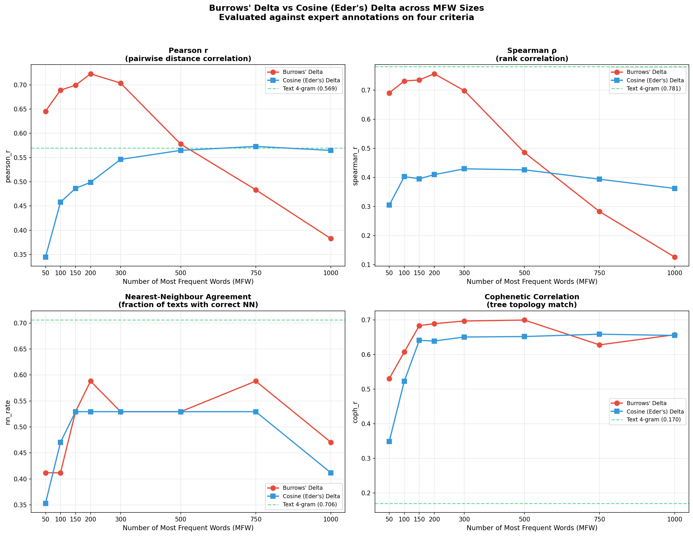

Four panels showing how each evaluation criterion changes as the number of Most Frequent Words increases from 50 to 1000. Red line = Burrows' Delta, blue line = Cosine (Eder's) Delta, green dashed line = Text 4-gram baseline.

**Key observations:**
- **Pearson r (top-left):** Burrows' Δ peaks at MFW=200 (r=0.723), then declines sharply. Cosine Δ rises steadily and stabilises around 0.56–0.57 for MFW ≥ 500. The two lines cross between 500 and 750.
- **Spearman ρ (top-right):** Burrows' Δ peaks at MFW=200 (ρ=0.756), then collapses. Cosine Δ is flat around 0.40. Text 4-gram wins overall (ρ=0.781) because Spearman rewards correct rank ordering, and direct text reuse is the strongest rank-ordering signal.
- **NN agreement (bottom-left):** Text 4-gram dominates (71%). Both stylometric methods fluctuate between 41–59%, with no clear MFW-size trend.
- **Cophenetic r (bottom-right):** Both stylometric methods vastly outperform text 4-grams (0.17) across all MFW sizes. Burrows' Δ peaks around MFW 300–500; Cosine Δ is remarkably stable (0.64–0.66 across all sizes ≥ 150). This stability is a practical advantage of Cosine Delta.

### Figure Z: Distance Scatter Plots

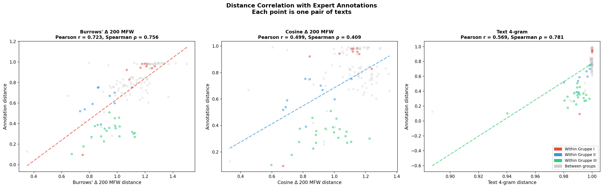

Three scatter plots showing raw distances (not normalised) for each method (x-axis) vs annotation distances (y-axis). Each point is one of the 136 text pairs. Dashed line = linear fit.

**What to look for:**
- **Burrows' Δ (left):** A clear positive linear relationship with good spread. Points follow the trend line reasonably well.
- **Cosine Δ (centre):** The relationship is present but weaker. Points are more compressed along the x-axis (Cosine distances span a narrower range), making the correlation less precise.
- **Text 4-gram (right):** Almost all points are compressed at x ≈ 1.0 (very high distance), with a few low-distance outliers that drive the correlation. This is why Pearson r is moderate (0.569) but Spearman ρ is high (0.781) — the rank ordering of the few non-zero pairs is very accurate.

### Figure AA: Best Dendrograms

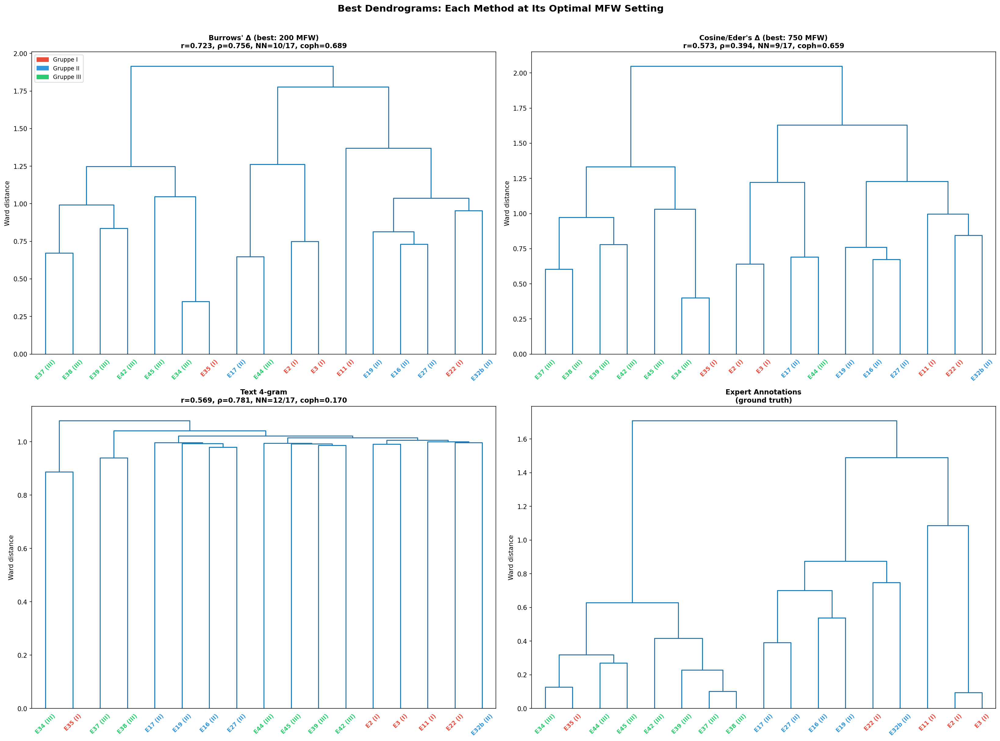

Four dendrograms at each method's optimal MFW setting: Burrows' Δ at 200 MFW (top-left), Cosine Δ at 750 MFW (top-right), Text 4-gram (bottom-left), Expert annotations (bottom-right).

Compare the branching structure with the expert annotation tree. Burrows' Δ 200 most closely mirrors the annotation tree's group structure and branching order, though with some differences in the Gruppe II region.

---

## 14. The Four Hardest Texts

Four texts consistently defy automated analysis — every method disagrees with expert annotations about their nearest neighbour:

### E22 (Gruppe I)
- Expert says nearest = E19. All automated methods say E32b or E16.
- E22 shares chemistry with E19 in completely different words.
- **Likely cause:** Independent transmission of the same chemical knowledge.

### E27 (Gruppe II)
- Expert says nearest = E17. All automated methods say E16 or E39.
- E27 shares more exact text with E16 but more chemical content with E17.
- **Likely cause:** E27 and E16 share a textual lineage (same source manuscript), while E27 and E17 share a chemical lineage (same laboratory tradition). The two lineages have diverged.

### E32b (Gruppe II)
- Expert says nearest = E19. All automated methods say E22, E27, or E16.
- E32b is the second-longest text (3226 words), creating noise through spurious matches.
- **Likely cause:** E32b's length makes all automated metrics unreliable. Its true chemical relationship to E19 is obscured by the sheer volume of coincidental word and style overlaps with other texts.

### E45 (Gruppe III)
- Expert says nearest = E44. All automated methods say E34 or E37.
- E45 shares 71 four-grams with E34 but only 19 with E44, strongly suggesting it was copied from E34. Yet its annotation similarity to E44 is fractionally higher (0.730 vs 0.724).
- **Likely cause:** E45 was textually derived from E34 but chemically converged with E44 through independent development or a shared source.

---

## 15. What Each Method Actually Measures

| Method | What it measures | Transmission channel it detects | Blind spots |
|--------|-----------------|-------------------------------|-------------|
| **Text 4-gram** | Verbatim word sequences | Direct copying, close textual lineage | Paraphrasing, rewriting, oral transmission |
| **Auto step detection** | Keyword presence for recipe steps | Broad procedural similarity | Subtlety, specificity, context |
| **Burrows' Delta** | Function + content word distributions (Manhattan, equal weight) | Scribal tradition + content overlap | Degrades at high MFW (>500) |
| **Eder's Delta** | Same as Burrows' but upweights most frequent words | Scribal tradition (emphasises unconscious habits) | Nearly identical to Burrows' for this corpus (r>0.99) |
| **Quadratic Delta** | Function + content word distributions (Euclidean) | Same as Burrows' but more sensitive to outlier features | Most robust across MFW sizes |
| **Cosine Delta** | Word distribution shape only (cosine, ignores magnitude) | Scribal tradition, authorial style | Lower correlation metrics but more stable |
| **Expert annotations** | Chemical procedural content | Any transmission channel | Limited by annotator agreement, schema design |

The fundamental insight is that these methods are **not redundant** — they measure genuinely different things. A complete picture of recipe transmission requires comparing their outputs:

- **Where text 4-gram and annotations agree:** Direct copying of chemical content (E34–E35, E37–E38).
- **Where stylometry and annotations agree but 4-grams don't:** Shared tradition without verbatim copying (E11–E22).
- **Where 4-grams agree with annotations but stylometry doesn't:** Content reuse with style change (E17–E27: shared content, different scribal hand).
- **Where no automated method agrees with annotations:** Meaning-level relationships invisible to text (E22–E19: same chemistry, entirely different expression).

---

## 16. Four Delta Variants: Burrows', Eder's, Quadratic, Cosine

(`delta_comparison.py` — Figures BB, CC)

### What are the four Deltas?

All four share the same first three steps: (1) tokenize texts, (2) select the N most frequent words (MFW), (3) compute relative word frequencies. They differ only in how they compute distance from those frequency vectors:

| Delta variant | Formula | What it measures |
|---------------|---------|-----------------|
| **Burrows' (2002)** | Mean absolute z-score difference (Manhattan/L1) | Equal-weight comparison of all MFW usage patterns |
| **Eder's (2011)** | Same as Burrows', but with rank-based weighting: weight(i) = 1 - (i-1)/(2N). Most frequent word gets weight 1.0, least frequent ~0.5 | Like Burrows' but trusts the most frequent words more |
| **Quadratic** | Root-mean-square z-score difference (Euclidean/L2) | Like Burrows' but penalises large single-feature differences more heavily (squaring amplifies outliers) |
| **Cosine/Wurzburg (Evert et al. 2017)** | 1 - cosine similarity of z-score vectors | Measures the *angle* between profiles, ignoring magnitude. Only the *shape* of the word-frequency profile matters |

### What does Eder's rank-weighting actually do?

For 200 MFW, the weights range from 1.0 (rank 1: "und") to 0.502 (rank 200: "voll"). The top-ranked function words receive roughly twice the weight of the lowest-ranked words. The rationale: the most frequent function words (und, die, der, in, das) are the most reliable stylometric markers because they are used unconsciously and are resistant to deliberate alteration.

In practice, however, the effect is small: **Burrows' and Eder's distances correlate at r = 0.997 for 200 MFW.** The largest pairwise difference is only 0.068 (E11-E3). This means that for this corpus, the rank weighting barely changes the results.

### Key findings from the four-Delta comparison

**There is no single "best" method.** Each of the four evaluation criteria answers a different sub-question:

| Criterion | What it asks | Best method | Score |
|-----------|-------------|-------------|-------|
| **Pearson r** | Does the method agree with experts about the *degree* of similarity? | Quadratic 300 MFW | 0.731 |
| **Spearman rho** | Does it get the *rank order* right? | Text 4-gram | 0.781 |
| **Nearest-neighbour** | Does it correctly identify each text's *closest relative*? | Text 4-gram | 12/17 (71%) |
| **Cophenetic r** | Does it produce the same *family tree*? | Quadratic 1000 MFW | 0.707 |

**Pattern by MFW size:**

- **MFW 50-200**: Burrows' and Eder's Deltas lead on Pearson r and Spearman rho. Their Manhattan-based approach works well in low dimensions.
- **MFW 300**: Quadratic Delta takes the lead on correlation metrics, while Eder's leads on NN agreement (10/17).
- **MFW 500-1000**: Burrows' Delta degrades sharply (Pearson drops from 0.72 to 0.38). Quadratic Delta is most robust, maintaining Pearson > 0.66 even at 1000 MFW. Eder's weighting partially mitigates the degradation (0.45 vs 0.38 at 1000 MFW).
- **Cosine Delta**: Most stable across MFW sizes but consistently lower on correlation metrics. Better for NN agreement at low MFW.
- **Cophenetic correlation**: All four Deltas converge to similar values (0.65-0.71) at high MFW. Tree topology is the most robust metric across methods.

**Why Eder's Delta doesn't outperform Burrows' here (contrary to the literature):**

The literature's finding that Eder's Delta outperforms Burrows' was established for *authorship attribution* — distinguishing who wrote what. In that task, the most frequent function words carry the strongest authorial signal, so upweighting them helps. Our task is different: we are measuring *recipe transmission and procedural dependency*, not authorship. The signal for transmission is distributed more evenly across the vocabulary (content words describing chemical procedures matter too), so Eder's rank weighting provides little advantage. With only 17 texts and a correlation of r > 0.99 between the two methods' distances, the difference is well within noise.

### For a non-technical audience

All four methods work the same way at their core: they look at how often common words appear in each text and measure whether two texts use words at similar rates. The differences are in how they define "similar rates":

- **Burrows'** treats all words equally and adds up all the differences.
- **Eder's** gives more importance to the very commonest words (like "and", "the", "is") on the theory that these reveal unconscious habits.
- **Quadratic** also treats all words equally but cares more about *big* differences on individual words than about many small differences.
- **Cosine** asks only "do these texts have the same *pattern* of word use?" regardless of how strongly the pattern shows.

The practical result: for this corpus, these distinctions matter less than you might expect. The methods mostly agree. Where they diverge (at high MFW counts), Quadratic Delta is the most stable, while Burrows' becomes unreliable.

---

## 17. Figures BB, CC: Four-Delta Comparison

### Figure BB: Four Deltas Across MFW Sizes

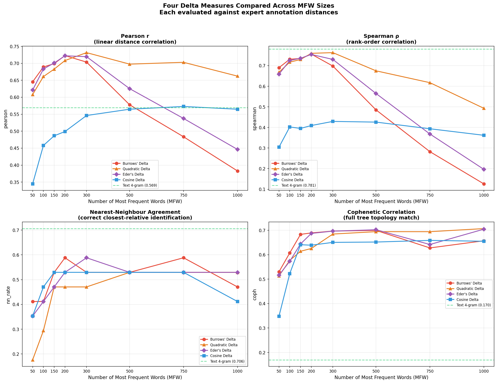

**What it shows:** Four panels, one per evaluation criterion. Each panel plots the four Delta variants across MFW sizes 50-1000, with the text 4-gram baseline as a dashed horizontal line.

**Technical reading:**
- Top-left (Pearson r): Burrows'/Eder's peak at MFW 200 then decline. Quadratic peaks later (300) and declines more gracefully. Cosine is flat and low.
- Top-right (Spearman rho): Similar pattern but sharper. Burrows' drops below the text 4-gram baseline by MFW 750. Quadratic remains competitive.
- Bottom-left (NN agreement): Noisy — all methods fluctuate between 0.3-0.6. No clear winner among the Deltas; text 4-gram baseline (0.71) dominates.
- Bottom-right (Cophenetic r): All four Deltas converge at high MFW. This is the metric where stylometry most consistently outperforms text 4-grams.

**Non-technical reading:** When you use fewer common words (50-200), the simple Manhattan-based methods (Burrows'/Eder's) work best. When you include many words (500+), the Euclidean method (Quadratic) is more reliable. For tree-building, all four methods work comparably well and all far outperform the verbatim-matching approach.

### Figure CC: Six Dendrograms

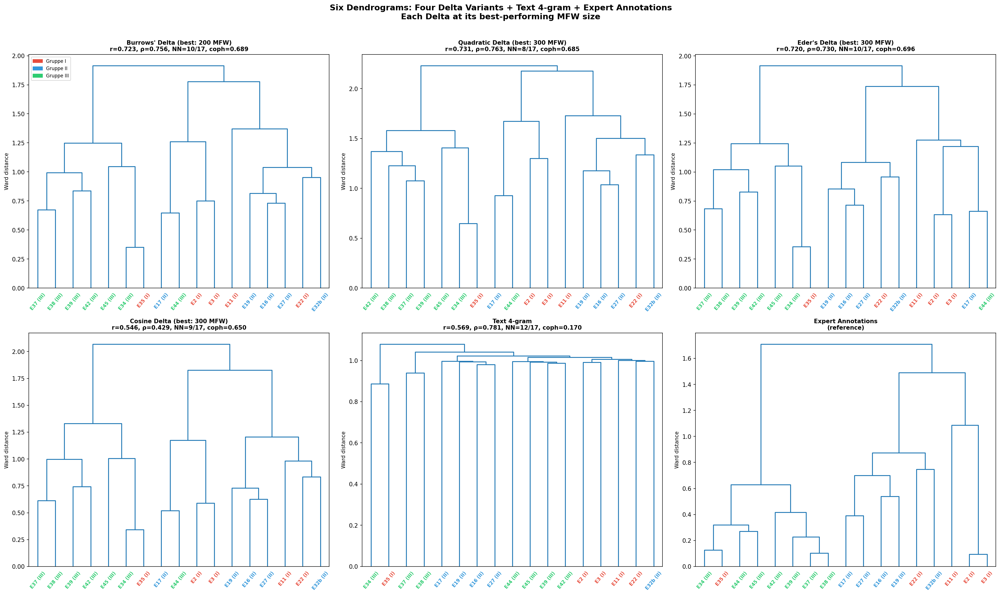

**What it shows:** Six family trees side by side — one for each Delta at its best MFW setting, one for text 4-grams, and one for expert annotations (reference). Text labels are colour-coded by Gruppe (red = I, blue = II, green = III).

**Technical reading:** The four Delta dendrograms are visually similar, reflecting their high inter-method correlation. Key differences from the expert dendrogram:
- All Deltas correctly group most Gruppe III texts together (green cluster).
- All Deltas struggle with the placement of E22 and E32b within their groups.
- Text 4-grams produce a tree with poor hierarchical structure (coph = 0.17) — good at identifying nearest neighbours but bad at reconstructing deeper branching.

**Non-technical reading:** The four mathematical variants produce nearly identical family trees. They all capture the broad group structure that experts identified (the three Gruppen). Where they fail — mostly with a few boundary texts — they all fail in the same way, suggesting the limitation is in what word frequencies can detect, not in the specific mathematical formula used.

---

## 18. Recommendations

### For this corpus

1. **E35 should be investigated for group reassignment.** Every method — text reuse, stylometry, and expert annotation — places it with Gruppe III rather than Gruppe I. This is the most robust cross-method finding.

2. **E22–E19 and E27–E17 deserve close reading.** These pairs show expert-identified chemical similarity with no automated support, suggesting non-textual transmission channels (oral teaching, laboratory practice).

3. **E32b's analysis is unreliable due to length.** Consider analysing it in segments rather than as a whole text.

### For other corpora

1. **Start with Burrows'/Eder's Delta at MFW 200 and Quadratic Delta at MFW 300.** These are the best-performing configurations for correlation with expert annotations (Pearson r = 0.72-0.73). Add Cosine Delta at MFW 500-1000 as a robustness check. If results agree, confidence is high. If they diverge, investigate why. Quadratic Delta is the most robust choice if you must pick one method — it maintains performance across MFW sizes better than the others.

2. **Add text 4-gram analysis for direct-copying detection.** It has the best nearest-neighbour agreement (71%) and uniquely identifies verbatim transmission — the only method that can provide evidence of *direct* textual descent.

3. **Skip keyword-based step detection** unless you have a very well-defined vocabulary. The 69% agreement and poor group separation (1.12×) make it the weakest method tested.

4. **Use all methods together.** The divergences between methods are not noise — they are information. Where methods disagree, there is something interesting happening in the transmission history.

5. **Expect automated methods to fail for ~25% of texts.** The four hardest cases (E22, E27, E32b, E45) cannot be resolved by any automated method. Budget expert time for these "boundary texts" where automated pre-screening flags ambiguity.

6. **Be cautious about claims that one Delta variant "outperforms" the others.** With a small corpus (17 texts), performance differences are often within noise. The four Delta variants are highly correlated (r > 0.99 for Burrows'/Eder's; somewhat lower for Cosine). The literature's findings about Eder's or Cosine Delta outperforming Burrows' were established for *authorship attribution* on large corpora — a different task with different signal structure. For recipe transmission analysis on small corpora, the choice of Delta variant matters less than the choice of MFW size.

---

*Documentation for `automated_pipeline.py`, `method_comparison_detailed.py`, and `delta_comparison.py`. All figures saved to `processus-universalis-graphics/processus_fig[R-CC]*.png`. Scripts and data in `/Users/slang/claude/`.*
