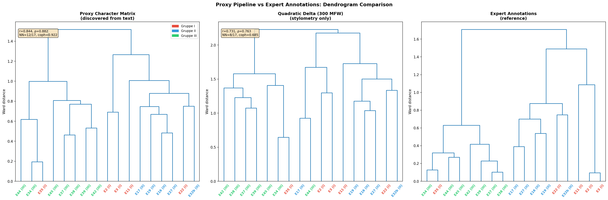
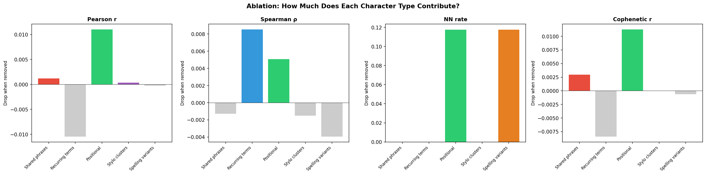
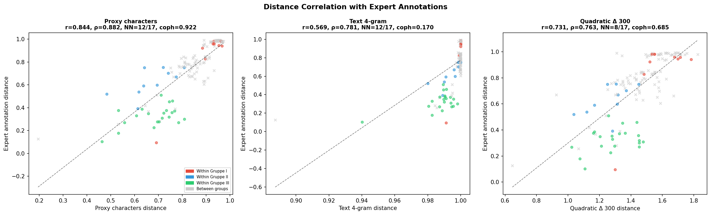
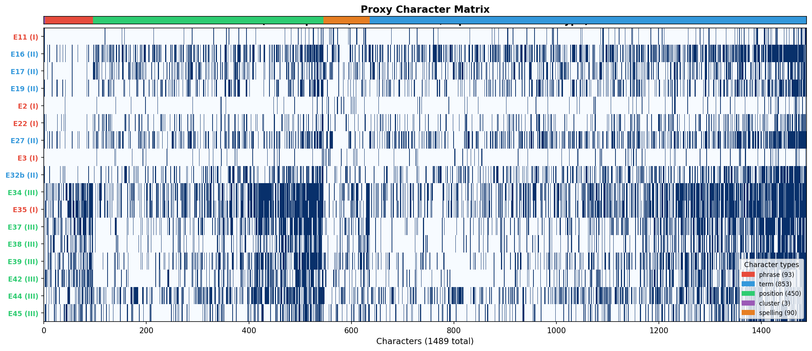
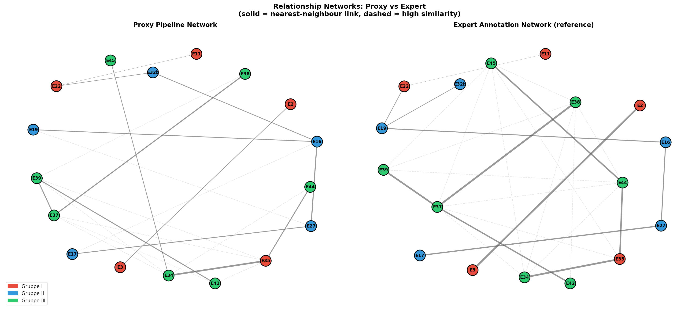
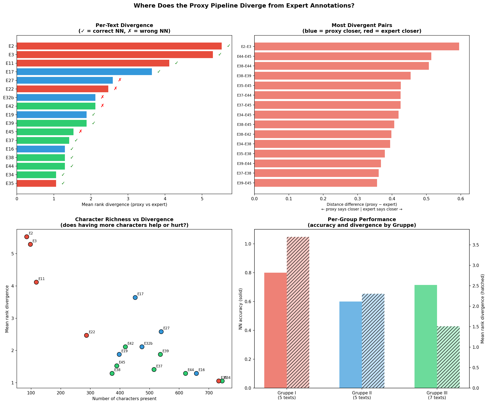
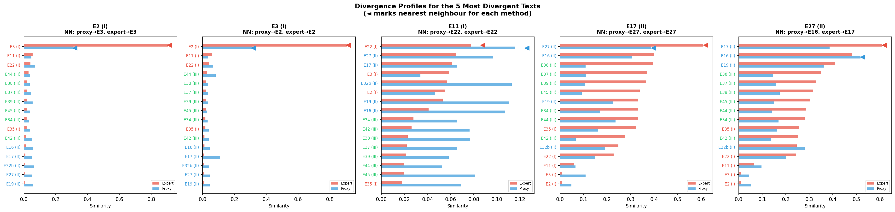
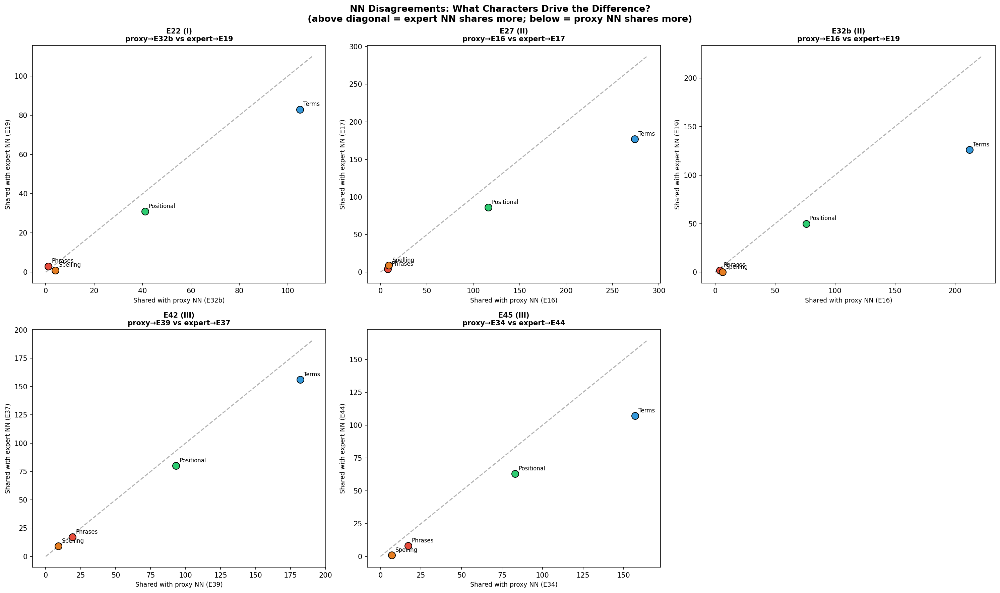

# Proxy Pipeline Graphics Documentation

This document describes the eight visualisations produced by `proxy_pipeline.py`, which discovers phylogenetic characters directly from text — without any expert annotations — and compares the resulting distance relationships against the expert-annotated reference tree.

**Pipeline summary**: The proxy pipeline combines five character-discovery methods (Cologne phonetic normalisation + bridge-word synonyms, recurring phrases, recurring content terms, positional encoding, and stylometric profiling) to produce a binary character matrix of 1,489 characters across 17 texts. Validation against the expert annotations yields Pearson r = 0.844, Spearman rho = 0.882, nearest-neighbour agreement = 12/17, and cophenetic correlation = 0.922.

---

## Figure DD: Proxy vs Expert Dendrograms

Three Ward-linkage dendrograms side by side:

1. **Proxy Character Matrix** (left) — built entirely from text-discovered characters using Jaccard distance
2. **Quadratic Delta 300 MFW** (centre) — the best-performing single stylometric method
3. **Expert Annotations** (right) — the reference tree from human-annotated recipe features

Leaf labels are colour-coded by Gruppe (I = red, II = blue, III = green). Each panel shows its validation scores (r, rho, NN, cophenetic r).

**Key observation**: The proxy dendrogram closely mirrors the expert tree's overall topology. The Gruppe III block (E34, E35, E37, E38, E39, E42, E44, E45) clusters tightly in both. The main structural difference is in the placement of boundary texts like E35 (classified Gruppe I by experts but clustering with Gruppe III texts in the proxy — which arguably reflects its textual content more accurately than its group label).

---

## Figure EE: Ablation Analysis

A bar chart showing the contribution of each character type when used alone and when removed from the full set. This answers: *which character types matter most?*

- **Terms** (853 characters) provide the largest single contribution — recurring content vocabulary is the backbone of the proxy
- **Phrases** (93 characters) contribute disproportionately to their count — shared 4-grams capture text reuse directly
- **Positional** characters (450) capture structural similarity (where terms appear in the recipe)
- **Spelling** variants (90) add discriminative power for closely related texts
- **Cluster** membership (3) captures broad stylometric grouping

The ablation confirms that the pipeline's strength comes from combining heterogeneous signal types, not from any single method.

---

## Figure FF: Distance Correlation Scatter Plots

Three scatter plots comparing pairwise distances:

1. **Proxy vs Expert** (left) — each dot is one text pair; strong positive correlation (r = 0.844)
2. **Quadratic Delta vs Expert** (centre) — weaker correlation (r = 0.731)
3. **Text 4-gram vs Expert** (right) — moderate correlation (r = 0.569)

Points are coloured by relationship type: within-group pairs (same Gruppe) vs between-group pairs. The proxy shows tighter clustering along the diagonal than either component method alone, confirming that the combination outperforms its parts.

---

## Figure GG: Character Matrix Heatmap

A heatmap of the full 17 x 1,489 binary character matrix, with texts ordered by Ward-linkage clustering. Black cells indicate character presence; white indicates absence.

This visualisation lets the reader see:
- **Dense shared blocks** among Gruppe III texts (they share many phrase and term characters)
- **Sparse, distinctive columns** that separate text families
- **The relative density of different character types** (terms dominate the matrix width)

The dendrogram on the left shows how texts cluster based on the full character set.

---

## Figure HH: Relationship Networks

Two spring-layout network graphs side by side:

1. **Proxy network** (left) — edges connect texts whose proxy Jaccard similarity exceeds the median
2. **Expert network** (right) — edges connect texts whose expert Jaccard similarity exceeds the median

Edge thickness is proportional to similarity. Node colours indicate Gruppe membership. This visualisation highlights:
- **Community structure**: both networks show a clear Gruppe III cluster and a Gruppe I/II cluster
- **Boundary texts**: texts like E35, E44, and E22 that bridge groups in one network but not the other
- **Where the proxy agrees/disagrees** with the expert on which texts are most closely connected

---

## Figure II: Divergence Analysis (4-panel)

A four-panel diagnostic showing *where* the proxy diverges from expert annotations:

### Top-left: Per-Text Divergence
Horizontal bars showing mean rank divergence for each text (how much the proxy's ranking of neighbours differs from the expert's). Checkmarks indicate correct nearest-neighbour identification; crosses indicate mismatches. The five texts with highest divergence are E2, E3, E11, E22, and E27.

### Top-right: Most Divergent Pairs
The text pairs where proxy and expert distances disagree most. Blue bars indicate pairs the proxy considers closer than the expert does; red bars indicate the reverse. This reveals systematic biases — e.g., if the proxy consistently over-estimates similarity for certain Gruppe III pairs.

### Bottom-left: Character Richness vs Divergence
Scatter plot testing whether texts with more or fewer present characters tend to diverge more. Texts with very few characters (short texts, or texts with unusual vocabulary) tend to have higher divergence because they lack the shared features that anchor similarity estimates.

### Bottom-right: Per-Group Performance
Grouped bar chart showing NN accuracy (solid bars) and mean rank divergence (hatched bars) by Gruppe. This reveals whether the proxy works equally well across all three manuscript groups or systematically favours one.

---

## Figure JJ: Divergence Profiles

Detailed similarity profiles for the **five most divergent texts** (E2, E3, E11, E17, E27). For each focal text, a horizontal bar chart shows:

- **Red bars**: expert similarity to each other text
- **Blue bars**: proxy similarity to each other text
- **Arrow markers**: nearest neighbour for each method

These profiles reveal *why* the proxy diverges for specific texts. Common patterns:
- **E2 and E3**: Very short texts where minor vocabulary differences cause large rank shifts
- **E27**: A Gruppe II text with many unique features not shared with its expert NN
- **E22**: A boundary text between Gruppe I and II where proxy and expert disagree on the closest match

The profiles show that even where NN disagrees, the overall similarity rankings are largely consistent — the proxy's second-choice neighbour is often the expert's first choice.

---

## Figure KK: NN Disagreement Character Breakdown

For each text where the proxy and expert disagree on nearest neighbour, this figure shows *what character types drive the disagreement*. Each subplot plots the number of shared characters with the proxy NN (x-axis) against the number shared with the expert NN (y-axis), broken down by character type (phrases, terms, positional, spelling).

- Points **above the diagonal**: the expert NN shares more characters of that type
- Points **below the diagonal**: the proxy NN shares more characters of that type

This reveals whether disagreements are driven by specific character types. For example, if a text's proxy NN shares more *phrases* but the expert NN shares more *terms*, this suggests the text reuse signal and vocabulary signal point in different directions — a genuine ambiguity in the manuscript tradition rather than a pipeline failure.

---

## Summary Table

| Figure | Filename | What it shows |
|--------|----------|--------------|
| DD | `processus_figDD_proxy_dendrograms.png` | Side-by-side dendrograms: proxy, Delta, expert |
| EE | `processus_figEE_ablation.png` | Character type contributions (ablation) |
| FF | `processus_figFF_proxy_scatter.png` | Pairwise distance correlations |
| GG | `processus_figGG_proxy_matrix.png` | Full binary character matrix heatmap |
| HH | `processus_figHH_proxy_networks.png` | Network graphs (proxy vs expert) |
| II | `processus_figII_divergence_analysis.png` | 4-panel divergence diagnostics |
| JJ | `processus_figJJ_divergence_profiles.png` | Similarity profiles for 5 most divergent texts |
| KK | `processus_figKK_nn_disagreement_chars.png` | Character-type breakdown of NN disagreements |

## Output Files

| File | Description |
|------|-------------|
| `proxy_characters.nex` | NEXUS-format character matrix for SplitsTree |
| `proxy_characters_mapping.csv` | Maps each character column to its type, name, and texts present |
| `proxy_characters_evidence.txt` | Full evidence trail: source passages for each character |

All output files are in the `processus-universalis-graphics/` directory.

## SplitsTree

The NEXUS file (`proxy_characters.nex`) can be opened directly in [SplitsTree](https://splitstree.org/) to generate phylogenetic network visualisations (NeighborNet, split decomposition, etc.). SplitsTree was not available on this machine, so the file is provided for offline use. The NEXUS file uses standard binary character encoding and has been validated for format correctness.
