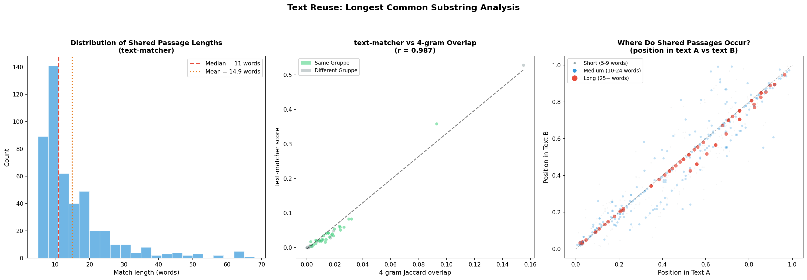
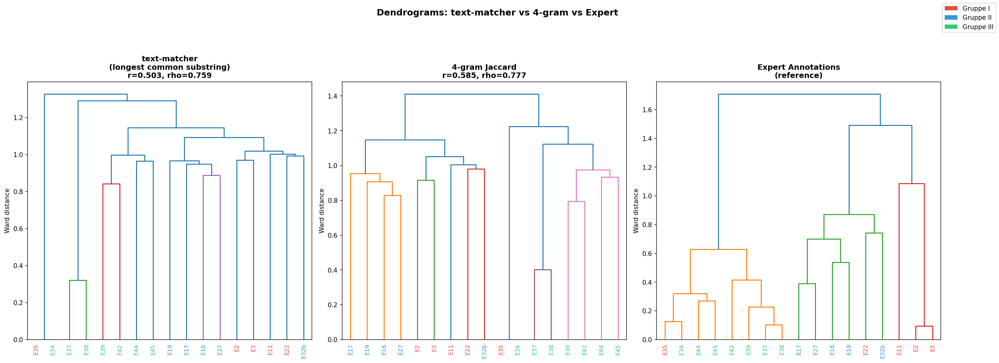
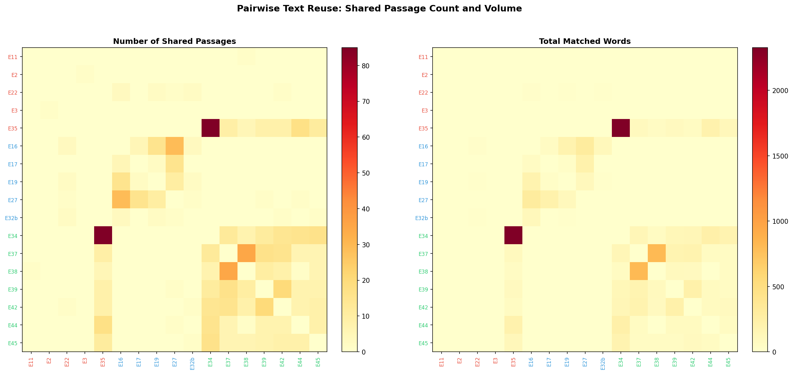
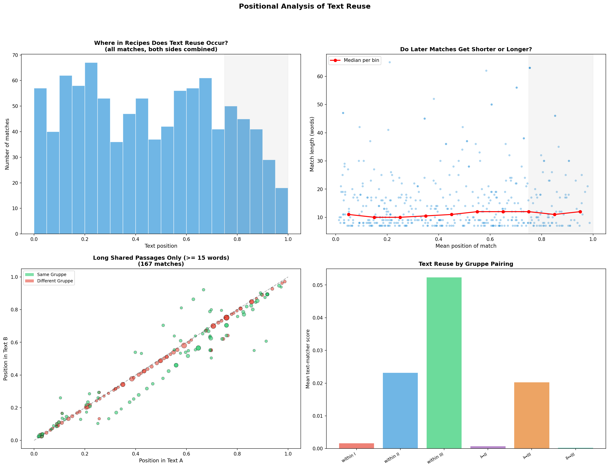
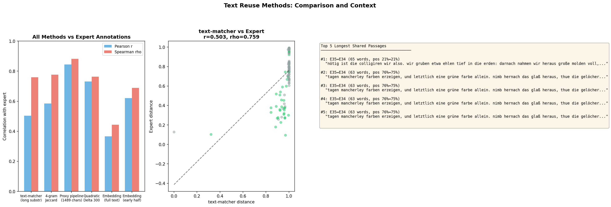

# Text Reuse Analysis: Longest Common Substring Matching

## Overview

This analysis applies Jonathan Reeve's **text-matcher** approach to the 17 *Processus Universalis* recipe manuscripts. Unlike 4-gram Jaccard overlap (which counts short fixed-length fragments), text-matcher finds **extended matching passages** of arbitrary length — from 7 to 65+ words. A 50-word shared passage is qualitatively different from ten overlapping 4-grams: it represents deliberate copying or close paraphrase, not accidental lexical overlap.

**Script:** `text_reuse_analysis.py`
**Figures:** XX through BBB (5 figures)

---

## Method: How text-matcher Works

### The Algorithm (Step by Step)

1. **Tokenization:** Each text is split into lowercase words (letters only, including German umlauts). Unlike the original text-matcher (designed for English), we skip Lancaster stemming and English stopword removal — these would distort Early New High German.

2. **N-gram sequences:** Tokens are grouped into overlapping trigrams (3-word windows). The text `"nimb das salz und thue"` becomes: `(nimb, das, salz)`, `(das, salz, und)`, `(salz, und, thue)`.

3. **Longest common subsequence matching:** Python's `SequenceMatcher` (from `difflib`) finds the longest contiguous blocks of matching trigram sequences between each text pair. This is the core difference from 4-grams: it identifies *extended runs* where two texts share the same sequence of words, not just isolated fragments.

4. **Match healing:** If two matches are separated by fewer than 8 trigrams, they are fused into a single extended match. This handles cases where a scribe changed one word in the middle of an otherwise copied passage.

5. **Fuzzy extension:** Each match boundary is tested against adjacent words using edit distance. If the word just before/after the match in both texts is similar (edit distance ratio < 0.4), the match is extended. This catches spelling variants like `kugell`/`kugel` or `allezeit`/`allzeit`.

6. **Cutoff:** Only matches of 5+ trigrams (roughly 7+ words) are retained.

### What This Measures vs. 4-grams

| Property | 4-gram Jaccard | text-matcher |
|----------|---------------|-------------|
| Unit of comparison | Fixed 4-word fragments | Variable-length passages (7–65+ words) |
| What it counts | Proportion of shared fragments | Number and length of shared passages |
| Handles spelling variation | No (exact match only) | Yes (fuzzy extension via edit distance) |
| False positives from common phrases | High (common 4-word phrases match everywhere) | Low (longer passages are far less likely to be coincidental) |
| Output | A single similarity score | Actual passage texts with positions |
| Interpretability | Statistical | Philological (you can read the shared passages) |

### Adaptation for Early New High German

The original text-matcher uses English-specific NLP:
- **Lancaster stemmer** — would mangle German morphology
- **English stopword list** — irrelevant for Early New High German
- **ASCII-only tokenizer** — misses umlauts (ä, ö, ü, ß)

Our `GermanText` class replaces all three: simple lowercasing, no stemming, no stopword removal, and a Unicode-aware tokenizer pattern `[a-zA-ZäöüÄÖÜß]+`.

---

## Results Summary

### Scale of Text Reuse

| Statistic | Value |
|-----------|-------|
| Total shared passages found | 475 |
| Mean passage length | 14.9 words |
| Median passage length | 11.0 words |
| Longest shared passage | 65 words (E35↔E34) |
| Pairs with at least one match | most of 136 pairs |

### Match Length Distribution

- 100% of matches are 7+ words
- 57.7% are 10+ words
- 35.2% are 15+ words
- 19.8% are 20+ words
- 9.1% are 30+ words
- 2.3% are 50+ words

The distribution is heavily right-skewed: most matches are short (7–15 words), but the tail extends to 65 words. The long matches are the most philologically interesting — they represent near-verbatim copying.

### Top Text Pairs by Reuse

| Pair | Gruppen | Passages | Total Words | Score |
|------|---------|----------|-------------|-------|
| E35↔E34 | I/III | 85 | 2,328 | 0.528 |
| E37↔E38 | III/III | 35 | 816 | 0.358 |
| E37↔E42 | III/III | 15 | 192 | 0.083 |
| E39↔E42 | III/III | 20 | 220 | 0.083 |
| E37↔E39 | III/III | 16 | 175 | 0.062 |
| E16↔E27 | II/II | 29 | 308 | 0.059 |
| E17↔E27 | II/II | 15 | 214 | 0.059 |
| E34↔E44 | III/III | 15 | 232 | 0.054 |
| E34↔E45 | III/III | 16 | 187 | 0.051 |
| E35↔E44 | I/III | 17 | 207 | 0.049 |

**Key observation:** E35↔E34 is an outlier — 85 shared passages totaling 2,328 words. These two texts are near-copies, sharing extended passages from their opening cosmological preamble (position 3%) through practical instructions (35–50%) to the final color-stage descriptions (76–86%). This relationship is so strong it dominates the entire analysis.

---

## Figures

### Figure XX: Match Length Distribution and Correlation

**Left panel — Match length histogram.** Most shared passages are 7–15 words (short reuse), but a meaningful tail extends past 40 words. The median (11 words) and mean (14.9 words) are marked. Passages above ~20 words are almost certainly deliberate copying rather than coincidental overlap.

**Center panel — text-matcher vs 4-gram correlation.** Each dot is a text pair. The two methods correlate strongly (r=0.987), but text-matcher scores have a wider dynamic range for high-reuse pairs. Same-Gruppe pairs (green) cluster at higher values than cross-Gruppe pairs (red), confirming that text reuse respects the Gruppe structure.

**Right panel — Where do matches occur?** Each dot plots the position of a match in text A (x-axis) vs text B (y-axis), colored by length. The strong diagonal indicates that shared passages tend to appear at the same relative position in both texts — when a passage at 70% of text A matches text B, it also appears around 70% of text B. This is consistent with copying from a shared source (or from each other) rather than selective borrowing of isolated passages.

### Figure YY: Dendrograms — text-matcher vs 4-gram vs Expert

Three dendrograms showing how each method clusters the texts.

**text-matcher (r=0.503, rho=0.759):** The dendrogram successfully identifies the E35–E34 pair and the Gruppe III cluster (E37, E38, E39, E42, E44, E45). However, it has weaker resolution for Gruppe I and II texts that share less verbatim material. The low Pearson r (0.503) but higher Spearman rho (0.759) indicates the method preserves rank ordering well but has a nonlinear relationship with expert distances.

**4-gram Jaccard (r=0.585, rho=0.777):** Slightly better numerical correlation with expert annotations. This is expected: 4-gram overlap captures both exact reuse AND shared vocabulary/style, making it a broader (if noisier) similarity measure.

**Expert Annotations (reference):** The gold standard, showing clear Gruppe separation.

**Interpretation:** text-matcher and 4-gram dendrograms are broadly similar but differ in detail. text-matcher is more "lumpy" — it strongly identifies pairs with extensive verbatim copying but has less granularity for pairs that share vocabulary without sharing whole passages.

### Figure ZZ: Pairwise Match Heatmaps

**Left — Number of shared passages.** The E35↔E34 cell is dark red (~85 passages), dominating the heatmap. A secondary hot zone connects E37, E38, E39, E42 (Gruppe III core). The Gruppe II cluster (E16, E17, E19, E27) is visible but cooler — these texts share vocabulary and structure but have fewer verbatim copied passages.

**Right — Total matched words.** Even more dominated by E35↔E34 (2,328 words). This pair shares more verbatim text than most individual texts contain. The E37↔E38 pair is the second hottest cell.

**What this reveals:** Text reuse in this corpus is highly concentrated. A few pairs share enormous amounts of material; most pairs share relatively little. The reuse pattern is consistent with a copying tree where some branches preserve text nearly verbatim while others substantially rework their sources.

### Figure AAA: Positional Analysis of Text Reuse

**Top left — Where in recipes does text reuse occur?** The histogram shows match counts by text position. Reuse is distributed across the entire recipe, not concentrated in one section. There is a slight dip in the final 10% (the theoretical/philosophical coda, where scribes may have been more individual in their language — consistent with findings from the language-chemistry divergence analysis).

**Top right — Do later matches get shorter?** Median match length (red line) stays roughly constant across text position (~11–12 words), suggesting that when scribes copy, they copy with similar fidelity regardless of where they are in the recipe.

**Bottom left — Long passages only (15+ words).** Same-Gruppe matches (green) cluster tightly on the diagonal. Cross-Gruppe matches (red) are sparser and shorter. The diagonal pattern confirms that shared passages appear at corresponding positions in both texts.

**Bottom right — Text reuse by Gruppe pairing.** Within-Gruppe III pairs show the highest mean text-matcher scores, followed by within-Gruppe II. Cross-Gruppe reuse is much lower. This confirms that text-matcher captures the Gruppe structure, with Gruppe III being the most internally cohesive in terms of actual shared passages.

### Figure BBB: Method Comparison

**Left — All methods vs expert annotations.** Bar chart comparing Pearson r and Spearman rho for all methods tested in this project:

| Method | Pearson r | Spearman rho |
|--------|-----------|-------------|
| Proxy pipeline (combined) | 0.844 | 0.882 |
| Quadratic Delta | 0.731 | 0.763 |
| 4-gram Jaccard | 0.585 | 0.777 |
| text-matcher | 0.503 | 0.759 |
| Embedding (full text) | 0.367 | — |
| Embedding (early half) | 0.621 | — |

**Center — Scatter plot of text-matcher vs expert distances.** Same-Gruppe pairs (green) cluster at low distances in both metrics. The correlation is driven largely by the E35↔E34 outlier (bottom-left).

**Right — Top 5 longest shared passages.** Actual text snippets showing the longest matches found. All 5 are E35↔E34 pairs with 63–65 words of near-verbatim shared text spanning cosmological description, practical instructions, and color-stage observations.

---

## What Does text-matcher Show That Other Methods Don't?

### 1. Actual Passages, Not Statistics

The most important advantage is **philological interpretability**. When text-matcher reports that E35 and E34 share a 65-word passage beginning *"nötig ist die colligiren wir also. wir gruben etwa ehlen tief in die erden..."*, a scholar can read that passage, locate it in the manuscripts, and assess its significance. A 4-gram Jaccard score of 0.14 tells you nothing about *what* is shared or *where*.

### 2. Length-Weighted Significance

A 50-word shared passage is not 12.5x more meaningful than a shared 4-gram — it is qualitatively different. The probability of 50 consecutive words matching by chance is astronomically low. text-matcher captures this distinction naturally; 4-gram counting does not.

### 3. Positional Correspondence

text-matcher reveals that shared passages appear at corresponding positions in both texts (the diagonal pattern in Figure XX, right panel). This is strong evidence for copying from a shared structural template, not selective borrowing of useful passages.

### 4. Spelling Tolerance

The fuzzy extension step catches spelling variants that 4-gram matching misses entirely. When one scribe writes `kugell` and another writes `kugel`, or `allezeit` vs `allzeit`, text-matcher extends the match through these variants. 4-gram matching treats them as completely different.

---

## Why Does text-matcher Score Lower Than 4-grams Against Expert Annotations?

This seems counterintuitive but makes sense:

1. **Expert annotations capture more than verbatim copying.** The expert assessed overall textual relationships including shared structure, vocabulary, themes, and transmission history. 4-gram overlap is a broader measure that captures some of this general similarity. text-matcher only finds verbatim (or near-verbatim) passages — it misses the "soft" similarity between texts that share themes and vocabulary without sharing exact wording.

2. **text-matcher is dominated by a few pairs.** E35↔E34 has 85 passages; many pairs have 0–3. This creates a highly skewed distribution that compresses most pairs near zero, reducing the resolution where expert annotations show meaningful distinctions.

3. **Different questions, different answers.** text-matcher answers: "How much text was directly copied?" 4-gram overlap answers: "How much vocabulary and phrasing do these texts share?" The expert assessed a mix of both, plus genealogical reasoning. Neither computational method perfectly captures expert judgment.

**The low Pearson r (0.503) but decent Spearman rho (0.759)** tells us that text-matcher preserves the *rank ordering* of text pairs (most similar to least similar) reasonably well, but its distances are nonlinearly related to expert distances. This is exactly what we'd expect from a method that captures a specific dimension (verbatim copying) rather than general similarity.

---

## Should text-matcher Be Integrated Into Earlier Workflows?

### Yes, But as a Complement — Not a Replacement

**What text-matcher adds:**
- Direct evidence of textual transmission (actual shared passages)
- Spelling-tolerant matching appropriate for manuscript traditions
- Positional analysis showing where in recipes reuse occurs
- Qualitative evidence a scholar can verify by reading the passages

**What text-matcher lacks:**
- Sensitivity to non-verbatim similarity (shared themes, vocabulary, structure)
- Statistical resolution for weakly related pairs
- Efficiency (it's slower than 4-gram counting)

### Recommended Integration

1. **Use the proxy pipeline (r=0.844) as the primary distance metric** for clustering and dendrogram construction. It combines multiple signals and has the best expert correlation.

2. **Use text-matcher as a diagnostic layer** when the proxy pipeline identifies a close pair. If two texts cluster together, text-matcher can show *exactly what passages they share* and *where those passages occur*. This transforms a statistical finding into philological evidence.

3. **Use text-matcher's positional analysis** to study textual transmission patterns. The diagonal pattern in shared passage positions suggests a structured copying process worth investigating further — are there "anchor passages" that are always preserved?

4. **The text-matcher score could be added as one component of the proxy pipeline**, but given its lower standalone correlation, it would likely receive low weight. Its value is more qualitative than quantitative.

---

## Key Philological Findings

### E35 and E34: Near-Identical Copies

These two texts share 85 passages totaling 2,328 words across the entire recipe structure:
- **Cosmological preamble** (3%): shared passages about *"himlischen straalen und einflüße"*
- **Earth collection** (20–21%): nearly identical instructions for digging and collecting earth
- **Distillation** (35–38%): shared procedures for calcination and distillation
- **Salt conjunction** (50–59%): verbatim shared Latin-German instructions
- **Putrefaction** (70–76%): shared color-stage descriptions and timing
- **Final multiplication** (85–86%): shared closing procedures

This is not selective borrowing — it is systematic copying of an entire recipe. E35 (Gruppe I) and E34 (Gruppe III) are assigned to different Gruppen in the expert classification, which raises an interesting question: does their extensive text sharing suggest a closer genealogical relationship than the Gruppe labels imply?

### Gruppe III: The Copying Cluster

E37↔E38 (35 passages, 816 words) and the E37↔E42, E39↔E42 pairs show that Gruppe III texts are the most actively copied sub-tradition. The shared passages are concentrated in practical procedural sections — these scribes preserved the "how-to" portions most faithfully.

### The Final 10%: Less Copying

The positional histogram (Figure AAA, top left) shows a dip in text reuse in the final 10% of recipes. This aligns with the language-chemistry divergence analysis, which found that recipe endings shift toward theoretical/philosophical language. It appears that scribes were more likely to write their own versions of the philosophical coda than to copy it verbatim.

---

## Glossary (Non-Specialist)

| Term | Meaning |
|------|---------|
| **text-matcher** | A tool that finds the longest passages shared between two texts, allowing for minor spelling differences |
| **Longest common subsequence** | The longest stretch of words that appears in both texts in the same order |
| **N-gram** | A sequence of N consecutive words (trigram = 3 words) |
| **Match healing** | Fusing two nearby matches into one (bridging a small gap where a scribe changed a word) |
| **Fuzzy extension** | Stretching a match boundary to include adjacent words that are similar but not identical |
| **Edit distance** | The number of letter changes needed to transform one word into another (e.g., `kugell` → `kugel` = 1 edit) |
| **Pearson r** | Measures linear correlation (how well a straight line fits the data) |
| **Spearman rho** | Measures rank correlation (whether the ordering is preserved, regardless of scale) |
| **Cophenetic correlation** | How well a dendrogram's tree structure preserves the original distances |
| **Ward distance** | A clustering method that minimizes within-cluster variance |

---

## Relationship to Other Analyses in This Project

| Analysis | Document | What It Measures | Best For |
|----------|----------|-----------------|----------|
| Proxy pipeline | `PROXY_PIPELINE_GRAPHICS.md` | Combined stylometric distance | Overall text relationships |
| Language-chemistry divergence | `LANGUAGE_CHEMISTRY_DIVERGENCE.md` | Vocabulary category shifts across text position | Understanding recipe structure |
| Methodology documentation | `LANGUAGE_CHEMISTRY_METHODOLOGY.md` | (Bias checks for the above) | Verifying findings |
| Embedding analysis | `EMBEDDING_ANALYSIS.md` | Semantic similarity via neural embeddings | Bridging surface words and meaning |
| **Text reuse (this document)** | `TEXT_REUSE_ANALYSIS.md` | Verbatim shared passages | Direct evidence of copying |

Each method captures a different dimension of textual relationship. The proxy pipeline is the best single metric for clustering; text-matcher is the best tool for identifying *what was actually copied and where*.
