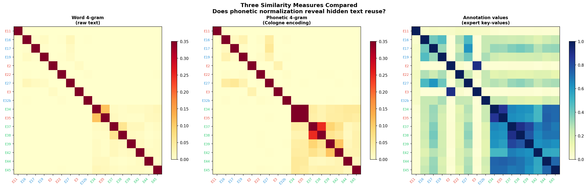
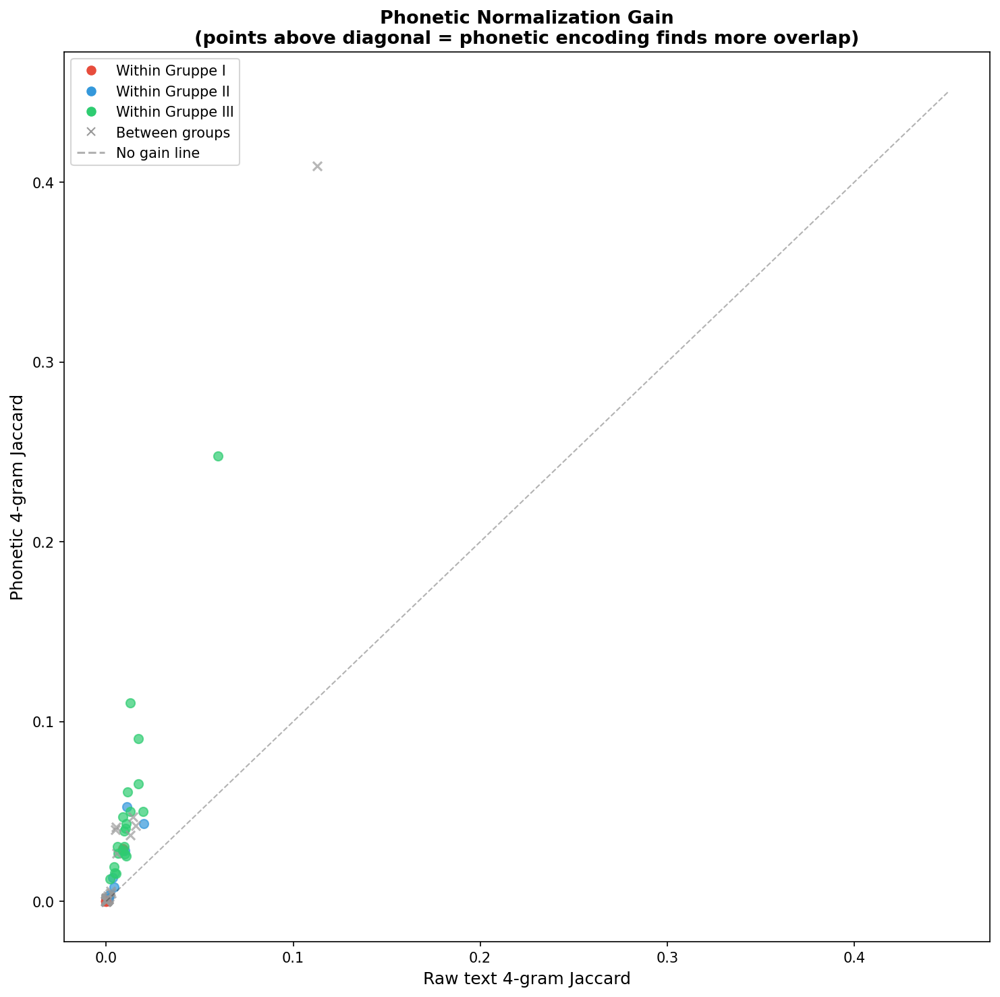
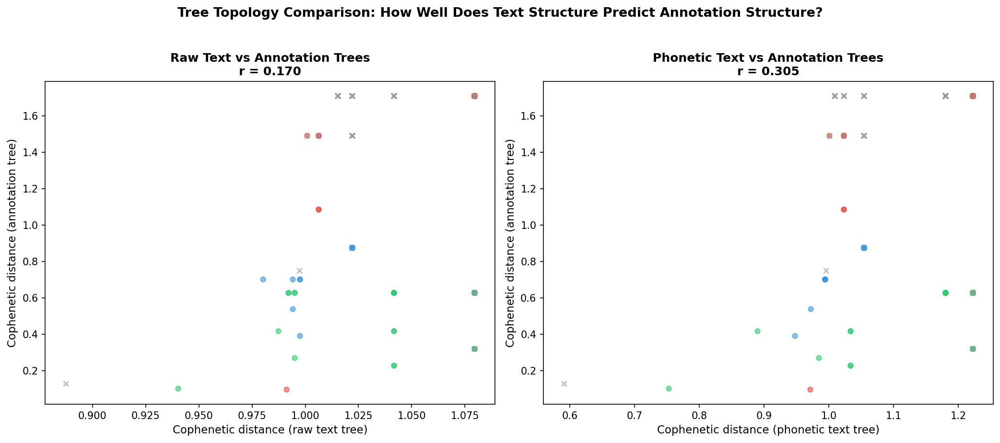
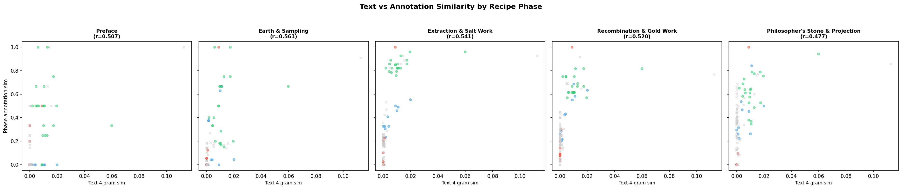

# Text Reuse Analysis — Detailed Documentation

## Can Automated Text Comparison Replicate Expert Annotations?

This document provides a comprehensive account of two analysis scripts — `text_reuse_analysis.py` (Figures G–K) and `text_reuse_divergence.py` (Figures L–Q) — that investigate the relationship between textual similarity and expert-annotated chemical similarity in the *Processus Universalis* corpus. It includes both technical detail and explanations for non-specialist readers.

---

## Table of Contents

1. [The Research Question](#1-the-research-question)
2. [Data Sources and Alignment](#2-data-sources-and-alignment)
3. [Method 1: Word 4-gram Similarity](#3-method-1-word-4-gram-similarity)
4. [Method 2: Phonetic Normalisation (Cologne Encoding)](#4-method-2-phonetic-normalisation)
5. [Method 3: Annotation Value Similarity](#5-method-3-annotation-value-similarity)
6. [Computing Similarity Matrices](#6-computing-similarity-matrices)
7. [Figure G: Three Similarity Measures Compared](#7-figure-g)
8. [Figure H: Phonetic Normalisation Gain](#8-figure-h)
9. [Figure I: Comparative Dendrograms](#9-figure-i)
10. [Figure J: Nearest-Neighbour Comparison](#10-figure-j)
11. [Figure K: Cophenetic Distance Correlation](#11-figure-k)
12. [Figure L: Divergence Scatter](#12-figure-l)
13. [Figure M: Per-Category Text Predictability](#13-figure-m)
14. [Figure N: Disagreement Profiles](#14-figure-n)
15. [Figures O & P: Per-Phase Correlation](#15-figures-o-p)
16. [Figure Q: Text Length Bias](#16-figure-q)
17. [The Five Disagreement Cases in Detail](#17-disagreement-cases)
18. [Shared Text Passages: What the 4-grams Actually Look Like](#18-shared-passages)
19. [Summary of Findings](#19-summary)
20. [Implications for Digital Humanities](#20-implications)

---

## 1. The Research Question

The *Processus Universalis* corpus consists of 18 alchemical recipe texts, each annotated by domain experts with 30 categories of chemical process information (e.g., "type of earth," "extraction method," "gold dissolution procedure"). The expert annotations capture *what chemical processes the text describes*, regardless of exactly how it phrases them. These annotations have been used to group the texts into three families (Gruppe I, II, III) that likely share common source traditions.

The central question of this analysis is:

> **If we ignore the expert annotations entirely and compare the texts only by their words, do we recover the same relationships?**

This matters for two reasons:
- **Scalability:** If word-level text comparison can approximate expert annotation, it could be applied to much larger corpora of unstudied recipe texts where no expert annotations exist.
- **Understanding transmission:** Where text similarity *diverges* from annotation similarity tells us something about how these recipes were transmitted — were they copied verbatim, or were the chemical procedures transmitted through some other channel (oral teaching, laboratory demonstration, deliberate rewriting)?

---

## 2. Data Sources and Alignment

### Text files

The plain text of each recipe is loaded from pre-prepared lowercase text files in the `processus_prev_work/` directory. These were produced in a previous project phase and contain the recipe texts stripped of XML tags and lowercased. Each file is named with the text's group and E-name (e.g., `G2_E16-...txt`).

The E-name is extracted from the filename using the regex `E(\d+[ab]?)`, which matches patterns like "E16", "E34", "E32b".

**17 of the 18 texts** have corresponding text files. E43 (A11, Gruppe III) is missing and is excluded from all text reuse analyses.

```
Text files loaded: E11, E16, E17, E19, E2, E22, E27, E3, E32b,
                   E34, E35, E37, E38, E39, E42, E44, E45
Missing:           E43
```

### Annotation data

Expert annotations are loaded from `processus_data.json`, which contains all 18 texts with their 30 annotation categories and specific values. Only the 17 texts present in both sources are used.

### Assumption: text file alignment

The analysis assumes that the lowercase text files faithfully represent the same text as the XML source. This was verified in the previous project phase. No further text cleaning is applied — the files are used as-is.

---

## 3. Method 1: Word 4-gram Similarity

### What it does

Each text is split into words (by whitespace), and all consecutive sequences of 4 words are collected as a set. For example, from the text "die erde soll man ausbreiten und trocknen lassen", the 4-grams would be:

```
("die", "erde", "soll", "man")
("erde", "soll", "man", "ausbreiten")
("soll", "man", "ausbreiten", "und")
("man", "ausbreiten", "und", "trocknen")
("ausbreiten", "und", "trocknen", "lassen")
```

The similarity between two texts is the **Jaccard similarity** of their 4-gram sets:

```
similarity = |4grams_A ∩ 4grams_B| / |4grams_A ∪ 4grams_B|
```

### What it assumes

- **Exact word matching:** A 4-gram match requires four consecutive words to appear in *exactly the same form and order* in both texts. This is strict — if a scribe substitutes one word or changes the word order, the 4-gram won't match.
- **No positional information:** It doesn't matter *where* in the text the 4-gram appears. A shared 4-gram at the beginning of one text and the end of another still counts.
- **Length independence (via Jaccard):** Jaccard normalises by the union of the two sets, so longer texts don't automatically get higher similarity scores. However, longer texts do have more 4-grams, giving them more opportunities for matches (see [Figure Q](#16-figure-q) for analysis of this effect).
- **Why 4?** The value 4 is a standard choice in text-reuse detection. Lower values (2-grams, 3-grams) would capture more matches but also many coincidental ones — common phrases like "und das ist" could appear by chance. Higher values (5-grams, 6-grams) are more conservative and may miss lightly edited passages. 4-grams balance sensitivity and specificity.

### For a non-technical reader

*Imagine laying two recipe manuscripts side by side and highlighting every passage of four consecutive words that appears in both. The more highlighting you see, the higher the similarity score. This measures direct textual copying — it catches passages that were transferred word-for-word. If a scribe rewrote a passage in their own words but kept the same chemical meaning, this method would not detect it.*

### Observed values

Text 4-gram Jaccard values in this corpus are **very low** — typically 0.001–0.06, with a maximum of 0.113 (E34–E35). This is normal for early modern texts: even closely related manuscripts show extensive orthographic variation, substitution, and paraphrasing. For comparison, the annotation-level Jaccard values range from 0.01 to 0.90.

---

## 4. Method 2: Phonetic Normalisation

### The problem of spelling variation

Early Modern German lacked standardised spelling. A single word might be spelled differently by different scribes, or even differently within the same manuscript. For example:
- prussiat / prussyat / prussiat
- saltze / salze / saltze
- feuer / fewer / fewr

These are the same words *phonetically* — they sound the same — but they won't match as identical strings in a word 4-gram comparison.

### Cologne Phonetic Encoding (Kölner Phonetik)

The Cologne encoding is a phonetic algorithm designed specifically for German (unlike Soundex, which was designed for English). It maps each letter of a word to a numeric code based on how it sounds:

| Code | Letters |
|------|---------|
| 0 | A, E, I, O, U, Ä, Ö, Ü, J, Y (vowels) |
| 1 | B, P |
| 2 | D, T (unless followed by C, S, Z) |
| 3 | F, V, W |
| 4 | G, K, Q; C (before A, H, K, O, Q, U, X) |
| 5 | L |
| 6 | M, N |
| 7 | R |
| 8 | S, Z, ß; C (before E, I); D, T (before C, S, Z); X (→48) |
| — | H (ignored) |

After coding, consecutive duplicate codes are collapsed, and internal vowels (0s) are removed. The first character retains its vowel code.

**Example:** "Salzwasser" → S=8, a=0, l=5, z=8, w=3, a=0, s=8, s=8, e=0, r=7 → after dedup and vowel removal → "085837"

### How it's applied

1. Each text is split into words using the regex `[a-zäöüß]+` (keeping only alphabetic characters)
2. Words shorter than 2 characters are discarded
3. Each remaining word is converted to its Cologne code
4. 4-grams of Cologne codes are collected as a set
5. Jaccard similarity is computed on these phonetic 4-gram sets

### What it assumes

- **Same pronunciation = same word:** The algorithm assumes that if two strings produce the same phonetic code, they represent the same word. This is usually correct for German orthographic variation but could produce false matches for genuinely different words that happen to sound similar.
- **German phonetics:** The encoding assumes German pronunciation rules. Non-German words or technical Latin terms may not be handled optimally.
- **Context-independent:** Each word is encoded independently. The algorithm doesn't consider sentence context.

### For a non-technical reader

*Imagine you have two recipes where one says "Saltze" and the other says "Salze." To a reader, these are obviously the same word — they just spell it differently. But a computer comparing them letter-by-letter would say they're different. The Cologne encoding solves this by converting both spellings to the same number code (like a phonetic fingerprint), so the computer can recognise them as the same word despite the different spelling.*

*This is especially important for early modern texts, which were written before spelling was standardised. By comparing phonetic fingerprints instead of exact spellings, we can detect text reuse that would otherwise be hidden.*

### Observed effect

The correlation between raw and phonetic 4-gram similarity is **r = 0.981** — nearly identical. This means phonetic normalisation confirms the raw text results rather than dramatically changing them. The within-group similarity ratio does improve slightly (from 3.91× to 4.26×), and the tree topology correlation with annotations improves more noticeably (from r = 0.170 to r = 0.305).

---

## 5. Method 3: Annotation Value Similarity

### What it does

For each text, all expert-annotated (category, value) pairs are collected as a set. For example, if a text has the annotation `Art der Erde: ["fette schwarze Erde", "lehmig"]`, this contributes two elements: `("Art der Erde", "fette schwarze Erde")` and `("Art der Erde", "lehmig")`.

FEHLT values (marking absent categories) are included in the set, so two texts that both lack a particular category will share the FEHLT value for it.

Jaccard similarity is computed on these sets.

### What it assumes

- **Expert correctness:** The annotations are treated as ground truth. If an expert annotated a value differently in two texts that actually describe the same thing, the method would not recognise the match.
- **Flat comparison:** All (category, value) pairs are treated equally. A match on a rare, highly specific value (like "gefüllte Phiole in Athanor") counts the same as a match on a common, generic value (like "FEHLT").
- **Value identity:** Values must be identical strings to count as a match. Near-synonyms are not collapsed.

### For a non-technical reader

*This measures whether two recipes describe the same chemical procedures with the same specific details — not whether they use the same words, but whether the expert annotators identified the same procedural content. This is the "gold standard" that we are trying to see whether automated text comparison can approximate.*

---

## 6. Computing Similarity Matrices

For all 17 texts, three 17×17 similarity matrices are computed:

1. **sim_raw:** Word 4-gram Jaccard between each pair
2. **sim_phon:** Phonetic 4-gram Jaccard between each pair
3. **sim_anno:** Annotation value Jaccard between each pair

Each matrix is symmetric (similarity of A to B = similarity of B to A) with 1.0 on the diagonal (each text is identical to itself). The upper triangle contains 136 unique pairwise values (17 × 16 / 2).

The primary comparison metric is the **Pearson correlation** between the 136 pairwise values from different matrices. This acts as a Mantel-like test: if text similarity perfectly predicted annotation similarity, the correlation would be 1.0.

### Observed correlations

| Comparison | Pearson r | p-value | Interpretation |
|---|---|---|---|
| Raw text ↔ Annotations | 0.569 | < 0.0001 | Moderate positive — text sharing partially predicts annotation similarity |
| Phonetic ↔ Annotations | 0.585 | < 0.0001 | Slightly stronger — phonetic helps at the margins |
| Raw text ↔ Phonetic | 0.981 | < 0.0001 | Near-identical — the two text methods agree closely |

### Within-group vs between-group separation

| Metric | Within-group avg | Between-group avg | Ratio |
|---|---|---|---|
| Raw text 4-gram | 0.0080 | 0.0021 | 3.91× |
| Phonetic 4-gram | 0.0314 | 0.0074 | 4.26× |
| Annotation values | 0.4704 | 0.1888 | 2.49× |

**Key observation:** Text-based similarity actually shows *stronger* group separation than annotations (3.9–4.3× vs 2.5×). This means the three-group structure is robustly detectable from text alone, and in fact text reuse is more "exclusive" to groups than annotation content is. Groups share some annotation patterns (common recipe elements) but don't share exact wording across group boundaries.

---

## 7. Figure G: Three Similarity Measures Compared

**File:** `processus_figG_three_similarities.png`



### Technical description

Three heatmaps showing the 17×17 similarity matrices side by side. Texts are ordered alphabetically by E-name. Axis labels are coloured by group (red = Gruppe I, blue = Gruppe II, green = Gruppe III).

- **Left:** Word 4-gram Jaccard. Colour scale 0–0.35 (YlOrRd palette).
- **Centre:** Phonetic 4-gram Jaccard. Same colour scale for comparability.
- **Right:** Annotation value Jaccard. Separate colour scale 0–1.0 (YlGnBu palette) because annotation similarity values span a much wider range.

The diagonal is included (self-similarity = 1.0).

### What to look for

The annotation heatmap (right) shows clear block structure: Gruppe III texts (E34, E35, E37, E38, E39, E42, E44, E45) form a prominent warm-coloured block. This block is also visible — though fainter — in the text-based heatmaps (left and centre), confirming that the group structure is real and text-detectable.

The text-based heatmaps are much sparser. Most off-diagonal cells are near zero, with a few hot spots (E34–E35, E37–E38). This sparseness is expected: exact 4-word matches are rare across manuscripts.

### For a non-technical reader

*Three different "lenses" on the same set of 18 recipes. The left two ask "do these recipes share exact phrases?" The right asks "do they describe the same chemistry?" The fact that all three show a cluster of warm colours in the same area (the Gruppe III texts in the lower-right corner) means the group structure identified by experts is also detectable from the words alone — even without reading the recipes for chemical content.*

---

## 8. Figure H: Phonetic Normalisation Gain

**File:** `processus_figH_phonetic_gain.png`



### Technical description

A scatter plot of 136 text pairs. X-axis: raw word 4-gram Jaccard. Y-axis: phonetic 4-gram Jaccard. The dashed diagonal represents "no gain" — points above this line have higher phonetic similarity than raw similarity, meaning phonetic encoding revealed additional matches.

Points are coloured by pair type: within-group pairs use group colours (circles), between-group pairs are grey crosses.

### What to look for

Most points sit **above** the diagonal, confirming that phonetic normalisation consistently reveals additional text reuse. The gain is largest for pairs that already have moderate raw similarity — the very low-similarity pairs (near the origin) don't gain much because they have few word overlaps to normalise. The one clear outlier in the upper region is a between-group pair (grey ×), which is E34–E35: these texts are in different groups (III and I respectively) but share extensive text.

### For a non-technical reader

*Each dot represents two recipes being compared. If a dot is above the dashed line, it means the phonetic approach found more shared text than exact word matching. Most dots are above the line — phonetic normalisation helps. But the improvement is modest: the two methods agree very closely (r = 0.981). For this particular corpus, most text reuse is already detectable from exact word matches. The phonetic approach is a useful refinement but not a game-changer.*

---

## 9. Figure I: Comparative Dendrograms

**File:** `processus_figI_comparative_dendrograms.png`


### Technical description

Three dendrograms (hierarchical clustering trees) produced from the three distance matrices (1 − similarity), all using Ward's linkage method. Leaf labels show E-name with A-name and group. Labels are coloured by group.

Ward's method merges clusters to minimise the total within-cluster variance at each step. It tends to produce compact, evenly-sized clusters. The y-axis shows Ward distance — the height at which two branches merge represents how dissimilar those clusters are.

**Important:** The y-axis scales are not directly comparable across the three panels because the input distance ranges differ (text distances are in the range 0.88–1.0; annotation distances span 0.0–1.0).

### What to look for

- **Annotation tree (right):** The clearest group separation. Gruppe III texts cluster together tightly at the bottom. E2, E3, E11 (Gruppe I) cluster together. Gruppe II texts form a mixed sub-tree. E35 (Gruppe I) clusters with Gruppe III — this anomaly was noted in earlier analyses and may indicate a misclassification or hybrid text.

- **Text-based trees (left, centre):** Partially recover the group structure. The E34–E35 pair is the strongest pairing in the text-based trees (they merge at the lowest height), consistent with their high text reuse. Gruppe III texts generally cluster together. But the precise branching order differs from the annotation tree.

- **Key difference:** In the annotation tree, E37–E38 merge very early (they are the most similar pair by annotations, Jaccard = 0.897). In the text-based trees, E34–E35 merge first (text Jaccard = 0.113). This illustrates a core finding: the pair that shares the most *words* is not the same as the pair that shares the most *chemical content*.

### For a non-technical reader

*These three "family trees" show how the 17 recipes group together according to three different measures. If the trees looked identical, it would mean that word-level comparison perfectly replaces expert annotation. They don't look identical — but they're not completely different either. The broad strokes (Gruppe III texts cluster together) are preserved, but the finer branches (which specific text is most similar to which) shift between the three measures.*

*This is the core finding in visual form: automated text analysis gets the "big picture" right but disagrees on the details.*

---

## 10. Figure J: Nearest-Neighbour Comparison

**File:** `processus_figJ_nn_comparison.png`


### Technical description

A circular network graph. Nodes represent texts, coloured by group. For each text, a nearest neighbour is identified by two methods:

1. **Annotation-based nearest neighbour** (solid grey line): the text with the highest annotation value Jaccard
2. **Phonetic text-based nearest neighbour** (dashed orange line): the text with the highest phonetic 4-gram Jaccard — shown *only where it disagrees* with the annotation-based nearest neighbour

If both methods agree, only the solid grey line appears. Node positions follow a circular layout sorted by group then E-number.

### Nearest-neighbour agreement table

| Text | By raw text | By phonetic | By annotation | Raw=Anno? | Phon=Anno? |
|------|-------------|-------------|---------------|-----------|------------|
| E11 | E38 | E38 | E22 | No | No |
| E16 | E27 | E27 | E27 | **Yes** | **Yes** |
| E17 | E27 | E27 | E27 | **Yes** | **Yes** |
| E19 | E16 | E27 | E16 | **Yes** | No |
| E2 | E3 | E3 | E3 | **Yes** | **Yes** |
| E22 | E32b | E19 | E19 | No | **Yes** |
| E27 | E16 | E17 | E17 | No | **Yes** |
| E3 | E2 | E2 | E2 | **Yes** | **Yes** |
| E32b | E22 | E22 | E19 | No | No |
| E34 | E35 | E35 | E35 | **Yes** | **Yes** |
| E35 | E34 | E34 | E34 | **Yes** | **Yes** |
| E37 | E38 | E38 | E38 | **Yes** | **Yes** |
| E38 | E37 | E37 | E37 | **Yes** | **Yes** |
| E39 | E37 | E42 | E37 | **Yes** | No |
| E42 | E37 | E39 | E37 | **Yes** | No |
| E44 | E35 | E34 | E35 | **Yes** | No |
| E45 | E34 | E34 | E44 | No | No |

**Agreement rate:** Raw text → Annotations: **12/17 (71%)**. Phonetic → Annotations: **10/17 (59%)**.

### For a non-technical reader

*For each recipe, we ask: "Which other recipe is most similar to this one?" We ask this question twice — once using word matching, once using expert annotations — and check if the answers agree. They agree 71% of the time. This means automated text comparison correctly identifies the closest relative for most recipes. The five disagreements tend to involve texts that are relatively isolated (E11, with few shared words with anyone) or sit at group boundaries (E45, caught between E34 and E44).*

---

## 11. Figure K: Cophenetic Distance Correlation

**File:** `processus_figK_cophenetic.png`



### Technical description

Two scatter plots comparing **cophenetic distances** from different dendrograms. The cophenetic distance between two items is the height in the dendrogram at which they first join the same cluster — it captures the full tree topology, not just nearest-neighbour relationships.

For each of the 136 text pairs, the cophenetic distance from the text-based tree (x-axis) is plotted against the cophenetic distance from the annotation tree (y-axis). Points are coloured by pair type. Pearson r is shown.

The `cophenet()` function from scipy is called with the original condensed distance matrix as its second argument, which returns both the cophenetic correlation coefficient and the cophenetic distance matrix.

- **Left panel:** Raw text tree cophenetic distances vs annotation tree. r = 0.170.
- **Right panel:** Phonetic text tree cophenetic distances vs annotation tree. r = 0.305.

### What it means

While nearest-neighbour agreement is 71%, the overall tree topology correlation is much weaker (r = 0.17–0.31). This means:

- Text analysis correctly identifies *local* relationships (which two texts are closest)
- But it fails to recover the *global* branching structure (which clusters join first, what the intermediate groupings are)

The phonetic tree does better (r = 0.305 vs 0.170), suggesting that phonetic normalisation helps more at the structural level than at the local level.

### For a non-technical reader

*Imagine comparing two family trees by checking not just who's siblings (nearest neighbours) but whether the entire tree shape matches — which branches split first, which sub-families exist. This is what cophenetic correlation measures. The result is sobering: the word-based tree and the annotation-based tree have only weakly similar shapes (r = 0.17–0.31). The automated method can tell you who's closely related, but it can't reconstruct the whole family history.*

---

## 12. Figure L: Divergence Scatter

**File:** `processus_figL_divergence_scatter.png`


### Technical description

A scatter plot of all 136 text pairs. X-axis: raw word 4-gram Jaccard. Y-axis: annotation value Jaccard. A dashed line shows the linear fit (r = 0.569). The 10 pairs with the largest **rank divergence** are labelled — these are pairs whose relative position changes most between the two rankings (i.e., they would be in very different positions in a sorted list of text similarity vs a sorted list of annotation similarity).

Rank divergence is computed by:
1. Ranking all 136 pairs by text similarity (rank 0 = most similar)
2. Ranking all 136 pairs by annotation similarity (rank 0 = most similar)
3. Computing the difference: `rank_annotation − rank_text`

A large positive rank difference means the pair is ranked much higher by text than by annotation ("text says similar, annotation says dissimilar"). A large negative rank difference means the opposite ("annotation says similar, text says not").

### What the labelled outliers tell us

The most divergent pairs are overwhelmingly **between-group pairs involving E17 (Gruppe II)**. E17 shares zero or near-zero text 4-grams with Gruppe III texts (E37, E38, E39, E44, E45) but has moderate annotation similarity with them (0.33–0.39). This means E17 describes similar chemical processes to these texts *but in completely different words*.

The pair **E2–E27** shows the opposite pattern: they share some text (rank 52 by text similarity) but have very low annotation similarity (rank 133). These are both Gruppe II texts that share some exact phrases but whose expert-annotated chemical content is quite different — perhaps because the shared passages are introductory/framing text rather than procedural content.

### For a non-technical reader

*The labelled points show the pairs where the two methods disagree most. Most are cases where recipes describe similar chemistry but in different words (the cluster of labels at the bottom-left, with low text similarity but moderate annotation similarity). This makes sense: a scribe could copy a recipe's chemical procedure into a new text while completely rewriting the prose. The expert annotators would recognise the same chemistry; the word-matching algorithm would not.*

*The reverse case — shared words but different chemistry — is rarer but also informative. It could indicate shared introductory passages or framing text that doesn't reflect the actual procedural content.*

---

## 13. Figure M: Per-Category Text Predictability

**File:** `processus_figM_category_predictability.png`


### Technical description

For each of the 30 annotation categories, a Pearson correlation is computed between:
- The text 4-gram Jaccard similarity (136 values, one per pair)
- The **category-specific** Jaccard similarity (also 136 values: for each pair, how similar are their annotations *within just this one category*?)

The resulting r values are displayed as a horizontal bar chart, ordered by recipe position (top = first category, bottom = last). Bars are coloured by recipe phase. Stars indicate statistical significance (* p < 0.05, ** p < 0.01, *** p < 0.001).

### Key findings

**Most-predictable categories** (r > 0.5, all p < 0.001):
- Bezeichnung des ausgelaugten Salzes (r = 0.59)
- Bezeichnung des Lösungsmittels (r = 0.55)
- Art der Erde (r = 0.54)
- Projection (r = 0.52)
- Beschreibung des Athanors (r = 0.52)

These are categories where similar text reliably predicts similar annotations. They tend to involve specific, named entities (types of earth, names of salts, descriptions of equipment) — things that are likely to be described using specific technical vocabulary that gets copied verbatim.

**Least-predictable categories** (r < 0.15, not significant):
- Fundort der Erde (r = 0.15, p = 0.08)
- Nasser und trockener Weg (r = 0.10, p = 0.24)
- Weiterverarbeitung der Mischung von Spiritus und Sal volatile (r = 0.09, p = 0.30)
- Salz mit Gold und Silber zusammenschmelzen (r = 0.04, p = 0.67)
- Zusammenfügung von zwei Prinzipien (r = 0.03, p = 0.77)

These are categories where text similarity does **not** predict annotation agreement. They fall into two types:
1. **Binary or near-binary categories** (Nasser und trockener Weg: only 2 distinct values) — there's not enough variation to correlate with.
2. **Rare categories** (Salz mit Gold und Silber zusammenschmelzen: present in only 2 texts; Zusammenfügung von zwei Prinzipien: 3 texts) — too few data points for a meaningful correlation.
3. **Procedurally complex categories** (Weiterverarbeitung der Mischung: 14 distinct values across only 4 texts) — these describe elaborate multi-step procedures that may be paraphrased extensively.

### For a non-technical reader

*This figure answers: "Which aspects of the recipe can a computer predict from words alone, and which require a human expert?" The answer has a clear pattern:*

*The computer is good at predicting categories that involve **specific named things** — types of earth, names of chemicals, descriptions of equipment. These things tend to be called by the same name across manuscripts, so if two recipes share words, they probably also share these specific details.*

*The computer is bad at predicting categories that involve **complex procedures** or that only appear in a few texts. A procedure like "further processing of the mixture of spiritus and sal volatile" involves many detailed steps that can be described in entirely different ways while still doing the same thing. An expert chemist can recognise that two different descriptions refer to the same procedure; a word-matching algorithm cannot.*

---

## 14. Figure N: Disagreement Profiles

**File:** `processus_figN_disagreement_profiles.png`


### Technical description

Five panels, one for each text whose nearest-neighbour assignment disagrees between text and annotation methods. Each panel shows two bars for every other text:
- **Blue bar:** Text similarity (scaled to the annotation similarity range for visual comparability)
- **Red bar:** Annotation similarity

The blue-bordered bar marks the text method's nearest neighbour; the red-bordered bar marks the annotation method's nearest neighbour.

### What to look for

- **E11:** The most isolated text. Its annotation-based nearest neighbour (E22) has zero shared 4-grams with it. Its text-based nearest neighbour (E38) shares only 2 four-grams. Both similarity values are extremely low. The "disagreement" is between two nearly-tied very weak candidates.

- **E22:** Text says E32b, annotations say E19. The text similarity gap is tiny (0.0005 difference), meaning the text method is essentially guessing between two nearly equal options. The annotation similarity gap is larger (0.048), making E19 a more confident annotation-based choice.

- **E27:** Text says E16, annotations say E17. All three (E27, E16, E17) are Gruppe II texts that are closely related by annotations. The text method picks E16 because E27 shares more exact phrases with E16 (0.020 vs 0.011); the annotation method picks E17 because they share more specific procedural details (0.609 vs 0.480).

- **E32b:** Text says E22, annotations say E19. Similar to E22's case — E32b is a very long text (3226 words, the second-longest in the corpus) that shares some phrases with many texts, making the text-based ranking unstable.

- **E45:** Text says E34, annotations say E44. All three are Gruppe III texts. E45 shares many more 4-grams with E34 (71 shared) than E44 (19 shared), so the text method strongly prefers E34. But E45's annotation similarity to E44 (0.730) is nearly identical to E34 (0.724) — the annotation margin is tiny (0.006). This is a case where text reuse tells us E45 was likely *copied from* E34 more directly, even though E44 and E45 describe almost identically similar chemistry.

### For a non-technical reader

*These five charts show the "problem cases" — the recipes where word matching and expert annotation disagree about who the closest relative is. In most cases, the disagreement is between two very close candidates, and the margins are slim. The most interesting case is E45: the words clearly point to E34 as the source (71 shared four-word phrases vs only 19 with E44), but the chemistry is equally similar to E44. This might mean E45 was copied from E34 and then independently developed the same chemical content as E44 — or that E44 and E45 share a common source that E34 also used.*

---

## 15. Figures O & P: Per-Phase Correlation

**File:** `processus_figO_phase_correlation.png`


**File:** `processus_figP_phase_scatter.png`



### Technical description

**Figure O:** A bar chart showing the Pearson r between text similarity and **phase-specific** annotation similarity, for each of the five recipe phases. Phase-specific annotation similarity is computed by restricting the Jaccard to only the annotation categories within that phase.

Two bars per phase: blue for raw text, green for phonetic text. Significance stars are shown above each bar.

**Figure P:** Five scatter panels (one per phase) showing the individual data points behind Figure O. Each point is a text pair, with text 4-gram Jaccard on the x-axis and phase-specific annotation Jaccard on the y-axis. Coloured by group relationship.

### Observed pattern

| Phase | r (raw) | r (phonetic) |
|---|---|---|
| Preface | 0.507 | 0.514 |
| Earth & Sampling | 0.561 | 0.600 |
| Extraction & Salt Work | 0.541 | 0.555 |
| Recombination & Gold Work | 0.520 | 0.535 |
| Philosopher's Stone & Projection | 0.477 | 0.482 |

The correlation is strongest in the **Earth & Sampling** phase (r = 0.56–0.60) and weakest in the **Philosopher's Stone & Projection** phase (r = 0.48). This aligns with the earlier finding (from `visualize_evolution.py`) that the groups diverge more in the later phases.

### For a non-technical reader

*This answers the question: "In which parts of the recipe does word-matching best predict the expert annotations?" The answer: the early-to-middle sections (describing the earth, sampling, and extraction) are the most predictable; the later sections (philosopher's stone and projection) are the least predictable.*

*This makes intuitive sense. The early parts of the recipe — selecting and preparing the earth — are relatively concrete and specific. They describe physical actions and materials that tend to be named consistently. The later parts — the philosopher's stone and its "projection" onto base metals — are more theoretical, more variable between texts, and more likely to be described in idiosyncratic or deliberately obscure language. These are exactly the parts where expert chemical knowledge is most needed to recognise that different descriptions refer to the same underlying procedure.*

*The decline in predictability tracks the recipe's trajectory from practical chemistry toward alchemical theory — and it matches the finding from earlier analyses that the three groups diverge most in these later phases.*

---

## 16. Figure Q: Text Length Bias

**File:** `processus_figQ_length_bias.png`


### Technical description

Three scatter panels investigating whether text length confounds the analysis:

1. **Left:** Word count vs mean text similarity to all other texts (r = 0.230)
2. **Centre:** Word count vs mean annotation similarity to all other texts (r = 0.363)
3. **Right:** Number of 4-grams vs number of annotation values (r = 0.871)

### Key findings

- **Length–similarity bias is weak for text (r = 0.23):** Longer texts do not systematically have higher text similarity scores. The Jaccard normalisation by union size effectively controls for length.
- **Length–similarity bias is moderate for annotations (r = 0.36):** Longer texts tend to have slightly higher mean annotation similarity. This is because longer texts tend to be more complete (include more process steps), and complete texts naturally share more values with each other.
- **Feature count correlation is strong (r = 0.87):** Longer texts produce more 4-grams *and* tend to have more annotation values. This is expected — more text means more content.
- **Notable outlier: E32b** (3226 words) has very low mean text similarity (0.0005) despite being the second-longest text. This is because E32b is a Gruppe II text written in a distinctive style that shares few exact phrases with other texts, even though its annotation content overlaps moderately.

### For a non-technical reader

*A potential concern with any word-based comparison is that longer texts might appear more similar simply because they have more words and thus more chances for random matches. This figure shows that this is **not** a major problem here: the correlation between text length and text similarity is weak (r = 0.23). The Jaccard method, by dividing by the total number of features, effectively accounts for length differences.*

*The most interesting point is E32b — the second-longest text in the corpus but one of the least similar to any other text by word matching. This tells us E32b is written in a very distinctive style. Its expert annotations show moderate similarity to other Gruppe II texts, meaning it describes similar chemistry but in very different words — a clear case where automated analysis would miss a relationship that expert annotation catches.*

---

## 17. The Five Disagreement Cases in Detail

This section provides a close reading of each case where the nearest-neighbour identification disagrees between text and annotation methods.

### Case 1: E11 (Gruppe I) — text→E38, anno→E22

E11 is the most isolated text in the corpus by text similarity. It shares only 2 four-grams with its text-based nearest neighbour E38, and **zero** four-grams with its annotation-based nearest neighbour E22. Both similarity values are near zero (text: 0.0012, annotation: 0.078).

The annotation similarity to E22, while low (0.078), reflects 7 shared annotation values across categories like Auflösung von Gold, Eindampfen, and Extraktion. These are common procedural elements that E11 and E22 both describe, but in entirely different words.

**Interpretation:** E11 is a short, unusual text (553 words, only 17 annotation values) that cannot be reliably linked to any other text by either method. The "disagreement" here is essentially meaningless — it's two different methods guessing randomly among very weak candidates.

### Case 2: E22 (Gruppe I) — text→E32b, anno→E19

E22 shares 12 four-grams with E32b and 0 with E19 — but the text similarity margin is tiny (0.0028 vs 0.0023). The annotation similarity margin is much larger (E19: 0.300, E32b: 0.252).

The shared 4-grams between E22 and E32b include laboratory procedure phrases like "setze die phiole in" ("place the vial in"), "sigillire hermetice, und setze" ("seal hermetically, and place"), and "in einen kolben, und" ("into a flask, and"). These are generic laboratory instructions that appear in many alchemical texts.

E22's annotation similarity to E19 is higher because they share 16 specific annotation values that E32b lacks — including detailed earth descriptions ("fette schwarze Erde," "lehmig"), specific salt processing steps, and the detailed "Weiterverarbeitung" (further processing) procedure with its numbered sub-steps.

**Interpretation:** E22 and E32b share generic laboratory language; E22 and E19 share specific chemical knowledge. This is a textbook example of the difference between textual and substantive similarity.

### Case 3: E27 (Gruppe II) — text→E16, anno→E17

All three texts (E27, E16, E17) are Gruppe II. E27 shares 20 4-grams with E16 but only 11 with E17. The annotation gap is the reverse: E27–E17 similarity is 0.609 vs E27–E16 at 0.480.

E27 and E16 share 20 annotation values that E17 lacks — including specific details about Phiole preparation, the solvent name "der wahre rechte Hauptschlüssel" ("the true right master key"), and the entire 11-step "Weiterverarbeitung der Mischung" procedure. These are detailed, group-specific procedural passages that are clearly shared textually.

E27 and E17 share 6 values that E16 lacks — more basic items like earth type and salt naming conventions.

**Interpretation:** E27 is textually closer to E16 (they share more exact wording) but chemically closer to E17 (they agree on more annotation categories at the value level). This may indicate that E27 and E16 share a textual tradition (common source manuscript), while E27 and E17 share a chemical tradition (common laboratory practice).

### Case 4: E32b (Gruppe II) — text→E22, anno→E19

Very similar to Case 2 (seen from E32b's perspective). E32b is a long text (3226 words) with many 4-grams (3167), giving it more opportunities for coincidental matches with various texts. Its text-based nearest neighbour E22 shares 12 four-grams; its annotation-based nearest neighbour E19 shares only 6.

But E32b and E19 share 45 annotation values vs 35 with E22. The extra 19 values shared with E19 include detailed earth sampling conditions ("klarer Himmel," "kein Regen," "früh morgens"), elaborate stone-production sequences, and specific chemical procedures — all substantive content that isn't reflected in shared wording.

**Interpretation:** E32b's length makes its text-based nearest-neighbour assignment unstable. A few coincidental phrase matches with E22 outweigh the fewer but equally coincidental matches with E19. Meanwhile, the annotations clearly point to E19 as the substantive match. This illustrates a limitation of 4-gram comparison for long texts: the signal-to-noise ratio decreases as text length increases, because longer texts accumulate more spurious matches.

### Case 5: E45 (Gruppe III) — text→E34, anno→E44

The most informative disagreement. E45 shares 71 four-grams with E34 but only 19 with E44, giving a strong text-based preference for E34 (Jaccard: 0.0195 vs 0.0054, nearly 4× higher). But the annotation similarity is nearly identical: E45–E44 = 0.730, E45–E34 = 0.724 (margin of only 0.006).

The shared 4-grams with E34 include detailed procedural language: "biß die spiritus alle herüber" ("until all the spirits have come over"), "athanor in die innerste" ("athanor in the innermost"), "50 tagen mancherley farben" ("50 days various colours"). These are specific, technically detailed phrases describing distillation and colour changes — they are almost certainly the result of direct copying rather than coincidence.

The shared 4-grams with E44 include some of the same procedural elements but fewer of them: "das glaß soll nur halb" ("the glass should only be half"), "damit die spiritus circuliren" ("so that the spirits circulate").

**Interpretation:** E45 was likely copied from E34 or a close relative of E34 — the extensive shared text is too specific to be coincidental. But E45's chemical content is equally close to E44's. This could mean that E44 and E45 independently arrived at similar annotation content from different textual traditions, or that all three share a common ancestor but E45 and E34 retained more of the original wording while E44 paraphrased more extensively.

---

## 18. Shared Text Passages: What the 4-grams Actually Look Like

To ground the analysis in the actual text, here are examples of shared 4-grams from key text pairs:

### E34–E35 (highest text similarity: 451 shared 4-grams)

These texts share extensive procedural language:
```
"1 theil klein geschlagen"          (1 part, finely beaten)
"10 oder 12 stunden"                (10 or 12 hours)
"40 oder 45 tage,"                  (40 or 45 days)
"50 tagen mancherley farben"        (50 days various colours)
"[cz: feuer] anfehet zu"            ([symbol: fire] begins to)
"[cz: gold] ist, wäge"             ([symbol: gold] is, weigh)
```

The `[cz: ...]` notation represents chemical symbols in the original text. The shared passages describe specific quantities (parts, hours, days), colour observations, and procedural instructions — this is clearly direct textual transmission.

### E37–E38 (132 shared 4-grams, highest annotation similarity: 0.897)

```
"1 theil [cz: salpeter]"           (1 part [symbol: saltpetre])
"1 theil des rothen"                (1 part of the red)
"2 oder 3 tropffen"                 (2 or 3 drops)
"3 kugeln, die erste"               (3 balls, the first)
"3 tropffen eingegeben treibt"      (3 drops administered drives)
"50 tagen eine weiße"               (50 days a white)
```

Similar procedural language about quantities, preparations, and observations.

### E32b–E22 (12 shared 4-grams, text-based nearest neighbours)

```
"einen kolben, und destillire"      (a flask, and distil)
"es in eine phiole"                 (it into a vial)
"hermetice, und setze sie"          (hermetically, and place it)
"setze die phiole in"               (place the vial in)
"sigillire hermetice, und setze"    (seal hermetically, and place)
```

Generic laboratory procedure language — not specific to any particular recipe. This explains why text similarity doesn't predict annotation similarity for this pair.

### E11–E22 (0 shared 4-grams, annotation-based nearest neighbours)

These texts share *no* four-word phrases at all, despite being the most similar pair by annotation for E11. Their annotation similarity (0.078) comes from shared procedural concepts described in completely different words. This is pure "substantive similarity without textual similarity."

---

## 19. Summary of Findings

### What text analysis gets right

1. **Group structure is detectable.** Within-group text similarity is 3.9–4.3× higher than between-group, even stronger than the annotation ratio (2.5×). A simple text comparison can correctly identify the three recipe families without any expert knowledge.

2. **Nearest-neighbour identification mostly works.** For 12 of 17 texts (71%), the text-based nearest neighbour matches the annotation-based one. The automated method finds the right "closest relative" most of the time.

3. **Entity-level categories are predictable.** Categories involving specific named things (earth types, salt names, equipment descriptions) are well-predicted by text similarity (r = 0.5–0.6). These items tend to retain their exact wording across copies.

### Where text analysis falls short

1. **Tree topology doesn't transfer.** The cophenetic correlation between text-based and annotation-based dendrograms is only r = 0.17–0.31. The automated method cannot reconstruct the full branching history.

2. **Procedurally complex categories are opaque.** Categories describing multi-step procedures (Weiterverarbeitung, Zusammenfügung von Prinzipien) have near-zero text predictability. Scribes frequently rewrote these procedures in their own words while preserving the chemical content.

3. **Rare categories are undetectable.** Categories present in only 2–3 texts cannot generate enough pairwise data for meaningful correlation.

4. **The Philosopher's Stone phase is hardest.** Text-annotation correlation drops from r = 0.56 (Earth & Sampling) to r = 0.48 (Philosopher's Stone & Projection). The most theoretically complex parts of the recipe are the hardest to analyse automatically.

5. **Long texts introduce noise.** E32b (3226 words) has so many 4-grams that spurious matches accumulate, distorting its nearest-neighbour assignment.

### Why the methods diverge

The divergence comes down to a fundamental distinction:

- **Text similarity measures *how things are said*:** shared words, shared phrases, shared syntax.
- **Annotation similarity measures *what is said*:** shared chemical content, shared procedural knowledge.

When recipes are copied verbatim, these coincide. But when the same chemical knowledge is transmitted through non-textual channels — oral instruction, laboratory demonstration, deliberate rewriting, or independent innovation from a shared tradition — the annotations match but the words don't.

The five disagreement cases reveal this clearly:
- E11 and E22 share *chemical concepts* but *zero words* — they describe similar procedures in entirely different language.
- E27 is textually closer to E16 (shared manuscript tradition) but chemically closer to E17 (shared laboratory practice).
- E45 was likely copied from E34 (extensive shared text) but arrived at annotation content equally similar to E44 (possibly through independent development or a shared source tradition).

---

## 20. Implications for Digital Humanities

### For the Processus Universalis specifically

The analysis confirms that the expert annotations capture information that goes beyond what can be detected from the text surface. The annotators' chemical knowledge — their ability to recognise that two differently-worded passages describe the same procedure — is essential for understanding the deeper relationships between these recipes. This is particularly true for the later recipe phases (philosopher's stone, projection) where the groups diverge most.

At the same time, the automated analysis provides genuinely useful information that complements the expert annotations:
- The text reuse patterns (especially E34–E35's 451 shared 4-grams) provide evidence about *direct copying* that the annotations alone cannot reveal. Two texts might have identical annotations because they were copied from the same source or because they independently developed similar content — text reuse helps distinguish these scenarios.
- The phonetic normalisation, while modest in effect for this corpus, demonstrates a methodology that could be more impactful for corpora with greater spelling variation.

### For other recipe corpora

For scholars approaching a **new, unannotated** recipe corpus:

1. **Start with text comparison.** A 4-gram similarity analysis can identify the most closely related text pairs and the overall group structure with reasonable accuracy. This takes minutes to compute and requires no domain expertise.

2. **Focus expert effort on the hard cases.** The 29% of nearest-neighbour disagreements tend to cluster around specific text types: short texts, long texts, texts at group boundaries. These are the cases where expert annotation adds the most value.

3. **Don't trust the tree topology.** While pairwise similarities transfer reasonably well (r = 0.57), the overall tree structure does not (r = 0.17–0.31). Building a stemma or transmission history requires expert knowledge — text comparison alone will produce misleading branching patterns.

4. **Pay attention to phase structure.** If the recipes have a natural chronological or procedural structure, the early/concrete phases will be more text-predictable than the late/theoretical phases. This can guide where to allocate annotation effort.

5. **Use phonetic normalisation for Early Modern texts.** The Cologne encoding provides a small but consistent improvement, especially for tree-level analysis (r improves from 0.17 to 0.31). For corpora with more extreme spelling variation, the gain could be larger.

---

*Documentation generated for the Processus Universalis text reuse analysis. Scripts: `text_reuse_analysis.py` (Figures G–K), `text_reuse_divergence.py` (Figures L–Q). All outputs are in `/Users/slang/claude/processus-universalis-graphics/`.*
