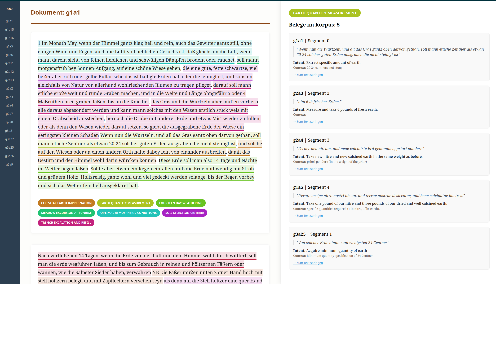

# 04. Conceptual Trajectory Phase

This phase focuses on labeling the discovered alchemical concepts and visualizing their flow across the corpus using an interactive, text-centric explorer.

### Execution Workflow

1.  **`02_visualize_trajectories.py`**: Compiles the interactive HTML application. It maps the atomic labels back to the original TextTiling segments and verbatim German snippets.

---

## Alchemical Trajectory Explorer

The final output of this phase is a dual-pane web application designed for comparative alchemical philology.

### Key Features:
*   **Annotated Reader**: Displays the full manuscript body text in a flow-centric view, with conceptual units highlighted in their respective category colors.
*   **Concept Inspector**: Clicking any highlighted German passage instantly reveals every other occurrence of that concept across the entire corpus in the side panel.
*   **Bidirectional Navigation**: Jump seamlessly between conceptual evidence in the side panel and the original manuscript context.
*   **Sticky Context**: Persistent document headers and a sidebar navigator ensure you never lose your place while scrolling through large manuscripts.

**Explorer Location**: `2026-knowledge-extraction-experiments/data/document_trajectories.html`



---

### Project Structure

```text
04-conceptual-trajectory/
└── 02_visualize_trajectories.py    # Generates the interactive Annotated Reader application
```

